# Computer Networks

# File Transfer Protocol (FTP)

```
$author:   Jin-Wen (Ed) Lai
$date:     Oct. 2001
$revised:  Mar. 2018
$keywords: computer, networks, network, http, RFC.
```

Find and read RFC959 for FTP (Key idea has been discussed in the class) and list all of the client commands that are supported by the RFC. 
- List all of the FTP client commands
- Interactive with FTP Server
- Get RFC 959 by Archive and Ftp

## Content

* [Concept](#concept)
* [Requirements](#requirements)
* [FTP](#ftp)
* [Download The File](#download-the-file)
* [Debug Mode](#debug-mode)
* [RFC 959](#rfc-959)

## Concept

Users use below applications

- Ftp clients (e.q. cute-Ftp; ws_ftp...) to access the Ftp Servics.

but we will not use any client-side applications to access above Services. instead of `telnet`. it will help us to know more detail of FTP protocol.

## Requirements

- Red-Hat Linux 6.2 + KDE/X-window

## FTP

### Step-by-Step by using telnet to access FTP server

- List all of the client commands that are supported by the [RFC 595](http://www.ietf.org/rfc/rfc0959.txt?number=959).
- Connect to FTP Server (port 21) and list all commands users can use.
- User has to login NTUT's `Sun OS` Server and telnet to NTUT's FTP Server. (Optional, if user wants to run `FTP client` on `Sun OS` Server)

- Issue below command on Terminal to access NTUT FTP Server after login `NTUT Sun OS Server`.

  ```bash
  telnet 140.124.13.2 21
  ```

- Issue below FTP commands trying to list file(s) from NTUT FTP Server

| # |      PROMPT      |  DESCRIPTION |
|:-:|:-----------------|:-------------|
| 1 | user s9360511   <kbd>⏎</kbd> | Identify yourself to the remote FTP server (please use your personal account)                                             |
| 2 | pass <password> <kbd>⏎</kbd> | Issue the password to FTP Server(please use your personal password)                                                       |
| 3 | HELP            <kbd>⏎</kbd> | List all FTP commands                                                                                                     |
| 4 | PWD             <kbd>⏎</kbd> | Print the name of the current working directory on the remote machine, in this case we saw `/user/student/s9360/s9360511` |
| 5 | list            <kbd>⏎</kbd> | Print a listing of the contents of a directory on the remote machine under folder `/user/student/s9360/s9360511`, but it will pop up a warnnig message saying `425 Can't build data connection: Connection refused.` |

### Screenshot

- Screenshot of running `telenet` 

  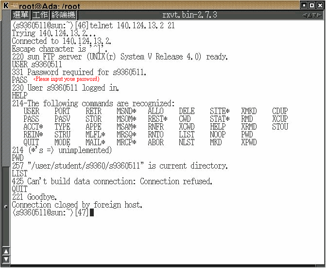

## Download The File

### Step-by-Step

- In above case, When users issue `LIST` command, Server responses `425 Can't open data connection`.

- Refer to [Richard Stevens _TCP/IP Illustrated vo1.1_](http://www.kohala.com/start/tcpipiv1.html) `CH27 FTP: File Transfer Protocol`, Server has to open `Data Channel` for `Data Connection`.

- **Terminal 1:** Issue below command to access NTUT FTP Server (`Command Port`)
  ```bash
  telnet 140.124.13.2 21
  ```

- **Terminal 1:** Issue below command on `Command Port` find out `Data Port`'s number
  
| STEP | PROMPT                        | DESCRIPTION                                                                                                |
|:-:|:------------------------------|:--------------------------------------------------------------------------------------------------------------------------|
| 1    | user s9360511   <kbd>⏎</kbd> | Identify yourself to the remote FTP server (please use your personal account)                              |
| 2    | pass <password> <kbd>⏎</kbd> | Issue the password to FTP Server(please use your personal password)                                        |
| 3    | PWD             <kbd>⏎</kbd> | Print the name of the current working directory on the remote machine, in this case we saw `/user/student/s9360/s9360511`  |                                               |
| 4    | PASV            <kbd>⏎</kbd> | Request the remote server open a port for the data connection and return the address of that port. In this case, `140,124,13,2,195,133`, it means server opens Port `50033(195*256*133)` for Data Connection |

- **Terminal 2:** Issue below command on `Terminal 2` to access NTUT FTP Server.

  ```bash
  telnet 140.124.13.2 21
  ```

- **Terminal 2:** Issue below FTP commands on `Terminal 2`, accessing Port `50033`.

  ```bash
  telnet 140.124.13.2 50033
  ```

- **Terminal 1:** Issue below command on `Data port`

| STEP | PROMPT             | DESCRIPTION                                                                     |
|:-:|:------------------------------|:--------------------------------------------------------------------------------------------------------------------------|
| 5    | LIST <kbd>⏎</kbd> | 回到原本的 FTP 控制埠(21)下命令                                                             |

  在 FTP 資料連接埠的視窗(Terminal 2)即可看到下 LIST 指令 所回應的資料,回應完後主機即將埠口關閉

- **Terminal 1:**  Issue below command on `Data Port` to say Goodbye to FTP Server

| STEP | PROMPT             | DESCRIPTION                                                                     |
|:-:|:------------------------------|:--------------------------------------------------------------------------------------------------------------------------|
| 6    | QUIT <kbd>⏎</kbd> | Logout FTP Server                                                                        |


### Screenshot

- Screenshot of `telenet`  

  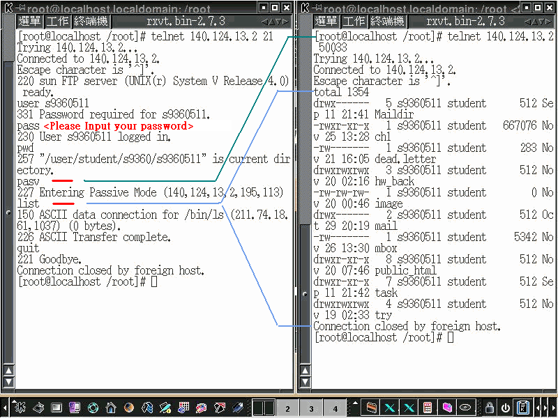

## Debug Mode

### Screenshot

- Enable `Debug Mode` (with `-d` optional)  when accessing FTP server.  

  ```bash
  ftp -d 140.124.13.2
  ```

- User can observe and diagnostic the command when the FTP-Client issues to FTP-Server. 

  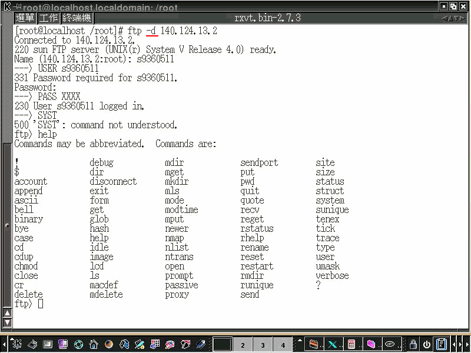

- In the case, we learned `ls` command was the combination of `PASV` and `LIST` commands.

  

## RFC 959

### Get RFC 959 from any FTP Server 
- Try to find the `ref959` document from `NCU Archie Service`. 

  

- Use NCTU FTP Server.    

  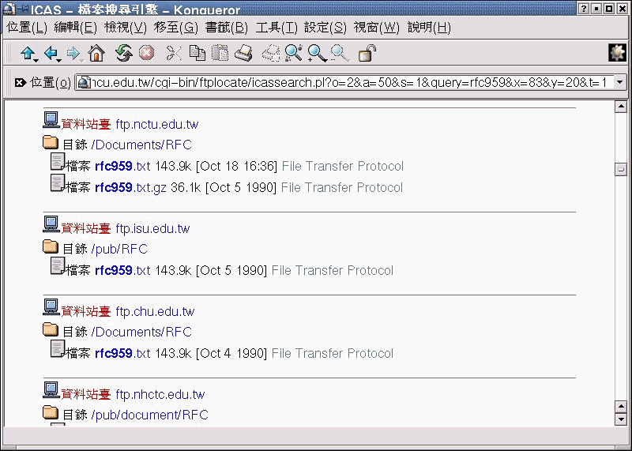

- FTP to NCTU FTP Server.  

  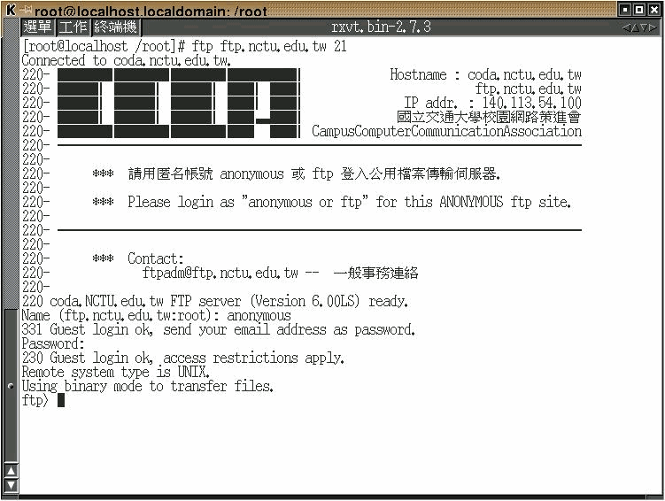

- Login with `anonymous` account, use `Email Address` as `Login Password`, list available command(s) by pressing `help`.  

  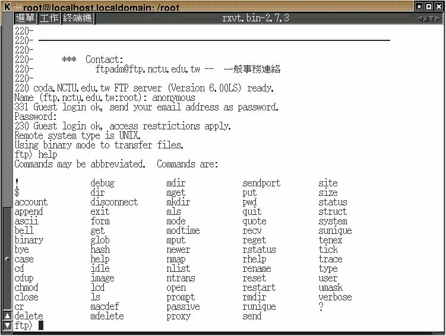

- Listing all files.  

  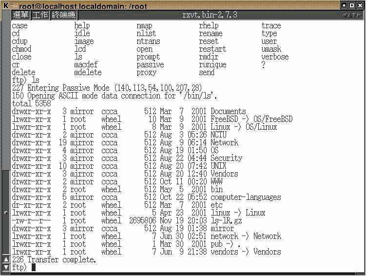

- Navigate to `Documents/RFC`, issue below command to fetch RFC file.

  ```bash
  get rfc959.txt      #<= get file rfc959.txt
  quit                #<= logout FTP server
  ```  

  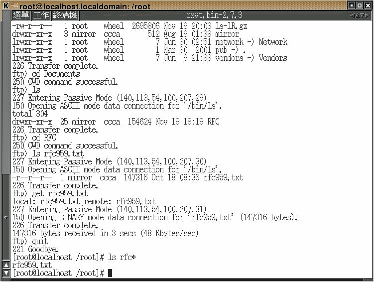

- Reading from the Editor.  

  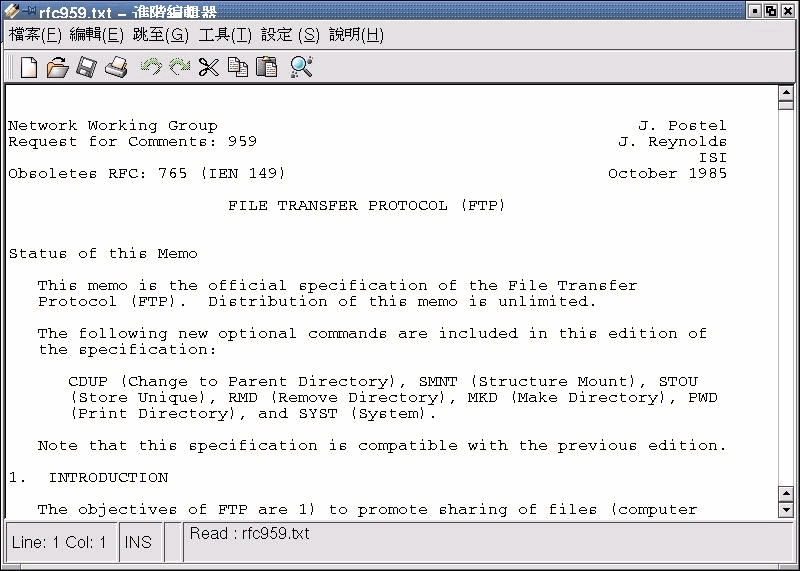


### Get RFC 959 from IEFT 

- We can found RFC from [IETF](http://www.ietf.org/rfc) Website also.  
  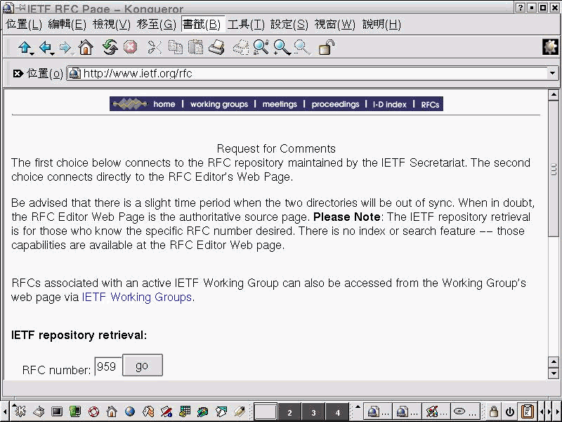

- Display `RFC 0959`  
  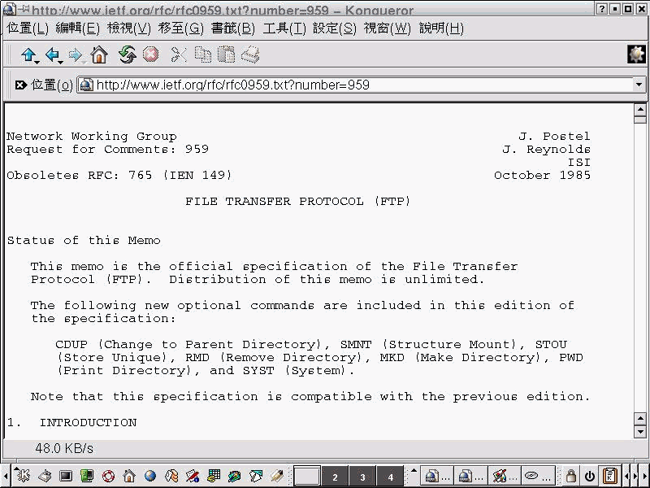


## Advanced

- FTP Code `226`
  - Closing data connection. Requested file action successful (file transfer, abort, etc.).