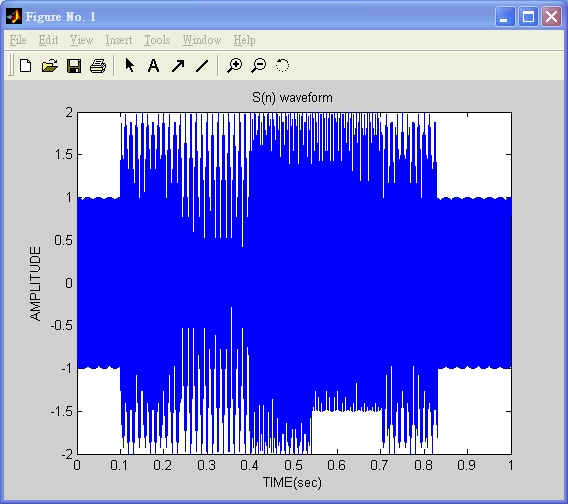
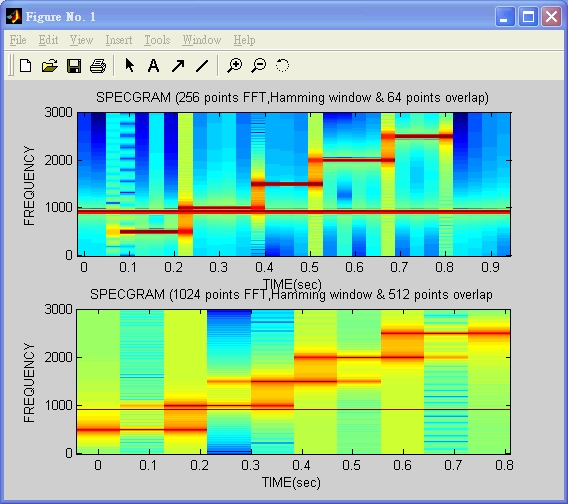
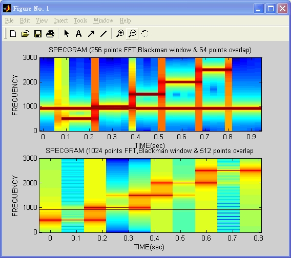

# [DSP (Digital Signal Processing)]((../))

## Spectrum Analysis - Window Size and the Spectrogram

```
$author:   Jing-Wen (Ed) Lai 
$initial:  Dec. 2002           
$revised:  Mar. 2018
$keywords: dsp, digital, signal, processing, spectrogram, matlab, windows, overlap
```

生成以下兩筆訊號, 兩筆訊號混合後, 觀察其在頻域之性質。

- S1 (t) = COS(2π **f1** t), f1=900
- S2(t) = COS(2π **f2** t),
  - f2= 500, t = 0.1s~0.24s
  - f2= 1000, t = 0.24s~0.4s
  - f2= 1500, t = 0.4s~0.54s
  - f2= 2000, t = 0.54s~0.7s
  - f2= 2500, t = 0.7s~0.83s

## Content

* [Requirements](#requirements)
* [Programming](#programming)
* [Running](#running)
  * [Screenshot](#screenshot)
  * [Step-by-Step](#step-by-step)
  * [Result](#result) 
  * [Analysis](#analysis)
  * [Conclusion](#conclusion)
* [Advanced](#advanced)
* [Comment](#comment)
* [Reference](#reference)

## Requirements

* Matlab 6.5

## Programming

```matlab
% .............................................................................
% Filename    :  dsp3.m
% Author      :  Ching-Wen,Lai 
% Running     :  running this .m file in Matlab
% Description :  Window Size and the Spectrogram  
% Date        :  01/04 2003 ver1.0
% Comment     :  Matlab Scripts : Getting SPECGRAM
%                SPECGRAM(A, NFFT, Fs, WINDOW, NOVERLAP)
% Reference   :  DSP First
% Path        :  DSP First - Text Book\CHAPTERS\9SPECTA\DEMOS\SPECGRAM\INDEX.HTM 
% .............................................................................

close all;
clear all;

fs = 6000;  
n = 1; f0 = 920; f1 = 500; f2 = 1000; f3 = 1500; f4 = 2000; f5 = 2500;

% ....................... Generating the Signal ...............................
for t=0:1/fs:1 
    if 0.1 < t & t < 0.24
        s(n) = cos(2 * pi * f0 * t) + cos(2 * pi * f1 * t);
    elseif 0.24 < t & t < 0.4
        s(n) = cos(2 * pi * f0 * t) + cos(2 * pi * f2 *t);
    elseif 0.4 < t & t < 0.54
        s(n) = cos(2 * pi * f0 * t) + cos(2 * pi * f3 * t);
    elseif 0.54 < t & t < 0.7
        s(n) = cos(2 * pi * f0 * t) + cos(2 * pi * f4 * t);
    elseif 0.7 < t & t < 0.83
        s(n) = cos(2 * pi * f0 * t) + cos(2 * pi * f5 * t);
    else 
        s(n) = cos(2 * pi * f0 * t);         
    end         
    n = n + 1; 
end

% ............................... Display Signal  .............................

t = 0:1/fs:1; plot(t,s);
ylabel('AMPLITUDE'); xlabel('TIME(sec)'); title('S(n) waveform');

% ................ Display Specgram using Hamming windows .....................

k=input('請按下 任一鍵 顯示 SPECGRAM - Hamming window');

subplot(211); specgram(s, 256, fs, hamming(256),64);         
ylabel('FREQUENCY'); xlabel('TIME(sec)');
title('SPECGRAM (256 points FFT, Hamming window & 64 points overlap)');

subplot(212); specgram(s, 1024, fs, hamming(1024),512);
ylabel('FREQUENCY'); xlabel('TIME(sec)');
title('SPECGRAM of o/p (1024 points FFT, Hamming window & 512 points overlap');

% ............. Display Specgram using Blackman windows .......................

k=input('請按下 任一鍵 顯示 SPECGRAM - Blackman window');

subplot(211); specgram(s, 256, fs, blackman(256), 64);
ylabel('FREQUENCY'); xlabel('TIME(sec)');
title('SPECGRAM (256 points FFT, Blackman window & 64 points overlap)');

subplot(212); specgram(s, 1024, fs, blackman(1024), 512);
ylabel('FREQUENCY'); xlabel('TIME(sec)');
title('SPECGRAM (1024 points FFT, Blackman window & 512 points overlap');
```

## Running

### Screenshot     

    

### Step-by-Step

| Step   | Prompt                                        | Description |
| ------ |-----------------------------------------------|----------------------------------------------------------- |
| 1      | >> dsp3                                       |                                                            |
| 2      | 請按下 任一鍵 顯示 SPECGRAM - Hamming Window  | Please Press any key to display SPECGRAM - Hamming Window  |
| 3      | 請按下 任一鍵 顯示 SPECGRAM - Blackman Window | Please Press any key to display SPECGRAM - Blackman Window |
| 4      | >>                                            |                                                            |

### Result

- Input Data    
      

- Hamming window    
      
  - 上圖犧牲 Frequency 上的解析度,  但增加時間軸上的解析度。
  - 下圖 Frequency 上的解析度較細, 但犧牲了 時間軸上的解析度，不知訊號在何時改變。端看所需之目地來選擇要使用的處理模式。
  
- Blackman window    
      
  - 上圖犧牲 Frequency 上的解析度,  但增加時間軸上的解析度。
  - 下圖 Frequency 上的解析度較細, 但犧牲了 時間軸上的解析度，不知訊號在何時改變。端看所需之目地來選擇要使用的處理模式。

### Analysis

| Original           | Hamming Window         |  Blackman Window        |
| -------------------|------------------------|-------------------------|
|    |  |  |

### Conclusion

- 觀察得知
  - Hamming Window 的能量較 Blackman window 集中. Overlap 讓相鄰的 框(FRAME)看起來較為平順(smooth).

## Advanced

- n/a

## Comment

- 如果 Matlab 6.0 無法被安裝在 Intel Pentium 4 (含 Intel Celeron 1.8G 以上 ), 可以嘗試安裝 Matlab 6.5 以上.

## Reference


- [Discrete-Time Signal Processing](https://books.google.com.tw/books/about/Discrete_Time_Signal_Processing.html?id=geTn5W47KEsC&redir_esc=y) 
  - author: Alan V. Oppenheim,Ronald W.Schafer and John R.Buck,
  - publisher: Prentice Hall
  - isbn: 0-13-0834443-2
  - sample code in cdrom: `Text Book\CHAPTERS\9SPECTA\DEMOS\SPECGRAM\INDEX.HTM`
