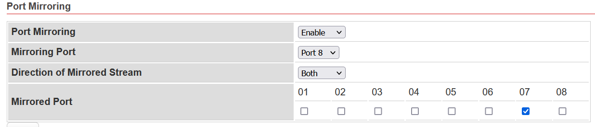

# Equipments

## Network Hub (Optional)

If you don't to want to spend your time to set `Port Mirror` to Network Switch, please consider to buy ancient Hub for packet sniffing.

- LINKSYS EW5HUB Instant Ethernet Workgroup 10M 5-port Hub
- D-Link DE-805TP 10Mbps Ethernet Mini Hub 5-Port

## Network Switch

better to have `Port Mirroring` function for the Network Switch.

### [DGS-1210-10P](http://www.dlinktw.com.tw/business/product?id=343)

### [VigorSwitch G1080](https://www.draytek.com/products/vigorswitch-g1080/)

- Default IP: 192.168.1.224
- Default Password: admin
- Port Mirroring:



## Ethernet Router

### [MikroTik RB750Gr3 hEX](https://mikrotik.com/product/RB750Gr3)

RouterOS is the nice operating system which has good cost performance ratio.
#### Config PPPoE server with VLAN support

```
Interfaces > VLAN > Name: vlan2 , VLAN ID: 2, Interface: eth3
IP > Pool > Name: PPPoE_Pool, Address: 10.1.1.2-10.1.1.254
PPP > Profiles > Name: PPPoE_profile, Local Address: 10.1.1.1, Remote Address: PPPoE_Pool
PPP > PPPoE Server > Interface: vlan2; Default Profile: PPPoE profile
```

#### Reference

- [MikroTik RouterOS 建置 PPPoE Server 防止 ARP 攻擊 (房東必備)](https://www.ez2o.com/Blog/Post/MikroTik-RouterOS-PPPoE-Server)

- [MIKROTIK:-PPPoE configuration On VLAN Interface](http://laxmidharnetworking.blogspot.com/2017/06/mikrotik-pppoe-configuration-on-vlan.html) 