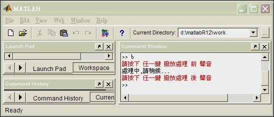
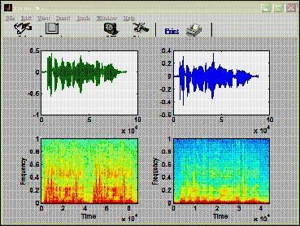

# Moving Average and Backward System


An implementation of using below methods to process human voice and comparing their output results

- Backward System (High-Pass Filter)
- Moving Average (Low-Pass Filter)

## Requirements

* Voice Recorder (Windows), for recording human voice
* Matlab 6.5, for processing the original voice and export the results

## Backward System

### Programming

```matlab
%..............................................................................
% Filename      : b.m
% Author        : Ching-Wen,Lai 
% Running       : running this .m file in Matlab
% Description   : High-Pass-Filter
%
% Date          : 10/21 2002 ver1.0
% Input Voice   : speech.wav (PCM 格式)
% Output Voice  : speech_m.wav(PCM 格式)
% 
% References    : Backward System
%                 Book : Discrete-Time Signal Processing 
%                 (ISBN: 0-13-0834443-2 p.21(2.45式)
%..............................................................................

fs=8000;

%  ..........................  語音取樣開始  ..................................

[ x,fs ] = wavread('speech.wav');            % 讀取 speech.wav 檔案內的語音樣本
k=input('請按下 任一鍵 撥放處理 前 聲音');
wavplay(x,fs);                               % 處理前先試聽該語音樣本

% ............   進行 DSP 處理  【  Backward System 】.........................

fprintf('處理中,請稍候...\n');
len=length(x);
for n = 1:len,                               % n  :: 語音資料數目
    if n == 1
        y(n) = x(n);                         % Backward System 第一筆不作累計      
    else
        y(n) = x(n)- x(n-1);                 % 將之前取樣值拿來與目前的相減
    end  
end

% ......... DSP 處理後結果::產生波型圖與頻譜 .....................................               

k=input('請按下 任一鍵 撥放處理 後 聲音');
wavplay(y,fs);                               % 聽處理后聲音
wavwrite(y, fs, 16, 'speech_b.wav');         % 寫入 speech_b.wav 檔

subplot(221), plot((1:length(x)),x);
subplot(223), specgram(x(:));
subplot(222), plot((1:length(y)),y);
subplot(224), specgram(y(:));
shg
```

### Screenshot     

    

### Step-by-Step

| Step | Prompt                 | Description                                    | Audio                 |
| ---- |------------------------| -----------------------------------------|-----------------------|
| 1    | >> b                   | Launch the program of Backward System    |                       |
| 2    | 請按下任一鍵撥放處理前聲音 | Play the original voice before proceeded | <audio controls=""><source src="speech.wav" type="audio/wav"></audio>     |
| 3    | 處理中,請稍候...         | Running Backward System                  |                                                                           |
| 4    | 請按下任一鍵撥放處理後聲音 | Play the output voice before proceeded   | <audio controls=""> <source src="speech_b.wav" type="audio/wav"> </audio> |
| 5    | >>                     |                                          |                                                                  

## Moving Average

### Programming

```matlab
%........................................................................................
% Filename     : m.m
% Author       : Ching-Wen,Lai
% Running      : running this .m file in Matlab
% Description  : Low-pass-Filter
%
% Date         : 10/21 2002 ver1.0
% Input Voice  : speech.wav (PCM 格式)
% Output Voice : speech_m.wav(PCM 格式)
% Advanced     : 由於程式在作累加與平均的工作。此次累加值只與上一筆差一筆新值與一筆舊值，
%                故累加動作可以改成只有第一次作累加， 之後作加上去新值與減去一筆舊值(之前
%                的最前取樣點)，如此累加的動作會較快。但目前為方便，直接搭配課本易閱讀於,
%                目前並無此動作
% Reference    : Moving Average
%                BOOK:  Discrete-Time Signal Processing 
%                (ISBN: 0-13-0834443-2 p.17(2.24式)
%........................................................................................

fs=8000;                              % Set sampling rate

% ................................    語音檔輸入    ................................

[ x,fs ] = wavread('speech.wav');     
k=input('請按下 [Enter] 鍵 撥放處理 前 聲音');
wavplay(x,fs);

% ...................... 進行 DSP 處理  【  Moving Average 】........................

m1=input('請輸入 M1 值 :: ');          % M1 控制 比 n 點 大的取樣數
m2=input('請輸入 M2 值 :: ');          % M2 控制 比 n 點 小的取樣數
fprintf('\n處理中,請稍候...\n');
len=length(x);

for n = 1:len,                        % n  :: 語音資料數目  
    if (n &gt;= m2+1) & ( n&lt;=len-m1)     % 只有在 Moving Average 的範圍內才作處理
        sum = 0; 
        for  k = -m1:m2,              % k = -m1 ~ m2
            sum=sum+x(n-k);           % 取值放入sum作累總
        end    
        y(n) = sum/(m1+m2+1);         % 求出累加後 的平均值                
    else        
        y(n) = x(n);
        %fprintf('第 %d 點數據,不作取樣\n',n);   % Check 用
    end  
end

% ...........     DSP 處理後結果::產生波型圖與頻譜     ...............
                
k=input('請按下 [Enter] 撥放處理 後 聲音');
wavplay(y,fs);
wavwrite(y, fs, 16, 'speech_m.wav');  % 寫入 speech_m.wav 檔
subplot(221), plot((1:length(x)),x);
subplot(223), specgram(x(:));
subplot(222), plot((1:length(y)),y);
subplot(224), specgram(y(:));
shg
```

### Screenshot


### Step-by-Step

| Step | Prompt                       | Description                                                 | Audio                 |
| ---- |------------------------------| -------------------------------------------------------|-----------------------|
| 1    | >> m                         | Launch the program of Moving Average                   |                       |
| 2    | 請按下 [Enter] 鍵撥放處理前聲音 | Play the original voice before proceeded               | <audio controls=""><source src="speech.wav" type="audio/wav"></audio> |
| 3    | 請輸入 M1 值 ::               | 輸入 Moving Average 由原點之後,要一起做平均的語音訊號 Range |  |
| 4    | 請輸入 M2 值 ::               | 輸入 Moving Average 由原點之前,要一起做平均的語音訊號 Range |  |
| ...  |                              |                                                        |  |
| 5    | 處理中,請稍候...               | Running Moving Average                                 |  |
| 6    | 請按下 [Enter] 撥放處理 後 聲音 | Play the output voice after proceeded PLAY             | <audio controls=""> <source src="speech_m.wav" type="audio/wav"> </audio> |
| 7    | >>                           |                                                        | |                                                            


### Analysis

| Backward System       | Moving Average:       |
| ----------------------|-----------------------|
|  |  |
| ▲ From Spectrogram we learned this function is for High-Pass filter | ▲ From Spectrogram we learned this function is for Low-Pass filter |

### Conclusion

觀察可得, 經過Backward System 處理後語音較為高亢，而經過 Moving Average 處理後語音較為低沉.

| Voice                                   | Audio |
| ----------------------------------------|---------------------------------------------------------------------------|
| Original voice                          | <audio controls=""> <source src="speech.wav" type="audio/wav"> </audio>   |
| The Voice after running Backward System | <audio controls=""> <source src="speech_b.wav" type="audio/wav"> </audio> |
| The Voice after running Moving Average  | <audio controls=""> <source src="speech_m.wav" type="audio/wav"> </audio> |

## Advanced

- could be tried to use VHDL/Verilog to implement Moving Average and Backward System

## Comment

- try to use Matlab 6.5 if Matlab 6.0 cannot be installed for CPU Intel Pentium 4

## Reference

- [Discrete-Time Signal Processing](https://books.google.com.tw/books/about/Discrete_Time_Signal_Processing.html?id=geTn5W47KEsC&redir_esc=y) 
  - author: Alan V. Oppenheim,Ronald W.Schafer and John R.Buck,
  - publisher: Prentice Hall
  - isbn: 0-13-0834443-2


```
$author:   Jing-Wen (Ed) Lai 
$initial:  Nov. 2002           
$revised:  Mar. 2018
$keywords: dsp, digital, signal, processing, voice, moving average, backward system, matlab, speech
```