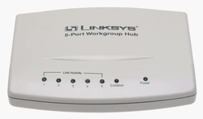
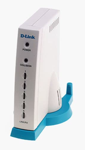
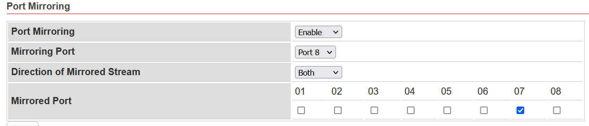
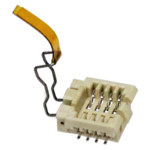

# Accessories for Firmware Development

This chapter introduces some accessories for firmware development.

## USB-to-Serial COMM port cable

### Prolific PL2303

try to buy it from [Taobao](https://www.taobao.com/). It is not very expensive.

- PID/VID: 2303/067B
- Driver: [Windows]((http://www.prolific.com.tw/US/ShowProduct.aspx?p_id=225&pcid=41))

<!--
### [FTDI chipsets]

It is expensive than PL2303.

- Driver: [Windows](https://ftdichip.com/drivers/)
-->


## Networking Equipments

### Network Hub (Optional, nice to have)

If you don't to want to spend your time to set `Port Mirror` to Network Switch, please look for ancient Hub for packet sniffing.

#### LINKSYS EW5HUB
   
#### D-Link DE-805TP

  
### Network Switch

It's better to have `Port Mirroring` function to the Network Switch.

<!--### [DGS-1210-10P](http://www.dlinktw.com.tw/business/product?id=343)-->

#### VigorSwitch G1080

8-Port Smart Lite Managed Gigabit Switch

- Default IP: 192.168.1.224
- Default Password: admin
- Website: [*](https://www.draytek.com/products/vigorswitch-g1080/#overview)
- Port Mirroring:



### Ethernet Router

#### MikroTik RB750Gr3 hEX

5x Gigabit Ethernet, Dual Core 880MHz CPU, 256MB RAM, USB, microSD, RouterOS L4.
<!--
RouterOS is the nice operating system which has good cost performance ratio.
-->

- Default IP: 192.168.88.1
- Website: [*](https://mikrotik.com/product/RB750Gr3)

- Config PPPoE server with VLAN support

```
Interfaces > VLAN > Name: vlan2 , VLAN ID: 2, Interface: eth3
IP > Pool > Name: PPPoE_Pool, Address: 10.1.1.2-10.1.1.254
PPP > Profiles > Name: PPPoE_profile, Local Address: 10.1.1.1, Remote Address: PPPoE_Pool
PPP > PPPoE Server > Interface: vlan2; Default Profile: PPPoE profile
```

- Reference
    - [MikroTik RouterOS 建置 PPPoE Server 防止 ARP 攻擊 (房東必備)](https://www.ez2o.com/Blog/Post/MikroTik-RouterOS-PPPoE-Server)
    - [MIKROTIK:-PPPoE configuration On VLAN Interface](http://laxmidharnetworking.blogspot.com/2017/06/mikrotik-pppoe-configuration-on-vlan.html)

## Wi-Fi Adaptor

There are some Wi-Fi USB dongle which can capture wireless packets in Linux OS, but MTK chipsets may have problem to capture `RTS` packets.


Clear syslog using `dmesg -c` then plug the dongle and run `lsusb`, `dmesg` and `ifconfig` to make sure this device is enabled in your machine.

### MTK 7601U

- PID/VID: 2717:4106
- Firmware: mt7601u.bin

```console
$ sudo lsusb
Bus 003 Device 025: ID 2717:4106

$ sudo dmesg
[ 2548.559092] usb 3-1: new high-speed USB device number 26 using xhci_hcd
[ 2548.718886] usb 3-1: New USB device found, idVendor=2717, idProduct=4106, bcdDevice= 0.00
[ 2548.718893] usb 3-1: New USB device strings: Mfr=1, Product=2, SerialNumber=3
[ 2548.718896] usb 3-1: Product: MI WLAN Adapter
[ 2548.718898] usb 3-1: Manufacturer: MediaTek
[ 2548.718900] usb 3-1: SerialNumber: 1.0
[ 2548.847525] usb 3-1: reset high-speed USB device number 26 using xhci_hcd
[ 2549.002214] mt7601u 3-1:1.0: ASIC revision: 76010001 MAC revision: 76010500
[ 2549.002965] mt7601u 3-1:1.0: firmware: direct-loading firmware mt7601u.bin
[ 2549.002976] mt7601u 3-1:1.0: Firmware Version: 0.1.00 Build: 7640 Build time: 201302052146____
[ 2549.396105] mt7601u 3-1:1.0: EEPROM ver:0d fae:00
[ 2549.396357] mt7601u 3-1:1.0: EEPROM country region 01 (channels 1-13)
[ 2549.603889] ieee80211 phy12: Selected rate control algorithm 'minstrel_ht'
[ 2549.619008] mt7601u 3-1:1.0 wlx8c00001900aa: renamed from wlan0

$ sudo ifconfig
wlx8c00001900aa: flags=4099<UP,BROADCAST,MULTICAST>  mtu 1500
        unspec 3A-A8-A0-8F-E9-47-30-3A-00-00-00-00-00-00-00-00  txqueuelen 1000  (UNSPEC)
        RX packets 9148  bytes 1749086 (1.6 MiB)
        RX errors 0  dropped 6499  overruns 0  frame 0
        TX packets 0  bytes 0 (0.0 B)
        TX errors 0  dropped 0 overruns 0  carrier 0  collisions 0

```

### MTK 7610

- PID/VID: 0e8d:7610
- Firmware: mediatek/mt7610e.bin

```console
$ sudo lsusb
Bus 003 Device 020: ID 0e8d:7610 MediaTek Inc.

$ sudo dmesg
[ 1563.661561] usb 3-1: new high-speed USB device number 20 using xhci_hcd
[ 1563.825615] usb 3-1: New USB device found, idVendor=0e8d, idProduct=7610, bcdDevice= 1.00
[ 1563.825622] usb 3-1: New USB device strings: Mfr=1, Product=2, SerialNumber=3
[ 1563.825625] usb 3-1: Product: WiFi
[ 1563.825627] usb 3-1: Manufacturer: MediaTek
[ 1563.825629] usb 3-1: SerialNumber: 1.0
[ 1563.954061] usb 3-1: reset high-speed USB device number 20 using xhci_hcd
[ 1564.107474] mt76x0u 3-1:1.0: ASIC revision: 76100002 MAC revision: 76502000
[ 1564.109431] mt76x0u 3-1:1.0: firmware: direct-loading firmware mediatek/mt7610e.bin
[ 1565.092770] mt76x0u 3-1:1.0: EEPROM ver:02 fae:04
[ 1565.113101] ieee80211 phy4: Selected rate control algorithm 'minstrel_ht'
[ 1565.124601] mt76x0u 3-1:1.0 wlx001122340147: renamed from wlan0

$ sudo ifconfig
wlx001122340147: flags=4099<UP,BROADCAST,MULTICAST>  mtu 1500
        ether f2:16:11:d2:7f:e3  txqueuelen 1000  (Ethernet)
        RX packets 0  bytes 0 (0.0 B)
        RX errors 0  dropped 0  overruns 0  frame 0
        TX packets 0  bytes 0 (0.0 B)
        TX errors 0  dropped 0 overruns 0  carrier 0  collisions 0

```

### MTK 7612

- SD Storage mode PID/VID: 0e8d:2870
- Wi-Fi adaptor mode PID/VID: 0e8d:7612
- Firmware: mt7662_rom_patch.bin, mt7662.bin
- Eject command: `sudo eject /dev/sr0` (depend on stroage name of `sr0`)


``` console
$ sudo lsusb
Bus 004 Device 004: ID 0e8d:7612 MediaTek Inc.

$ sudo dmesg
[ 1386.531768] usb 4-1: new SuperSpeed Gen 1 USB device number 3 using xhci_hcd
[ 1386.553264] usb 4-1: New USB device found, idVendor=0e8d, idProduct=7612, bcdDevice= 1.00
[ 1386.553271] usb 4-1: New USB device strings: Mfr=2, Product=3, SerialNumber=4
[ 1386.553274] usb 4-1: Product: Wireless
[ 1386.553276] usb 4-1: Manufacturer: MediaTek Inc.
[ 1386.553278] usb 4-1: SerialNumber: 000000000
[ 1386.684289] usb 4-1: reset SuperSpeed Gen 1 USB device number 3 using xhci_hcd
[ 1386.705420] mt76x2u 4-1:1.0: ASIC revision: 76120044
[ 1386.728319] mt76x2u 4-1:1.0: firmware: direct-loading firmware mt7662_rom_patch.bin
[ 1386.728329] mt76x2u 4-1:1.0: ROM patch build: 20141115060606a
[ 1386.860075] mt76x2u 4-1:1.0: firmware: direct-loading firmware mt7662.bin
[ 1386.860085] mt76x2u 4-1:1.0: Firmware Version: 0.0.00
[ 1386.860087] mt76x2u 4-1:1.0: Build: 1
[ 1386.860089] mt76x2u 4-1:1.0: Build Time: 201507311614____
[ 1387.590772] ieee80211 phy2: Selected rate control algorithm 'minstrel_ht'
[ 1387.609803] mt76x2u 4-1:1.0 wlx008e86000266: renamed from wlan0

$sudo ifconfig
wlx008e86000266: flags=4099<UP,BROADCAST,MULTICAST>  mtu 1500
        ether 32:62:0a:a0:25:57  txqueuelen 1000  (Ethernet)
        RX packets 0  bytes 0 (0.0 B)
        RX errors 0  dropped 0  overruns 0  frame 0
        TX packets 0  bytes 0 (0.0 B)
        TX errors 0  dropped 0 overruns 0  carrier 0  collisions 0
```

<!--
- With SD function (0e8d:2870)

```console
$ lsusb
Bus 003 Device 021: ID 0e8d:2870 MediaTek Inc.

$ sudo dmesg
[ 1805.548111] usb 3-1: new high-speed USB device number 22 using xhci_hcd
[ 1805.697239] usb 3-1: New USB device found, idVendor=0e8d, idProduct=2870, bcdDevice= 0.01
[ 1805.697246] usb 3-1: New USB device strings: Mfr=1, Product=2, SerialNumber=3
[ 1805.697249] usb 3-1: Product: Љ
[ 1805.697251] usb 3-1: Manufacturer: Љ
[ 1805.697253] usb 3-1: SerialNumber: Љ
[ 1805.698411] usb-storage 3-1:1.0: USB Mass Storage device detected
[ 1805.699041] scsi host7: usb-storage 3-1:1.0
[ 1806.709016] scsi 7:0:0:0: CD-ROM            MediaTek Flash autorun    0.01 PQ: 0 ANSI: 0 CCS
[ 1806.710264] sr 7:0:0:0: [sr0] scsi3-mmc drive: 52x/52x cd/rw xa/form2 cdda tray
[ 1806.732682] sr 7:0:0:0: Attached scsi CD-ROM sr0
[ 1806.732813] sr 7:0:0:0: Attached scsi generic sg2 type 5

$ sudo eject /dev/sr0
not an sg device, or old sg driver
eject: unable to eject, last error: No such device

$ sudo dmesg -c
[ 2046.451311] usb 3-1: USB disconnect, device number 23
[ 2046.458221] scsi 7:0:0:0: rejecting I/O to dead device
[ 2047.210411] usb 4-1: new SuperSpeed Gen 1 USB device number 7 using xhci_hcd
[ 2047.231867] usb 4-1: New USB device found, idVendor=0e8d, idProduct=7612, bcdDevice= 1.00
[ 2047.231875] usb 4-1: New USB device strings: Mfr=2, Product=3, SerialNumber=4
[ 2047.231878] usb 4-1: Product: Wireless
[ 2047.231880] usb 4-1: Manufacturer: MediaTek Inc.
[ 2047.231882] usb 4-1: SerialNumber: 000000000
[ 2047.362927] usb 4-1: reset SuperSpeed Gen 1 USB device number 7 using xhci_hcd
[ 2047.384075] mt76x2u 4-1:1.0: ASIC revision: 76120044
[ 2047.407061] mt76x2u 4-1:1.0: firmware: direct-loading firmware mt7662_rom_patch.bin
[ 2047.407071] mt76x2u 4-1:1.0: ROM patch build: 20141115060606a
[ 2047.538679] mt76x2u 4-1:1.0: firmware: direct-loading firmware mt7662.bin
[ 2047.538688] mt76x2u 4-1:1.0: Firmware Version: 0.0.00
[ 2047.538690] mt76x2u 4-1:1.0: Build: 1
[ 2047.538693] mt76x2u 4-1:1.0: Build Time: 201507311614____
[ 2048.269551] ieee80211 phy8: Selected rate control algorithm 'minstrel_ht'
[ 2048.283783] mt76x2u 4-1:1.0 wlx0013ef5f0f65: renamed from wlan0

$ sudo lsusb
Bus 004 Device 009: ID 0e8d:7612 MediaTek Inc.

$ sudo ifconfig
wlx0013ef5f0f65: flags=4099<UP,BROADCAST,MULTICAST>  mtu 1500
        ether 1a:71:52:85:55:49  txqueuelen 1000  (Ethernet)
        RX packets 0  bytes 0 (0.0 B)
        RX errors 0  dropped 0  overruns 0  frame 0
        TX packets 0  bytes 0 (0.0 B)
        TX errors 0  dropped 0 overruns 0  carrier 0  collisions 0
```
-->

### Ralink RT5372

- PID/VID: 2001:3c20
- Driver: [D-Link DWA-140 rev D1](https://deviwiki.com/wiki/D-Link_DWA-140_rev_D1) (rt2800usb)

``` console
$ dmesg
[ 7355.421533] usb 2-2: new high-speed USB device number 11 using xhci_hcd
[ 7355.586303] usb 2-2: New USB device found, idVendor=2001, idProduct=3c20, bcdDevice= 1.01
[ 7355.586309] usb 2-2: New USB device strings: Mfr=1, Product=2, SerialNumber=3
[ 7355.586313] usb 2-2: Product: 802.11 n WLAN
[ 7355.586315] usb 2-2: Manufacturer: Ralink
[ 7355.586317] usb 2-2: SerialNumber: 1.0
[ 7355.713930] usb 2-2: reset high-speed USB device number 11 using xhci_hcd
[ 7355.871253] ieee80211 phy8: rt2x00_set_rt: Info - RT chipset 5392, rev 0222 detected
[ 7355.884821] ieee80211 phy8: rt2x00_set_rf: Info - RF chipset 5372 detected
[ 7355.884997] ieee80211 phy8: Selected rate control algorithm 'minstrel_ht'
[ 7355.899487] rt2800usb 2-2:1.0 wlxd8fee3d7ae29: renamed from wlan0
[ 7355.919436] ieee80211 phy8: rt2x00lib_request_firmware: Info - Loading firmware file 'rt2870.bin'
[ 7355.919471] rt2800usb 2-2:1.0: firmware: direct-loading firmware rt2870.bin
[ 7355.919475] ieee80211 phy8: rt2x00lib_request_firmware: Info - Firmware detected - version: 0.36

$ sudo ifconfig
wlxd8fee3d7ae29: flags=4099<UP,BROADCAST,MULTICAST>  mtu 1500
        ether 96:4f:c3:ae:3b:c2  txqueuelen 1000  (Ethernet)
        RX packets 0  bytes 0 (0.0 B)
        RX errors 0  dropped 0  overruns 0  frame 0
        TX packets 0  bytes 0 (0.0 B)
        TX errors 0  dropped 0 overruns 0  carrier 0  collisions 0
```

## Bluetooth Adaptor

Install BLE tools

```console
$ sudo apt-get update
$ sudo apt-get install bluetooth bluez bluez-hcidump
```

### CP2102/CP2109

- PID/VID: 10c4:ea60

```console
$ lsusb
Bus 003 Device 027: ID 10c4:ea60 Cygnal Integrated Products, Inc. CP2102/CP2109 UART Bridge Controller [CP210x family]

$ dmesg
[ 3743.253835] usb 3-1: new full-speed USB device number 28 using xhci_hcd
[ 3743.433358] usb 3-1: New USB device found, idVendor=10c4, idProduct=ea60, bcdDevice= 1.00
[ 3743.433364] usb 3-1: New USB device strings: Mfr=1, Product=2, SerialNumber=3
[ 3743.433367] usb 3-1: Product: CP2102 USB to UART Bridge Controller
[ 3743.433370] usb 3-1: Manufacturer: Silicon Labs
[ 3743.433372] usb 3-1: SerialNumber: 0001
[ 3743.442472] cp210x 3-1:1.0: cp210x converter detected
[ 3743.444720] usb 3-1: cp210x converter now attached to ttyUSB0
```

### Cambridge Bluetooth

- PID/VID: 0a12:0001

``` console
$ lsusb
Bus 003 Device 034: ID 0a12:0001 Cambridge Silicon Radio, Ltd Bluetooth Dongle (HCI mode)

$ dmesg -c
[ 3849.277478] usb 3-1: new full-speed USB device number 33 using xhci_hcd
[ 3849.405514] usb 3-1: device descriptor read/64, error -71
[ 3849.641504] usb 3-1: device descriptor read/64, error -71
[ 3849.877474] usb 3-1: new full-speed USB device number 34 using xhci_hcd
[ 3850.081071] usb 3-1: New USB device found, idVendor=0a12, idProduct=0001, bcdDevice=88.91
[ 3850.081077] usb 3-1: New USB device strings: Mfr=0, Product=0, SerialNumber=0
[ 3850.083788] Bluetooth: hci1: unexpected event for opcode 0x0000

$ sudo hcitool dev
Devices:
        hci1    00:1A:7D:DA:71:15
        hci0    68:94:23:EB:7A:63
```

## Flash Programmer and Socket

### Flash Programmer (nice to have)

- [SF100 SPI NOR Flash](https://www.dediprog.com/product/SF100)

### SPI flash Socket 8 Pin SO8W 207mil package


