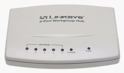
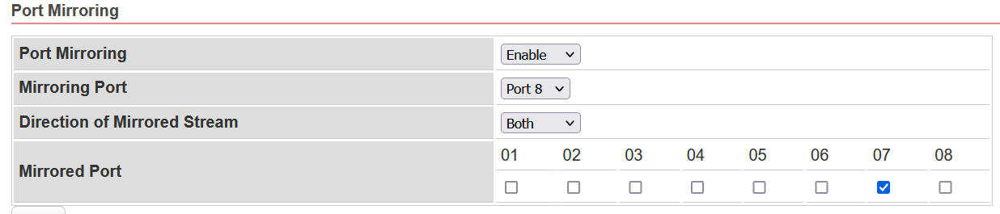

# Equipments

## Network Hub (Optional)

If you don't to want to spend your time to set `Port Mirror` to Network Switch, please look for ancient Hub for packet sniffing.

### LINKSYS EW5HUB
 
### D-Link DE-805TP


## Network Switch

It's better to have `Port Mirroring` function to the Network Switch.

<!--### [DGS-1210-10P](http://www.dlinktw.com.tw/business/product?id=343)-->

### VigorSwitch G1080

8-Port Smart Lite Managed Gigabit Switch

- Default IP: 192.168.1.224
- Default Password: admin
- Website: [*](https://www.draytek.com/products/vigorswitch-g1080/#overview)
- Port Mirroring:



## Ethernet Router

### MikroTik RB750Gr3 hEX

5x Gigabit Ethernet, Dual Core 880MHz CPU, 256MB RAM, USB, microSD, RouterOS L4.
<!--
RouterOS is the nice operating system which has good cost performance ratio.
-->

- Default IP: 192.168.88.1
- Website: [*](https://mikrotik.com/product/RB750Gr3)

- Config PPPoE server with VLAN support

```
Interfaces > VLAN > Name: vlan2 , VLAN ID: 2, Interface: eth3
IP > Pool > Name: PPPoE_Pool, Address: 10.1.1.2-10.1.1.254
PPP > Profiles > Name: PPPoE_profile, Local Address: 10.1.1.1, Remote Address: PPPoE_Pool
PPP > PPPoE Server > Interface: vlan2; Default Profile: PPPoE profile
```

- Reference
    - [MikroTik RouterOS 建置 PPPoE Server 防止 ARP 攻擊 (房東必備)](https://www.ez2o.com/Blog/Post/MikroTik-RouterOS-PPPoE-Server)
    - [MIKROTIK:-PPPoE configuration On VLAN Interface](http://laxmidharnetworking.blogspot.com/2017/06/mikrotik-pppoe-configuration-on-vlan.html) 