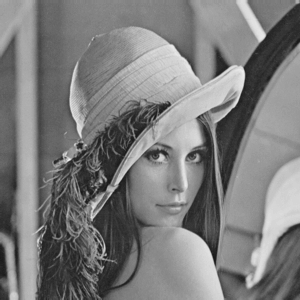

# [Image Processing](../../)

## Grayscale

```
$author:   Jin-Wen (Ed) Lai           
$date:     Mar. 2018
$keywords: image, processing, rgb, colormap, grayscale
```

An implementation of digital image processing to convert RGB image or colormap to grayscale (rgb2gray).

## Content

* [Requirements](#requirements)
* [Programming](#programming)
* [CMakeLists](#cmakelists)
* [Running](#running)

## Requirements

- OpenCV
  ```sh
  # apt-get install libopencv-dev
  # apt-get install cmake
  ```
<!-- python-opencv -->

## Programming

- create `Grayscale.cpp`    

  ```cpp
  #include <cv.h>
  #include <highgui.h>
  #include <opencv2/imgproc/imgproc.hpp>
  #include <stdio.h>
  
  using namespace cv;
  
  int main( int argc, char** argv )
  {
    Mat image;
    image = imread("../../lena.png");
  
    Mat grayscale;
    cvtColor( image, grayscale, CV_BGR2GRAY );
    imwrite( "lena_`grayscale.png", grayscale );
    return 0;
   }
```

## CMakeLists

- Create `CMakeLists.txt`    

  ```
  cmake_minimum_required(VERSION 2.8)
  project( Grayscale )
  find_package( OpenCV REQUIRED )
  add_executable( Grayscale Grayscale.cpp )
  target_link_libraries( Grayscale ${OpenCV_LIBS} )
  ```

## Running

- Issue below commands    

  ```
  cmake .
  make
  ```

- Result    

  | Original                   | Grayscale                      |
  |----------------------------|--------------------------------|
  |  |  |


#### Note:
- The canvas tag is not supported in Internet Explorer 8 and earlier versions.
- Try to Refresh this Page (Press `F5`) if you cannot see the result.

## Reference:

- [Load, Modify, and Save an Image](https://docs.opencv.org/2.4/doc/tutorials/introduction/load_save_image/load_save_image.html)
- [Reading and Writing Images](https://docs.opencv.org/3.0-beta/modules/imgcodecs/doc/reading_and_writing_images.html)
