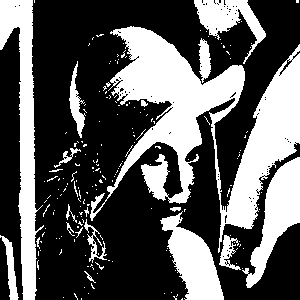

# [Image Processing](../../)

## Monochrome (B&W; Black-and-White)

```
$author:   Jin-Wen (Ed) Lai           
$date:     Mar. 2018
$keywords: image, processing, rgb, colormap, grayscale
```

An implementation of digital image processing to change RGB image or colormap to monochrome (black-and-white) image.

## Content

* [Requirements](#requirements)
* [Programming](#programming)
* [CMakeLists](#cmakelists)
* [Running](#running)

## Requirements

- OpenCV
  ```sh
  # apt-get install libopencv-dev
  # apt-get install cmake
  ```
<!-- python-opencv -->

## Programming

- create `Memochrome.cpp`    

  ```cpp
  #include <cv.h>
  #include <highgui.h>
  #include <opencv2/imgproc/imgproc.hpp>
  #include <stdio.h>
  
  using namespace cv;
  
  int main( int argc, char** argv )
  {
  
   Mat im_rgb  = imread("../../lena.png");
   Mat im_gray;
   cvtColor(im_rgb,im_gray,CV_RGB2GRAY);
   Mat img_bw = im_gray > 128;
   imwrite("lena_monochrome.png", img_bw);
   return 0;
  }
  ```

## CMakeLists

- Create `CMakeLists.txt`    

  ```
  cmake_minimum_required(VERSION 2.8)
  project( Monochrome )
  find_package( OpenCV REQUIRED )
  add_executable( Monochrome Monochrome.cpp )
  target_link_libraries( Monochrome ${OpenCV_LIBS} )
  ```

## Running

- Issue below commands    

  ``` sh
  cmake .
  make
  ./ Monochrome
  ```

- Result    

  | Original                   | Grayscale                        |
  |----------------------------|----------------------------------|
  |  |  |


#### Note:
- The canvas tag is not supported in Internet Explorer 8 and earlier versions.
- Try to Refresh this Page (Press `F5`) if you cannot see the result.

## Reference:

- [Load, Modify, and Save an Image](https://docs.opencv.org/2.4/doc/tutorials/introduction/load_save_image/load_save_image.html)
- [Reading and Writing Images](https://docs.opencv.org/3.0-beta/modules/imgcodecs/doc/reading_and_writing_images.html)
- [固定閾值(threshold)](http://monkeycoding.com/?tag=二值化)