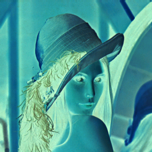

# [Image Processing](../../)

## Negative Film

An implementation of digital image processing to change RGB image or colormap to negative-film image.

* [Requirements](#requirements)
* [Programming](#programming)
* [CMakeLists](#cmakelists)
* [Running](#running)

## Requirements

- OpenCV
  ```sh
  # apt-get install libopencv-dev
  # apt-get install cmake
  ```
<!-- python-opencv -->

## Programming

- create file `Negative.cpp`    

  ``` cpp
  #include <cv.h>
  #include <highgui.h>
  #include <opencv2/imgproc/imgproc.hpp>
  #include <stdio.h>
  
  using namespace cv;
  using namespace std;
  // start of pixel navigation
  
  Mat navigate(Mat img) {
  
      if(img.channels()==1){
          Mat_<uchar>::iterator it = img.begin<uchar>();
          Mat_<uchar>::iterator itend = img.end<uchar>();
          for(;it!=itend;it++){
              (*it) = 255 - (*it);
          }
      }
      if(img.channels()==3){
          Mat_<Vec3b>::iterator it = img.begin<Vec3b>();
          Mat_<Vec3b>::iterator itend = img.end<Vec3b>();
          for(;it!=itend;it++){
              (*it)[0] = 255 - (*it)[0];
              (*it)[1] = 255 - (*it)[1];
              (*it)[2] = 255 - (*it)[2];
          }
      }
      return img;
  }
  
  // end of pixel navigation
  
  int main( int argc, char** argv )
  {
      Mat src = cv::imread("../../lena.png", CV_LOAD_IMAGE_COLOR);
  
      if(! src.data){
          cout << "could not open or find the image" << endl;
          return -1;
      }
      Mat dst = navigate(src.clone());    
      imwrite("lena_negative.png", dst);
    
      return 0;
  
  }
  ```

## CMakeLists

- Create `CMakeLists.txt`    

  ```
  cmake_minimum_required(VERSION 2.8)
  project( Negative )
  find_package( OpenCV REQUIRED )
  add_executable( Negative Negative.cpp )
  target_link_libraries( Negative ${OpenCV_LIBS} )
  ```

## Running

  | Original            | Negative Film            |
  |---------------------|--------------------------|
  | |   |


- The canvas tag is not supported in Internet Explorer 8 and earlier versions.
- Try to Refresh this Page (e.q. Pressing `F5`) if you cannot see the result.

## Reference

- [Load, Modify, and Save an Image](https://docs.opencv.org/2.4/doc/tutorials/introduction/load_save_image/load_save_image.html)
- [Reading and Writing Images](https://docs.opencv.org/3.0-beta/modules/imgcodecs/doc/reading_and_writing_images.html)
- [像素巡訪(at、ptr)](http://monkeycoding.com/?p=538)

