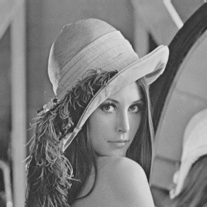

# Image Processing

## Grayscale

An implementation of digital image processing to convert RGB image or colormap to grayscale (rgb2gray).

## Content

* [Requirements](#requirements)
* [Programming](#programming)
* [Running](#running)

## Requirements

- PHP

## Programming

- create file `grayscale.php`

``` php
<?php

$img = imagecreatefrompng("../../lena.png");
imageTrueColorToPalette($img,true,256);
$numColors = imageColorsTotal($img);

for ($x = 0; $x < $numColors; $x++)
{
  list($r,$g,$b) = array_values(imageColorsForIndex($img,$x));
  $avg = intval(($r + $g + $b) / 3);
  imageColorSet($img,$x,$avg,$avg,$avg);
}
  
$img_grayscale = 'lena_grayscale.png';
imagepng($img, $img_grayscale);
imagedestroy($img);

?>
```

## Running

- Issue below command    
  ```
  # php ./grayscale.php
  ```

### Result

  | Original            | Grayscale                |
  |---------------------|--------------------------|
  | |  |

## Demo

- [Demo Site](http://45.77.13.97/cgi-bin/dip/grayscale.php)

#### Reference


#### Note:
- The canvas tag is not supported in Internet Explorer 8 and earlier versions.
- Try to Refresh this Page (e.q. Pressing `F5`) if you cannot see the result.

