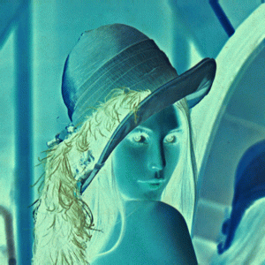

# Image Processing

## Negative Film

An implementation of digital image processing to change RGB image or colormap to negative-film image.

## Content

* [Requirements](#requirements)
* [Programming](#programming)
* [Running](#running)

## Requirements

- PHP

## Programming

``` php
<?php

$img = imagecreatefrompng("../../lena.png");
imageTrueColorToPalette($img,true,256);
$numColors = imageColorsTotal($img);
for ($x = 0; $x < $numColors; $x++)
{
  list($r,$g,$b) = array_values(imageColorsForIndex($img,$x));
  $r = 255 - $r;
  $g = 255 - $g;
  $b = 255 - $b;
  imageColorSet($img,$x,$r,$g,$b);
}

$img_negative= 'lena_negative.png';
imagepng($img, $img_negative);
imagedestroy($img);

?>
```

## Running

- Issue below command    
  ```
  # php ./negative.php
  ```

### Result

  | Original            | Negative                |
  |---------------------|-------------------------|
  | |  |


#### Note:
- The canvas tag is not supported in Internet Explorer 8 and earlier versions.
- Try to Refresh this Page (e.q. Pressing `F5`) if you cannot see the result.

