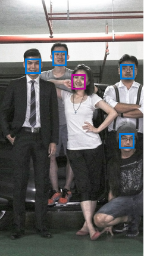

# [Image Processing](../../)

## Face Detection

An implementation of digital image processing for Face Detection.

## Content

* [Requirements](#requirements)
* [Programming](#programming)
* [Running](#running)

## Requirements

- Python
- OpenCV `apt install python-opencv`
- [haarcascade_frontalface_default.xml](haarcascade_frontalface_default.xml)

## Programming

- save below code to `face.py`

  ``` python
  import cv2
  import sys
 
  cascPath = "haarcascade_frontalface_default.xml";
  faceCascade = cv2.CascadeClassifier(cascPath)

  img = cv2.imread("../../lena.png")
  gray =cv2.cvtColor(img,cv2.COLOR_BGR2GRAY)    

  faces = faceCascade.detectMultiScale(
    gray,
    scaleFactor=1.1,
    minNeighbors=5,
    minSize=(30, 30),
    flags=cv2.cv.CV_HAAR_SCALE_IMAGE
  )

  # Draw a rectangle around the faces
  for (x, y, w, h) in faces:
    cv2.rectangle(img, (x, y), (x+w, y+h), (0, 255, 0), 2)

  cv2.imwrite('lena_face.png',img)
  ```


## Running

- The result of single face detection 

  | Original            | Single-Face Detection |
  |---------------------|-----------------------|
  | |    | 

- The result of multiple-face detection

  | Original            | Multiple-Face Detection |
  |---------------------|-------------------------|
  |        |       |


## Advanced

### [Microsoft Azure Face API](https://azure.microsoft.com/zh-tw/services/cognitive-services/face/)

- It should be five-face but we got six-face from multiple-face detection.
- It seems there is no this problem from Microsoft Azure Face API.
- Gender also be distinguished by Microsoft Azure also.

  | Original            | Face Detection by `Microsoft Azure` |
  |---------------------|-------------------------------------|
  |     |                |

## Reference

- [FACE DETECTION USING OPENCV AND PYTHON: A BEGINNER’S GUIDE](https://www.superdatascience.com/opencv-face-detection/)
- [記錄, OpenCV 學習路徑, (3) 人臉辨識 (OpenCV, Python, Face Recognition)](http://gogoprivateryan.blogspot.tw/2015/09/opencv-3-opencv-python-face-recognition.html)

## Attachment

- **Single-Face Detection:** The `JSON` result of `Microsoft Azure Face API`    
  ``` json
  [
    {
      "faceId": "ddb79f2d-3e55-4153-8d60-a51e81e85551",
      "faceRectangle": {
        "top": 131,
        "left": 126,
        "width": 97,
        "height": 97
      },
      "faceAttributes": {
        "hair": {
          "bald": 0.0,
          "invisible": true,
          "hairColor": []
        },
        "smile": 0.0,
        "headPose": {
          "pitch": 0.0,
          "roll": 0.1,
          "yaw": 30.4
        },
        "gender": "female",
        "age": 25.0,
        "facialHair": {
          "moustache": 0.0,
          "beard": 0.0,
          "sideburns": 0.0
        },
        "glasses": "NoGlasses",
        "makeup": {
          "eyeMakeup": true,
          "lipMakeup": true
        },
        "emotion": {
          "anger": 0.0,
          "contempt": 0.0,
          "disgust": 0.0,
          "fear": 0.0,
          "happiness": 0.0,
          "neutral": 1.0,
          "sadness": 0.0,
          "surprise": 0.0
        },
        "occlusion": {
          "foreheadOccluded": true,
          "eyeOccluded": false,
          "mouthOccluded": false
        },
        "accessories": [
          {
            "type": "headwear",
            "confidence": 0.97
          }
        ],
        "blur": {
          "blurLevel": "low",
          "value": 0.11
        },
        "exposure": {
          "exposureLevel": "goodExposure",
          "value": 0.58
        },
        "noise": {
          "noiseLevel": "medium",
          "value": 0.4
        }
      },
      "faceLandmarks": {
        "pupilLeft": {
          "x": 153.9,
          "y": 155.0
        },
        "pupilRight": {
          "x": 191.9,
          "y": 155.3
        },
        "noseTip": {
          "x": 183.6,
          "y": 183.3
        },
        "mouthLeft": {
          "x": 153.4,
          "y": 203.6
        },
        "mouthRight": {
          "x": 187.1,
          "y": 204.5
        },
        "eyebrowLeftOuter": {
          "x": 137.9,
          "y": 145.7
        },
        "eyebrowLeftInner": {
          "x": 173.1,
          "y": 149.7
        },
        "eyeLeftOuter": {
          "x": 147.2,
          "y": 155.9
        },
        "eyeLeftTop": {
          "x": 156.2,
          "y": 151.4
        },
        "eyeLeftBottom": {
          "x": 154.6,
          "y": 160.7
        },
        "eyeLeftInner": {
          "x": 163.3,
          "y": 158.0
        },
        "eyebrowRightInner": {
          "x": 187.4,
          "y": 149.2
        },
        "eyebrowRightOuter": {
          "x": 207.9,
          "y": 144.6
        },
        "eyeRightInner": {
          "x": 186.3,
          "y": 158.1
        },
        "eyeRightTop": {
          "x": 193.7,
          "y": 151.4
        },
        "eyeRightBottom": {
          "x": 193.9,
          "y": 160.7
        },
        "eyeRightOuter": {
          "x": 199.7,
          "y": 156.3
        },
        "noseRootLeft": {
          "x": 172.2,
          "y": 159.3
        },
        "noseRootRight": {
          "x": 183.5,
          "y": 159.9
        },
        "noseLeftAlarTop": {
          "x": 171.0,
          "y": 174.9
        },
        "noseRightAlarTop": {
          "x": 187.1,
          "y": 174.6
        },
        "noseLeftAlarOutTip": {
          "x": 166.7,
          "y": 185.9
        },
        "noseRightAlarOutTip": {
          "x": 190.0,
          "y": 183.8
        },
        "upperLipTop": {
          "x": 177.7,
          "y": 200.6
        },
        "upperLipBottom": {
          "x": 176.2,
          "y": 204.5
        },
        "underLipTop": {
          "x": 175.5,
          "y": 207.1
        },
        "underLipBottom": {
          "x": 174.6,
          "y": 213.1
        }
      }
    }
  ]
  ```
- **Multiple-Face Detection:** The `JSON` result of `Microsoft Azure Face API`    
  ``` json
  [
    {
      "faceId": "c2a726c1-1dcb-4a30-bd3b-ccb3615132c3",
      "faceRectangle": {
        "top": 896,
        "left": 801,
        "width": 110,
        "height": 110
      },
      "faceAttributes": {
        "hair": {
          "bald": 0.0,
          "invisible": true,
          "hairColor": []
        },
        "smile": 0.0,
        "headPose": {
          "pitch": 0.0,
          "roll": 2.8,
          "yaw": 11.4
        },
        "gender": "male",
        "age": 25.0,
        "facialHair": {
          "moustache": 0.1,
          "beard": 0.1,
          "sideburns": 0.1
        },
        "glasses": "ReadingGlasses",
        "makeup": {
          "eyeMakeup": false,
          "lipMakeup": false
        },
        "emotion": {
          "anger": 0.0,
          "contempt": 0.0,
          "disgust": 0.0,
          "fear": 0.0,
          "happiness": 0.0,
          "neutral": 1.0,
          "sadness": 0.0,
          "surprise": 0.0
        },
        "occlusion": {
          "foreheadOccluded": true,
          "eyeOccluded": false,
          "mouthOccluded": true
        },
        "accessories": [
          {
            "type": "glasses",
            "confidence": 0.99
          },
          {
            "type": "headwear",
            "confidence": 1.0
          }
        ],
        "blur": {
          "blurLevel": "medium",
          "value": 0.67
        },
        "exposure": {
          "exposureLevel": "goodExposure",
          "value": 0.65
        },
        "noise": {
          "noiseLevel": "high",
          "value": 0.86
        }
      },
      "faceLandmarks": {
        "pupilLeft": {
          "x": 833.0,
          "y": 924.9
        },
        "pupilRight": {
          "x": 881.3,
          "y": 926.8
        },
        "noseTip": {
          "x": 859.9,
          "y": 953.7
        },
        "mouthLeft": {
          "x": 832.0,
          "y": 976.2
        },
        "mouthRight": {
          "x": 871.6,
          "y": 980.5
        },
        "eyebrowLeftOuter": {
          "x": 809.7,
          "y": 913.2
        },
        "eyebrowLeftInner": {
          "x": 848.3,
          "y": 914.1
        },
        "eyeLeftOuter": {
          "x": 824.0,
          "y": 923.2
        },
        "eyeLeftTop": {
          "x": 833.2,
          "y": 921.5
        },
        "eyeLeftBottom": {
          "x": 832.0,
          "y": 928.2
        },
        "eyeLeftInner": {
          "x": 841.1,
          "y": 925.8
        },
        "eyebrowRightInner": {
          "x": 869.4,
          "y": 916.6
        },
        "eyebrowRightOuter": {
          "x": 897.8,
          "y": 915.9
        },
        "eyeRightInner": {
          "x": 874.8,
          "y": 926.2
        },
        "eyeRightTop": {
          "x": 883.2,
          "y": 923.4
        },
        "eyeRightBottom": {
          "x": 882.6,
          "y": 930.1
        },
        "eyeRightOuter": {
          "x": 889.9,
          "y": 927.0
        },
        "noseRootLeft": {
          "x": 850.9,
          "y": 928.7
        },
        "noseRootRight": {
          "x": 866.2,
          "y": 929.2
        },
        "noseLeftAlarTop": {
          "x": 846.5,
          "y": 944.9
        },
        "noseRightAlarTop": {
          "x": 869.7,
          "y": 946.0
        },
        "noseLeftAlarOutTip": {
          "x": 840.0,
          "y": 956.4
        },
        "noseRightAlarOutTip": {
          "x": 873.4,
          "y": 957.7
        },
        "upperLipTop": {
          "x": 855.2,
          "y": 975.0
        },
        "upperLipBottom": {
          "x": 854.6,
          "y": 979.6
        },
        "underLipTop": {
          "x": 854.6,
          "y": 980.4
        },
        "underLipBottom": {
          "x": 854.1,
          "y": 987.1
        }
      }
    },
    {
      "faceId": "5b2795a8-dc0d-4860-83de-a594f761283d",
      "faceRectangle": {
        "top": 396,
        "left": 172,
        "width": 106,
        "height": 106
      },
      "faceAttributes": {
        "hair": {
          "bald": 0.1,
          "invisible": false,
          "hairColor": [
            {
              "color": "black",
              "confidence": 1.0
            },
            {
              "color": "brown",
              "confidence": 0.93
            },
            {
              "color": "gray",
              "confidence": 0.53
            },
            {
              "color": "other",
              "confidence": 0.18
            },
            {
              "color": "blond",
              "confidence": 0.08
            },
            {
              "color": "red",
              "confidence": 0.01
            }
          ]
        },
        "smile": 1.0,
        "headPose": {
          "pitch": 0.0,
          "roll": 1.7,
          "yaw": 2.2
        },
        "gender": "male",
        "age": 27.0,
        "facialHair": {
          "moustache": 0.1,
          "beard": 0.1,
          "sideburns": 0.1
        },
        "glasses": "NoGlasses",
        "makeup": {
          "eyeMakeup": false,
          "lipMakeup": false
        },
        "emotion": {
          "anger": 0.0,
          "contempt": 0.0,
          "disgust": 0.0,
          "fear": 0.0,
          "happiness": 1.0,
          "neutral": 0.0,
          "sadness": 0.0,
          "surprise": 0.0
        },
        "occlusion": {
          "foreheadOccluded": false,
          "eyeOccluded": false,
          "mouthOccluded": false
        },
        "accessories": [],
        "blur": {
          "blurLevel": "high",
          "value": 0.96
        },
        "exposure": {
          "exposureLevel": "goodExposure",
          "value": 0.73
        },
        "noise": {
          "noiseLevel": "high",
          "value": 0.83
        }
      },
      "faceLandmarks": {
        "pupilLeft": {
          "x": 203.1,
          "y": 424.7
        },
        "pupilRight": {
          "x": 251.1,
          "y": 425.4
        },
        "noseTip": {
          "x": 225.8,
          "y": 452.9
        },
        "mouthLeft": {
          "x": 202.5,
          "y": 473.6
        },
        "mouthRight": {
          "x": 244.7,
          "y": 474.7
        },
        "eyebrowLeftOuter": {
          "x": 185.1,
          "y": 414.6
        },
        "eyebrowLeftInner": {
          "x": 218.3,
          "y": 419.1
        },
        "eyeLeftOuter": {
          "x": 195.9,
          "y": 425.0
        },
        "eyeLeftTop": {
          "x": 202.3,
          "y": 422.6
        },
        "eyeLeftBottom": {
          "x": 202.2,
          "y": 427.6
        },
        "eyeLeftInner": {
          "x": 209.2,
          "y": 426.7
        },
        "eyebrowRightInner": {
          "x": 237.6,
          "y": 418.3
        },
        "eyebrowRightOuter": {
          "x": 266.3,
          "y": 414.3
        },
        "eyeRightInner": {
          "x": 243.0,
          "y": 426.4
        },
        "eyeRightTop": {
          "x": 250.8,
          "y": 423.0
        },
        "eyeRightBottom": {
          "x": 251.3,
          "y": 428.2
        },
        "eyeRightOuter": {
          "x": 259.4,
          "y": 426.0
        },
        "noseRootLeft": {
          "x": 221.2,
          "y": 429.1
        },
        "noseRootRight": {
          "x": 233.6,
          "y": 428.9
        },
        "noseLeftAlarTop": {
          "x": 216.9,
          "y": 444.1
        },
        "noseRightAlarTop": {
          "x": 236.0,
          "y": 444.0
        },
        "noseLeftAlarOutTip": {
          "x": 210.1,
          "y": 453.3
        },
        "noseRightAlarOutTip": {
          "x": 240.8,
          "y": 454.6
        },
        "upperLipTop": {
          "x": 224.7,
          "y": 467.4
        },
        "upperLipBottom": {
          "x": 224.9,
          "y": 472.4
        },
        "underLipTop": {
          "x": 224.8,
          "y": 476.2
        },
        "underLipBottom": {
          "x": 225.1,
          "y": 483.3
        }
      }
    },
    {
      "faceId": "ec0d98e8-7255-46ca-965d-21e31983b71d",
      "faceRectangle": {
        "top": 432,
        "left": 809,
        "width": 98,
        "height": 98
      },
      "faceAttributes": {
        "hair": {
          "bald": 0.07,
          "invisible": false,
          "hairColor": [
            {
              "color": "black",
              "confidence": 0.98
            },
            {
              "color": "brown",
              "confidence": 0.95
            },
            {
              "color": "gray",
              "confidence": 0.44
            },
            {
              "color": "other",
              "confidence": 0.22
            },
            {
              "color": "blond",
              "confidence": 0.07
            },
            {
              "color": "red",
              "confidence": 0.05
            }
          ]
        },
        "smile": 0.0,
        "headPose": {
          "pitch": 0.0,
          "roll": -0.4,
          "yaw": 2.5
        },
        "gender": "male",
        "age": 43.0,
        "facialHair": {
          "moustache": 0.4,
          "beard": 0.4,
          "sideburns": 0.1
        },
        "glasses": "ReadingGlasses",
        "makeup": {
          "eyeMakeup": false,
          "lipMakeup": false
        },
        "emotion": {
          "anger": 0.0,
          "contempt": 0.0,
          "disgust": 0.0,
          "fear": 0.0,
          "happiness": 0.0,
          "neutral": 1.0,
          "sadness": 0.0,
          "surprise": 0.0
        },
        "occlusion": {
          "foreheadOccluded": false,
          "eyeOccluded": false,
          "mouthOccluded": false
        },
        "accessories": [
          {
            "type": "glasses",
            "confidence": 1.0
          }
        ],
        "blur": {
          "blurLevel": "high",
          "value": 0.76
        },
        "exposure": {
          "exposureLevel": "overExposure",
          "value": 0.76
        },
        "noise": {
          "noiseLevel": "high",
          "value": 1.0
        }
      },
      "faceLandmarks": {
        "pupilLeft": {
          "x": 834.3,
          "y": 459.4
        },
        "pupilRight": {
          "x": 879.8,
          "y": 458.8
        },
        "noseTip": {
          "x": 860.2,
          "y": 478.3
        },
        "mouthLeft": {
          "x": 841.1,
          "y": 506.3
        },
        "mouthRight": {
          "x": 874.6,
          "y": 506.0
        },
        "eyebrowLeftOuter": {
          "x": 816.5,
          "y": 445.8
        },
        "eyebrowLeftInner": {
          "x": 851.9,
          "y": 445.1
        },
        "eyeLeftOuter": {
          "x": 826.9,
          "y": 459.3
        },
        "eyeLeftTop": {
          "x": 834.9,
          "y": 456.4
        },
        "eyeLeftBottom": {
          "x": 834.7,
          "y": 461.9
        },
        "eyeLeftInner": {
          "x": 842.6,
          "y": 459.3
        },
        "eyebrowRightInner": {
          "x": 866.1,
          "y": 445.6
        },
        "eyebrowRightOuter": {
          "x": 899.8,
          "y": 447.4
        },
        "eyeRightInner": {
          "x": 871.8,
          "y": 458.9
        },
        "eyeRightTop": {
          "x": 880.3,
          "y": 456.0
        },
        "eyeRightBottom": {
          "x": 880.8,
          "y": 461.4
        },
        "eyeRightOuter": {
          "x": 889.6,
          "y": 459.2
        },
        "noseRootLeft": {
          "x": 852.6,
          "y": 459.2
        },
        "noseRootRight": {
          "x": 866.8,
          "y": 458.9
        },
        "noseLeftAlarTop": {
          "x": 849.2,
          "y": 472.8
        },
        "noseRightAlarTop": {
          "x": 869.5,
          "y": 472.1
        },
        "noseLeftAlarOutTip": {
          "x": 843.2,
          "y": 483.4
        },
        "noseRightAlarOutTip": {
          "x": 875.2,
          "y": 482.5
        },
        "upperLipTop": {
          "x": 858.3,
          "y": 496.9
        },
        "upperLipBottom": {
          "x": 858.6,
          "y": 502.1
        },
        "underLipTop": {
          "x": 859.1,
          "y": 505.1
        },
        "underLipBottom": {
          "x": 858.8,
          "y": 511.5
        }
      }
    },
    {
      "faceId": "b6fcac21-8876-4c40-89c5-078401e02ab9",
      "faceRectangle": {
        "top": 496,
        "left": 483,
        "width": 95,
        "height": 95
      },
      "faceAttributes": {
        "hair": {
          "bald": 0.03,
          "invisible": false,
          "hairColor": [
            {
              "color": "brown",
              "confidence": 0.97
            },
            {
              "color": "black",
              "confidence": 0.95
            },
            {
              "color": "gray",
              "confidence": 0.28
            },
            {
              "color": "other",
              "confidence": 0.28
            },
            {
              "color": "red",
              "confidence": 0.23
            },
            {
              "color": "blond",
              "confidence": 0.03
            }
          ]
        },
        "smile": 1.0,
        "headPose": {
          "pitch": 0.0,
          "roll": 13.2,
          "yaw": -18.9
        },
        "gender": "female",
        "age": 33.0,
        "facialHair": {
          "moustache": 0.0,
          "beard": 0.0,
          "sideburns": 0.0
        },
        "glasses": "NoGlasses",
        "makeup": {
          "eyeMakeup": true,
          "lipMakeup": false
        },
        "emotion": {
          "anger": 0.0,
          "contempt": 0.0,
          "disgust": 0.0,
          "fear": 0.0,
          "happiness": 1.0,
          "neutral": 0.0,
          "sadness": 0.0,
          "surprise": 0.0
        },
        "occlusion": {
          "foreheadOccluded": false,
          "eyeOccluded": false,
          "mouthOccluded": false
        },
        "accessories": [],
        "blur": {
          "blurLevel": "high",
          "value": 1.0
        },
        "exposure": {
          "exposureLevel": "goodExposure",
          "value": 0.67
        },
        "noise": {
          "noiseLevel": "low",
          "value": 0.28
        }
      },
      "faceLandmarks": {
        "pupilLeft": {
          "x": 515.7,
          "y": 519.0
        },
        "pupilRight": {
          "x": 556.8,
          "y": 527.6
        },
        "noseTip": {
          "x": 525.0,
          "y": 546.2
        },
        "mouthLeft": {
          "x": 505.8,
          "y": 559.5
        },
        "mouthRight": {
          "x": 550.1,
          "y": 568.9
        },
        "eyebrowLeftOuter": {
          "x": 498.8,
          "y": 507.9
        },
        "eyebrowLeftInner": {
          "x": 525.0,
          "y": 510.5
        },
        "eyeLeftOuter": {
          "x": 507.6,
          "y": 518.1
        },
        "eyeLeftTop": {
          "x": 515.2,
          "y": 515.9
        },
        "eyeLeftBottom": {
          "x": 513.4,
          "y": 521.6
        },
        "eyeLeftInner": {
          "x": 520.9,
          "y": 521.4
        },
        "eyebrowRightInner": {
          "x": 543.4,
          "y": 514.2
        },
        "eyebrowRightOuter": {
          "x": 577.9,
          "y": 524.1
        },
        "eyeRightInner": {
          "x": 548.6,
          "y": 527.7
        },
        "eyeRightTop": {
          "x": 556.9,
          "y": 524.5
        },
        "eyeRightBottom": {
          "x": 555.7,
          "y": 530.6
        },
        "eyeRightOuter": {
          "x": 563.8,
          "y": 529.8
        },
        "noseRootLeft": {
          "x": 526.2,
          "y": 523.8
        },
        "noseRootRight": {
          "x": 539.1,
          "y": 526.2
        },
        "noseLeftAlarTop": {
          "x": 519.5,
          "y": 537.5
        },
        "noseRightAlarTop": {
          "x": 538.6,
          "y": 542.7
        },
        "noseLeftAlarOutTip": {
          "x": 512.2,
          "y": 544.2
        },
        "noseRightAlarOutTip": {
          "x": 542.7,
          "y": 553.4
        },
        "upperLipTop": {
          "x": 524.4,
          "y": 560.6
        },
        "upperLipBottom": {
          "x": 523.9,
          "y": 563.7
        },
        "underLipTop": {
          "x": 523.1,
          "y": 569.8
        },
        "underLipBottom": {
          "x": 522.0,
          "y": 574.6
        }
      }
    },
    {
      "faceId": "c0a132fc-29cb-4262-8a58-fb138ff42994",
      "faceRectangle": {
        "top": 339,
        "left": 358,
        "width": 94,
        "height": 94
      },
      "faceAttributes": {
        "hair": {
          "bald": 0.08,
          "invisible": false,
          "hairColor": [
            {
              "color": "brown",
              "confidence": 0.98
            },
            {
              "color": "black",
              "confidence": 0.94
            },
            {
              "color": "blond",
              "confidence": 0.37
            },
            {
              "color": "gray",
              "confidence": 0.22
            },
            {
              "color": "other",
              "confidence": 0.09
            },
            {
              "color": "red",
              "confidence": 0.07
            }
          ]
        },
        "smile": 0.999,
        "headPose": {
          "pitch": 0.0,
          "roll": 0.0,
          "yaw": 4.7
        },
        "gender": "male",
        "age": 28.0,
        "facialHair": {
          "moustache": 0.1,
          "beard": 0.1,
          "sideburns": 0.1
        },
        "glasses": "NoGlasses",
        "makeup": {
          "eyeMakeup": false,
          "lipMakeup": false
        },
        "emotion": {
          "anger": 0.0,
          "contempt": 0.0,
          "disgust": 0.0,
          "fear": 0.0,
          "happiness": 0.999,
          "neutral": 0.001,
          "sadness": 0.0,
          "surprise": 0.0
        },
        "occlusion": {
          "foreheadOccluded": false,
          "eyeOccluded": false,
          "mouthOccluded": false
        },
        "accessories": [],
        "blur": {
          "blurLevel": "high",
          "value": 1.0
        },
        "exposure": {
          "exposureLevel": "overExposure",
          "value": 0.77
        },
        "noise": {
          "noiseLevel": "high",
          "value": 1.0
        }
      },
      "faceLandmarks": {
        "pupilLeft": {
          "x": 385.0,
          "y": 363.7
        },
        "pupilRight": {
          "x": 426.1,
          "y": 364.2
        },
        "noseTip": {
          "x": 406.6,
          "y": 386.4
        },
        "mouthLeft": {
          "x": 385.7,
          "y": 408.4
        },
        "mouthRight": {
          "x": 420.3,
          "y": 409.0
        },
        "eyebrowLeftOuter": {
          "x": 365.9,
          "y": 354.2
        },
        "eyebrowLeftInner": {
          "x": 399.4,
          "y": 353.2
        },
        "eyeLeftOuter": {
          "x": 375.9,
          "y": 364.3
        },
        "eyeLeftTop": {
          "x": 384.3,
          "y": 361.2
        },
        "eyeLeftBottom": {
          "x": 384.1,
          "y": 366.3
        },
        "eyeLeftInner": {
          "x": 391.3,
          "y": 364.8
        },
        "eyebrowRightInner": {
          "x": 413.2,
          "y": 351.9
        },
        "eyebrowRightOuter": {
          "x": 440.3,
          "y": 354.1
        },
        "eyeRightInner": {
          "x": 418.3,
          "y": 365.5
        },
        "eyeRightTop": {
          "x": 425.2,
          "y": 362.1
        },
        "eyeRightBottom": {
          "x": 425.8,
          "y": 366.7
        },
        "eyeRightOuter": {
          "x": 432.1,
          "y": 364.9
        },
        "noseRootLeft": {
          "x": 399.0,
          "y": 366.2
        },
        "noseRootRight": {
          "x": 410.9,
          "y": 366.2
        },
        "noseLeftAlarTop": {
          "x": 397.6,
          "y": 380.4
        },
        "noseRightAlarTop": {
          "x": 414.2,
          "y": 380.5
        },
        "noseLeftAlarOutTip": {
          "x": 391.3,
          "y": 387.9
        },
        "noseRightAlarOutTip": {
          "x": 419.2,
          "y": 389.6
        },
        "upperLipTop": {
          "x": 406.4,
          "y": 401.4
        },
        "upperLipBottom": {
          "x": 406.3,
          "y": 405.4
        },
        "underLipTop": {
          "x": 405.3,
          "y": 412.9
        },
        "underLipBottom": {
          "x": 405.3,
          "y": 417.9
        }
      }
    }
  ]
  ```
