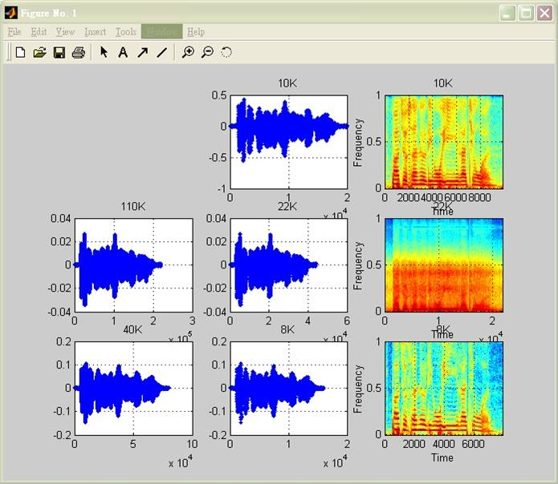
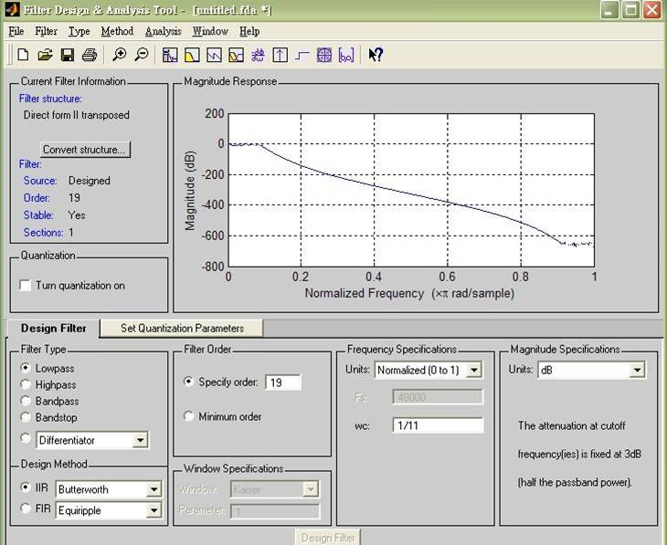
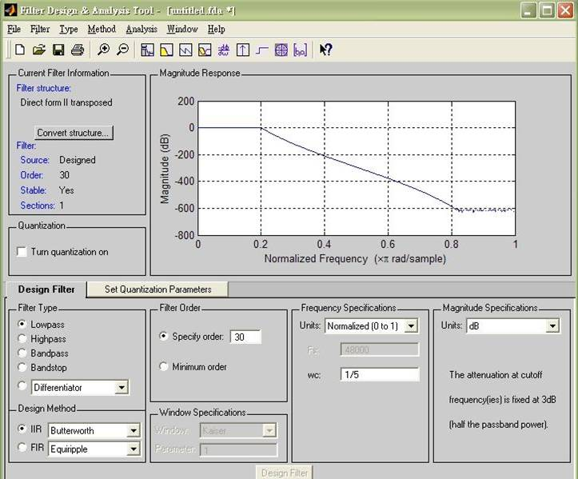
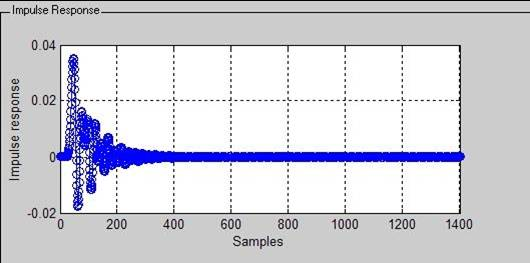
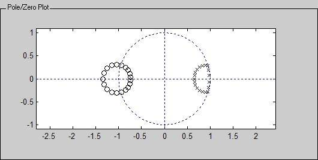
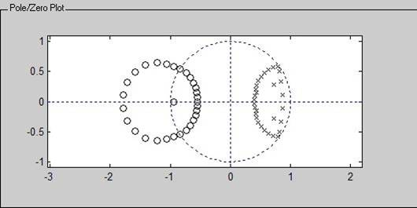
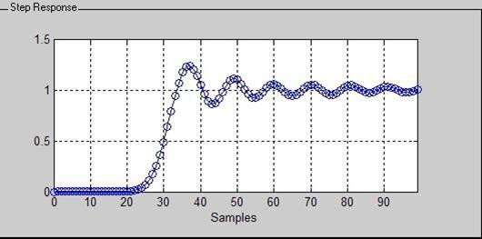

# Discrete-Time Processing

An implementation of changing the 10K sampling-rate-voice to

- 22K sampling-rate-voice
- 8K sampling-rate-voice

## Requirements

- Matlab 6.5
- CoolEdit 2000

## Programming

```matlab
%..............................................................................
% Filename    : dsp2.m
% Author      : Ching-Wen,Lai 
% Running     : running this .m file in Matlab
% Description : Changing the Sampling Rate 
%
% Date        : 12/02/2002  ver2.0  
%               1. 更正 22K 的 butter filter 成 stable – 減少爆音現象
%               2. 更正 8K  butter filter , Wc=1/5 (取最小的)
%               3. 更正 10K Plot 錯誤 與 新增 頻 域 圖 形 
% Requirement : speech_10K.wav     (PCM 格式 ; sampling rate = 10K)
%
% Result      : 1. speech_22K.wav  (PCM 格式 ; sampling rate = 22K)
%               2. speech_8K.wav   (PCM 格式 ; sampling rate =  8K) 
%
% References  : Chapter 4.6 Changing The Sampling Rate using 
%               Discrete-Time Processing
%               Book::Discrete-Time Signal Processing 
%               (ISBN: 0-13-0834443-2  )
%
% Comment     : 使用 矩陣方式 處理 ,比 用Loop方式處理(for...), 速度快很多
%..............................................................................

clear all;
fs = 10000;                                      % set sampling rate

%==============================================================================
%              輸入 處理 10 K 語音資料
%==============================================================================

[ x,fs ] = wavread('speech_10K.wav');            % loading the PCM speech file
len=length(x);
k=input('請按下 任一鍵 播放 10K 語音');             % playing it 
wavplay(x,fs);

%==============================================================================
%              進行 DSP 處理 (10K -> 110K --> 22K )
%==============================================================================

fprintf('將 10K 轉成 22K 處理中,請稍候...\n');

%..............................................................................
%  [ Up sampling ] 10K -> 110K          
%  x_110K = {  x[ n/len ] , n= 0,|L|,|2l|,... 
%                  {  0, Otherwise , 參考課本 4.84 式(p.172) 
%..............................................................................

x_110K= [ zeros(len,10) x ];      
x_110K = x_110K';                                %  轉置該矩陣 成 課本 4.84式
%..............................................................................
%
%  使用  時域 Butterworth 數位濾波器 做 訊號重建
%           同頻域 sinc 方式重建  ( 課本 4.88式 )
%..............................................................................

[ b ,a ] = butter( 19 , 1/11);                   % 1/11 與 1/5 取最小的 
x_110K = filter(b,a,x_110K(:)); 

%..............................................................................
%   [ Down sampling ] 110K -> 22K
%   X_110K[n] = X_22K [ nM ]  , M = 1/5
%                        課本 4.71式 
%..............................................................................

x_22K = reshape(x_110K(:),5,(len*11)/5);         %  重新安排矩陣的形狀                                                                                      
x_22K=x_22K';                                    %  轉置該矩陣
x_22K = x_22K(:, 5 ) ;                           %  M= 1/5, 取出第五行          
                         
%==============================================================================
%              輸出 處理結果 ( 10 K --> 22K )
%==============================================================================

k=input('請按下 任一鍵 撥放 22K 聲音');
wavplay( x_22K(:), fs*2.2 );
wavwrite( x_22K(:), fs*2.2 ,16,'speech_22K.wav');

%==============================================================================
%              進行 DSP 處理 (10K -> 40K --> 8K )
%==============================================================================

fprintf('將 10K 轉成 8K 處理中,請稍候...\n');

%..............................................................................
%           [ Up sampling ] 10K -> 40K          
%  x_40K  = {  x[ n/len ] , n= 0,|L|,|2l|,... 
%                 {  0, Otherwise , 參考課本 4.84式(p.172) 
%..............................................................................

x_40K= [ zeros(len,3) x ];      
x_40K = x_40K';                                  %  轉置該矩陣

%..............................................................................
%
%  使用  時域 Butterworth 數位濾波器 做 訊號重建
%      同頻域 sinc 方式重建  ( 課本 4.88式 )
%..............................................................................

[ b ,a ] = butter( 30 , 1/5);                    % 1/5 與 1/4 取最小的             
x_40K = filter(b,a,x_40K(:)); 

%..............................................................................
%   [Down sampling ] 40K -> 8K
%   X_110K[n] = X_22K [ nM ]  , M = 1/5
%                               課本 4.71式 
%..............................................................................

x_8K = reshape(x_40K(:),5,(len*4)/5);            %  重新安排矩陣的形狀                                                                                           
x_8K=x_8K';                                      %  轉置該矩陣
x_8K = x_8K(:, 5 ) ;                             %  M=1/5, 取出第五行                                   

%============================================================================== 
%              輸出 處理結果 ( 10 K --> 8K )
%==============================================================================

k=input('請按下 任一鍵 撥放 8K 聲音');
wavplay( x_8K(:), fs*0.8 );
wavwrite( x_8K(:), fs*0.8 ,16,'speech_8K.wav');

%==============================================================================
%  繪出 各處理階段的 訊號 ( 10K/ 110K/ 22K/ 40K/ 8K ), 方便 比較
%==============================================================================

subplot(332), plot(x(:),'.'),grid                % 繪出 原始 10K 訊號
title('10K')
subplot(333), specgram(x(:)),grid                % 繪出 10K 訊號 頻譜圖
title('10K')

subplot(334), plot(x_110K,'.'),grid              % 繪出 110K 訊號
title('110K')
subplot(335), plot(x_22K,'.'),grid               % 繪出 22K 訊號
title('22K')
subplot(336), specgram(x_22K(:)),grid            % 繪出 22K 訊號 頻譜圖
title('22K')

subplot(337), plot(x_40K,'.'),grid               % 繪出 40K 訊號
title('40K')
subplot(338), plot(x_8K,'.'),grid                %  繪出8K 訊號
title('8K')
subplot(339), specgram(x_8K(:)),grid             %  繪出 8K 訊號 頻譜圖
title('8K')
shg
```

## Running

### Screenshot     

    

### Step-by-Step

| Step   | Prompt                        | Description                                           | Audio                 |
| ------ |-------------------------------| -------------------------------------------------|-----------------------|
| 1      | >> dsp3                       | Launch the program of Changing The Sampling Rate |  |
| 2      | 請按下 任一鍵 播放 10K 語音      | Play the original voice before proceeded         | <audio controls=""><source src="speech_10K.wav" type="audio/wav"></audio>   |
| 3      | 將 10K 轉成 22K 處理中,請稍候... | Changing the sample rate to 22K voice            |                                                                             |
| 4      | 請按下 任一鍵 播放 22K 語音      | Play the output voice after proceeded            | <audio controls=""> <source src="speech_22K.wav" type="audio/wav"> </audio> |
| 5      | 將 10K 轉成 8K 處理中,請稍候...  | Changing the sample rate to 8K voice             |                                                                             |
| 6      | 請按下 任一鍵 播放 8K 語音       | Play the output voice after proceeded            | <audio controls=""> <source src="speech_8K.wav" type="audio/wav"> </audio>  |
| 7      | >>                            |                                                  |

### Result

    

▲ 圖形中可觀察, Up Sampling 與 Down Sampling 時的失真程度
- 右邊為upSampling,到 110K 與 40K 的波形。
- 中間上面為原始波形外,上至下各為 downSampling 到 22K, 與 8K 的波形。
- 左邊即為 10K, 22K, 8K分別對應的頻譜圖.

### Observation

| Sampling Rate    | 22K                                | 8K                                  |
| -----------------|------------------------------------|-------------------------------------|
| fdatools         | fdatools [Wc = 1 /11, order = 19 ]  ▲使用 Butterworth filter ,並將之調到 Stable| fdatools [ Wc = 1 /5, order = 30 ]   ▲使用 Butterworth filter ,並將之調到 Stable|
| Impulse Response |  |  |
| Zero-pole plot   |  |  |
| Step Response    |  |  |
| Phase Response   |  |  |

### Conclusion

- 觀察得知
  - Hamming Window 的能量較 Blackman window 集中.
  - Overlap 讓相鄰的 框(FRAME)看起來較為平順(smooth).

## Advanced

- 可以利用 Fdatools 試試其它型式 IIR或 FIR 的 濾波器.

## Comment

- 如果 Matlab 6.0 無法被安裝在 Intel Pentium 4 (含 Intel Celeron 1.8G 以上 ), 可以嘗試安裝 Matlab 6.5 以上 。
- Up Sampling 內的程式內的內差法，為求簡化.

## Reference

### Book

- [Discrete-Time Signal Processing](https://books.google.com.tw/books/about/Discrete_Time_Signal_Processing.html?id=geTn5W47KEsC&redir_esc=y) 
  - Author: Alan V. Oppenheim,Ronald W.Schafer and John R.Buck,
  - Publisher: Prentice Hall
  - ISBN: 0-13-0834443-2

```
$author:   Jin-Wen (Ed) Lai 
$initial:  Dec. 2002           
$revised:  Mar. 2018
$keywords: dsp, digital, signal, processing, up sampling, down sampling, matlab, speech
```