# Man-Machine Interfaces

## Industry Standard Architecture (ISA)

```
$author:   Ching-Wen (Ed) Lai
$date:     May. 2003
$revised:  Mar. 2018
$keywords: man, machine, interface, industry standard architecture, isa
```

An exercise of Intel 8255 PIO (Programmable Peripheral Interface, PPI) control via ISA interface. Blinking LED on Red Hat Linux. 

1. Doing `circuit design work` by using `OrCAD` 
2. `Soldering` circuit board by using `Hand Tools`
3. Verifying circuit board by using `debug` command on DOS
4. Blinking LED by using  Linux `C` and `C++` on Linux 

## Content

* [Concept](#concept)
* [Requirements](#requirements)
  * [Hardware](#hardware)
    * [Schematic](#schematic)
    * [Components](#components)
    * [Soldering](#soldering)
    * [Hand Tools](#hand-tools)
    * [Safety First](#safety-first)
  * [Software](#software)
* [Demonstration](#demonstration)
  * [DOS](#dos)
    * [Debug](#debug)
  * [Linux](#linux)
    * [C](#c)
    * [C++](#c-1)
  * [Windows](#windows)
    * [Turbo C](#turbo-c)
* [Advanced](#advanced)
    * [Qt](#qt)
* [References](#reference)
* [Appendix](#appendix)
  * [Appendix A - PC AT Interface Pinout](#appendix-a---pc-at-interface-pinout)
  * [Appendix B - Intel 82C55A Programmable Peripheral Interface Pinout](#appendix-b---intel-82c55a-programmable-peripheral-interface-pinout)
  * [Appendix C - Intel 8254 Programmable Interval Timer Pinout](#appendix-c---intel-8254-programmable-interval-timer-pinout)
  * [Appendix D - Remote Access by VNC](#appendix-d---remote-Access-by-vnc)  

## Concept

基本 I/O 控制實驗，設計一塊 ISA 電路板，利用 Intel 8255 擴充電腦 IO port, 並控制 LED 閃爍. 

## Requirements

### Hareware

#### Schematic

- Electronic Schematic    
  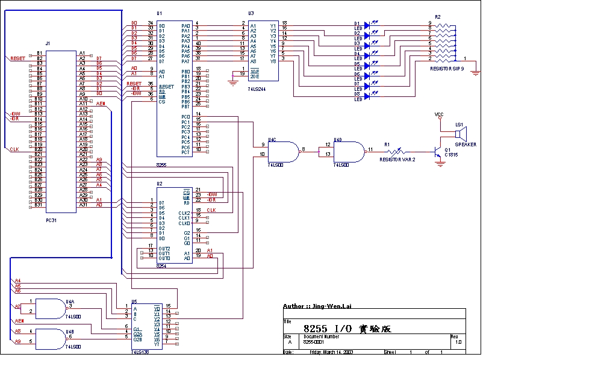

- I/O Address mapping of Intel 8255:    

  | 8255A (Selects)       | A1 | A0 | I/O Address |
  |-----------------------|----|----|-------------|
  | Port A                | 0  | 0  | 300H        |
  | Port B                | 0  | 1  | 301H        |
  | Port C                | 1  | 0  | 302H        | 
  | Control Word Register | 1  | 1  | 303H        |

- I/O Address mapping for Intel  8254:    

  | 8254 (Selects)       |A1 |A0 | I/O Address|
  |----------------------|---|---|------------|
  |Counter 0             |0  |  0| 320H       |
  |Counter 1             |0  |  1| 321H       |
  |Counter 2             |1  |  0| 322H       |
  |Control Word Register |1  |  1| 323H       |

- Power Source Pin Number:    

  | TTL | 8255|8254|74LS138 (3-8 Decode)|74LS00 (NAND)|74LS244 (Locker)|
  |-----|-----|----|--------------------|-------------|----------------|
  | +5V | 26  | 24 | 16                 |14           |20              |
  | GND |  7  | 12 | 8                  |7            |10              |

#### Soldering

- Good    

  |Front View                        |Inserting Board into ISA slot on PC |
  |----------------------------------|------------------------------------|
  | 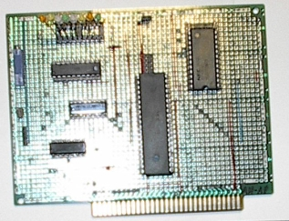                    | 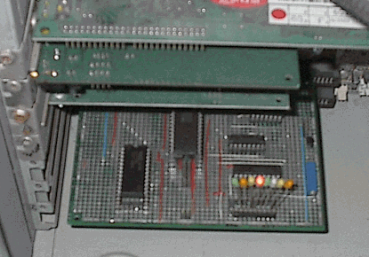                 |

#### Hand Tools

- 準備一般的焊接工具即可, 另有 可有可無的 防靜電用躡子、一號起子、十號起子…不再贅述.    

  | No | 手工具名稱      | 數量 | 單位 | 品牌/規格    | 備註                             |
  |----|-----------------|------|------|--------------|----------------------------------|
  | 1  | 電烙鐵          | 1    | 支   |              |                                  |
  | 2  | 尖嘴鉗          | 1    | 支   | /PN-2005     |                                  |
  | 3  | 斜口鉗          | 1    | 支   | /TR-25-P     |                                  |
  | 4  | 吸錫器          | 1    | 支   |              |                                  |
  | 5  | 銲錫            | 1    | 捲   |              | Consumables                      |
  | 6  | 鍍銀線          | 1    | 捲   | OK / R26-500 | Consumables; Optional            |
  | 7  | 錫油(錫膏 )     | 1    | 罐   | goot / BS-10 | Consumables; Optional            |
  | 8  | 三用電錶        | 1    | 台   |              | 用於測焊接完後的電路版是否有短路 |

#### Components

- Electronic Components    

  | No | 零件名稱            | 數量     | 備註                                                       |
  |----|---------------------|----------|------------------------------------------------------------|
  | 1  | 82C55               | 1        | 可程式規劃邏輯介面 ; PPI                                   |
  | 2  | 8254 ( 或 D71054C ) | 1        | 可程式規劃計數(時)介面 / 最高輸入時序 8 MHz                |
  | 3  | 74LS138             | 1        | 解碼致能 8255 與 8254 用                                   |
  | 4  | 74LS00              | 1        | 解碼致能 74LS138 與 喇叭電路                               |
  | 5  | 5K 可調式電阻       | 1        | 喇叭電路用                                                 |
  | 6  | C1815               | 1        | 喇叭電路用 , 編號面 接腳 ECB                               |
  | 7  | 喇叭                | 1        | 喇叭電路用, 使用 PC 上的喇叭即可                           |
  | 8  | LED                 | 8        | 檢視8255 portA 輸出用 <!--(十顆包裝型 LED 有時無法動作)--> |
  | 9  | PC ISA 空版         | 1        | 金手指 AT 介面電路板                                       |
  | 10 | IC 腳座             | N/A      | 上述 IC 所需腳座                                           |

  PS. 排針座可視需要準備.

- Orcad Family Release 9.2 Lite Edition    

  |NO|Orcad 零件庫          | 零件名稱     |
  |--|----------------------|--------------|
  |1 | MISC                 | 82C55A, 8254 |
  |2 | MUX DECODER GATE     | 74LS138      |
  |3 | BUSDRIVER TRANSCEIVER| 74LS00       |
  |4 | DISCRETE             |              |
  |5 | CONNECTOR            |              |

- 電路改良    

  |NO| 項目                       | 說明                        |
  |--|---------------------------|-----------------------------|
  |1 | 旁路電容                    | 每顆 IC 旁靠近電源處可加上  |
  |2 | LED 的限流電阻              | |
  |3 | DIP SWITCH 的光藕合電晶體    | |

#### Safety First

- **Short Circuit**: 當電路焊接完畢後, 需使用三用電表，確定電路板的正負電源沒有短路.

### Software

- MicroSoft DOS (Disk Operating System) 6.0
  - `debug` 
- Red Hat Linux 8.0
  - GCC (C compiler)
  - G++ (C++ compiler)
- Windows 98
  - Turbo C

## Demonstration

### DOS

- DOS系統在硬碟上的開機速度快, 且內部的 Debug 指令，在電路板剛焊好, 要驗證其功能時，非常方便.
- 使用我的桌上型電腦。在 CONNER CP30254H( 252M ) 硬碟上安裝以下的系統.    

  |NO| 軟體名稱             | 說明                          | 必要性    |
  |--|----------------------|-------------------------------|-----------|
  |1 | DOS 6.00             | 用於電腦開機，與 `debug` 指令 | Mandatory |
  |2 | PCTOOLS9             | 類似 NU8 的系統管理與修護工具 | Optional  |
  |3 | Turbo C++ 3.0        | C 程式 編譯器                 | Optional  |
  |4 | Macro Assembler 6.11 | 組合語言編譯器                | Optional  |


### Debug

- 由於我們只是要用來測試 8255 I/O 實驗版，故只需要 DOS 6.00 就可以了，其它視需要再安裝.
- 將 8255 I/O 實驗版 插入 ISA 槽，電腦開機後，鍵入以下指令.    

  | Step | 指令            | 說明                                                      |
  | ---- | ----------------| --------------------------------------------------------- |
  | 0    | C:/\>`cd dos60` | 切到 debug 所在的那個資料夾 (Optional)                    |
  | 1    | C:/\>`debug`    | 進入 `debug `模式，此時會出現命令提示字元 `-`             |
  | 2    | - `o 303 80`    | 設定 8255 的 Port A 、Port B、Port C 皆為模式 0 輸出      |
  | 3    | - `o 300 ff`    | 令 8255 的 Port A 輸出 `11111111` ( LED 全部 點亮 )       |
  | 4    | - `o 300 00`    | 令 8255 的 Port A 輸出 `00000000` ( LED 全  暗 )          |
  | 5    | - `o 300 55`    | 令 8255 的 Port A 輸出 `10101010` ( LED 0、2、4、6 點亮 ) |
  | 6    | - `o 300 aa`    | 令 8255 的 Port A 輸出 `01010101` ( LED 1、3、4、5 點亮 ) |
  | 7    | - `q`           | 最後下 q 命令 離開 debug 模式                             |

  - 當然可多加幾項測試 8255 I/O 實驗版，若測試項目眾多，可以考慮寫 應用程式語言 ( Turbo C++、Macro Assembler ) 加以測試。

### Red Hat Linux

- 在 Red Hat Linux 8.0 平台上 ，使用 root 權限 ，以 C 與 C++ 來驅動  8255 I/O 實驗板。
- 硬碟使用 Quantum Fireball Ex( 6449M ) 並安裝以下的系統.    

  |NO| 軟體名稱              | 說明                          | 備註                                       |
  |--|----------------------|--------------------------------|--------------------------------------------|
  |1 | RedHat Linux 8.0     | 含 X window( X 11 ；視窗環境 ) | Linux 作業平台                             |
  |2 | gcc 3.2 (20020903)   | C 語言(GNU C) 組譯器           | 下 gcc -v 指令 可查看 gcc 版本             |
  |3 | g++                  | C++ 語言組譯器                 | 組譯器                                     |
  |4 | QT                   | KDE UI 工具組                  | 需使用 g++ 編譯器. QT  參考手冊 [簡體](http://www.qiliang.net:81/qt/) |
  |5 | Kate                 | 編輯 C/C++ 語言用              | 編輯器                                     |    

- 使用 C 語言 與 C++ 語言來控制 I/O 所需 include 的標頭檔.    

  |NO| 使用語言 | 所需 INCLUDE 的檔案與語法  |
  |--|----------|----------------------------|
  |1 | C  語言  | #include <asm/io.h>        |
  |2 | C++語言  | #include <sys/io.h>        |

### C 

- There are some programs which can help us to verify the hardware and software.    

  |NO| 程式名稱      | 說明                                                      |
  |--|---------------|-----------------------------------------------------------|
  |1 |hello.c        | Linux C  的基本測試，印出 `Hello, world`                  |
  |2 |kb.c           | 類似 DOS 上 的 `kbhit`  函式(偵測鍵盤是否被按下)功能      |
  |3 |io.c           | 以 Linux C 控制 閃爍 8255 I/O 實驗板上的 LED              |
  |4 |blink.c        | 結合kb.c與io.c.讓實驗板上的LED不停閃爍，直到按下q鍵才離開 |
  |5 |pili_testing.c | 跑馬燈模擬程式。由1計數至128,128計數至1,來回列印20 次     |
  |6 |pili.c         | LED 跑馬燈。讓實驗板上的 LED來回閃爍，直到按下`q`才離開   |    

- 由最後的跑馬燈程式，最後確定 可控制 8255 I/O 實驗板.

#### Programming

- hello.c    

``` c
/****************************************************************************
Filename:  hello.c
Compiler:  gcc -O -o hello hello.c
Author  :  Jing-Wen.Lai
Function:  Linux C  的基本測試，印出 Hello, world。 
Date:      3/22 2003
****************************************************************************/

#include <stdio.h>
int main(int argc, char *argv[])
{
  printf("Hello, world\n");
  return 0;
}
```

  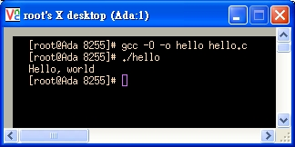

- kb.c

``` c
/****************************************************************************
Filename: kb.c
Compiler: gcc -O -o kb kb.c
Author:   Jing-Wen.Lai
Function: 平常執行 Loop 印出 計數 訊息 ，除非鍵盤按下 'q' 鍵 則離開計數 Loop 。 
Date:     03/22 2003
Reference: 參考以下網路文件改寫
      http://www.control.auc.dk/~jnn/c2000/programs/mm5/keyboardhit/msg02541.html
****************************************************************************/
#include <stdio.h>
#include <termios.h>

static struct termios orig, new;
static int peek = -1;

int main()
{
  int ch =0;                           /*  鍵盤所按下的字元 */
  int loopCount=1;                     /*  Loop 用 計數器  */

  tcgetattr(0, &orig);
  new = orig; new.c_lflag &= ~ICANON; new.c_lflag &= ~ECHO; new.c_lflag &= ~ISIG;
  new.c_cc[VMIN] = 1; new.c_cc[VTIME] = 0; tcsetattr(0, TCSANOW, &new);

  /* =========================== */
  /* [[ 當輸入字元不為 q 時  ]]  */
  /* =========================== */

  while(ch != 'q') {
    printf("looping %d time(s) \n",loopCount);
    sleep(1); loopCount++;

    if(kbhit()) {
      ch = readch();
      printf("== Input %c ==\n",ch);
    }
  }

  /* ======================== */
  /* [[  輸入字元 為 q 時  ]] */
  /* ======================== */

  printf("== Quit == \n");
  tcsetattr(0,TCSANOW, &orig);
  exit(0);
}

/* ======================= */
/*   SUB Function          */
/* ======================= */
int kbhit()
{
  char ch;int nread;
  if(peek != -1) return 1;
  new.c_cc[VMIN]=0;
  tcsetattr(0, TCSANOW, &new);
  nread = read(0,&ch,1);
  new.c_cc[VMIN]=1;
  tcsetattr(0, TCSANOW, &new);    
  if(nread == 1) {
    peek = ch;
    return 1;
  }
  return 0;
}

int readch()
{
  char ch;
  if(peek != -1) {
    ch = peek;
    peek = -1;
    return ch;
  }
  read(0,&ch,1);
  return ch;
}
```


  

- io.c

``` c
/****************************************************************************
      --  io.c  <Linux I/O 埠 基本測試 -- 測試 剛組裝完成的 IO 板用>  --
Author:    Jing-Wen.Lai
Function:  以 Linux C 控制 8255 I/O 實驗板上的 LED,
Compiler:  使用 `gcc -O2 -o io io.c',
Running:   以 root 的身份執行 `./io'.
Reference: 由<<CLDP -- Linux 中文文件計劃>>改寫
            http://www.linux.org.tw/CLDP/mini/IO-Port-Programming-9.html
****************************************************************************/
#include <stdio.h>
#include <unistd.h>
#include <asm/io.h>

#define CCW 0x303   /* 8255 CCW */
#define PA  0x300   /* 8255 PORT A */
int main()
{
  int i=0;

  /* 取得埠位址的存取權限 */
  if (ioperm(CCW, 3, 1)) {perror("ioperm"); exit(1);}
  if (ioperm(PA, 3, 1))  {perror("ioperm"); exit(1);}

  /* 定義 8255 工作模式 */
  outb(0x80, CCW);

  /* 重置 8255 PORT A 的輸出資料信號 (D0-7) 全為零 (0) */
  outb(0, PA);

  /* LED   交互 閃爍 10 次 ，每次 1000 ms */
  for (i=1; i<=10; i++){
    usleep(1000000);        
    if(i%2 == 0){
      outb( 0x00, PA);
      printf("-X-  step: %d\n",i); 
    }else{
      outb( 0xFF, PA);
      printf("-O-  step: %d\n",i);
    }
  }
  /* 我們不再需要這些埠位址 */
  if (ioperm(CCW, 3, 0)) {perror("ioperm"); exit(1);}
  if (ioperm(PA, 3, 0))  {perror("ioperm"); exit(1);}
  exit(0);
  /* 結束 io.c */
}
```


- blink.c    

``` c
/******************************************************************************
Filename:  blink.c
Compiler:  gcc -O -o blink blink.c
Author:    Jing-Wen.Lai
Function:  平常執行 Loop 印出 計數 訊息 ， 8255 I/O 實驗板上的 LED 亦隨之閃爍
            除非鍵盤按下 'q' 鍵 則離開計數 Loop 。 
Date:      May. 22/2003
******************************************************************************/

#include <stdio.h>
#include <termios.h>
#include <unistd.h>
#include <asm/io.h>

#define CCW 0x303   /* 8255 CCW */
#define PA  0x300   /* 8255 PORT A */

static struct termios orig, new;
static int peek = -1;

int main()
{
  
  int ch =0;          /*  鍵盤所按下的字元 */
  int loopCount=0;    /*  Loop 用 計數器   */

  tcgetattr(0, &orig);
  new = orig; new.c_lflag &= ~ICANON; new.c_lflag &= ~ECHO; new.c_lflag &= ~ISIG;
  new.c_cc[VMIN] = 1; new.c_cc[VTIME] = 0; tcsetattr(0, TCSANOW, &new);

  /* 取得埠位址的存取權限 */
  if (ioperm(CCW, 3, 1)) {perror("ioperm"); exit(1);}
  if (ioperm(PA, 3, 1))  {perror("ioperm"); exit(1);}
  
  /* 定義 8255 工作模式 */
  outb(0x80, CCW);

  /* 重置 8255 PORT A 的輸出資料信號 (D0-7) 全為零 (0) */
  outb(0, PA);

  /* =========================== */
  /* [[ 當輸入字元不為 q 時  ]]  */
  /* =========================== */

  /*  LED  交互 閃爍  */
    
  while(ch != 'q') {
    //printf("looping %d times \n",loopCount);

    sleep(1); loopCount++;

    if(loopCount %2 == 0){
          outb( 0x00, PA);
          printf("-X-  step: %d\n",loopCount); 
    }else{
          outb( 0xFF, PA);
          printf("-O-  step: %d\n",loopCount);
    }

    if(kbhit()) {
        ch = readch();
    }
  }

  /* ======================== */
  /* [[  輸入字元 為 q 時  ]] */
  /* ======================== */
  
  //  LED 不亮 
  outb( 0x00, PA);

  /* 我們不再需要這些埠位址 */
  if (ioperm(CCW, 3, 0)) {perror("ioperm"); exit(1);}
  if (ioperm(PA, 3, 0))  {perror("ioperm"); exit(1);}
  
  printf("== Quit == \n");
  tcsetattr(0,TCSANOW, &orig);
  exit(0);

}

/* ======================= */
/*   sub Function          */
/* ======================= */
int kbhit()
{
    char ch;int nread;
    if(peek != -1) return 1;
    new.c_cc[VMIN]=0;
    tcsetattr(0, TCSANOW, &new);
    nread = read(0,&ch,1);
    new.c_cc[VMIN]=1;
    tcsetattr(0, TCSANOW, &new);    
    if(nread == 1) {
        peek = ch;
        return 1;
    }
    return 0;
}

int readch()
{
    char ch;
    if(peek != -1) {
        ch = peek;
        peek = -1;
        return ch;
    }
    read(0,&ch,1);
    return ch;
}
```

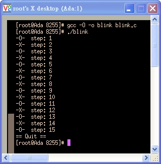

- pili_test.c    

``` c
/****************************************************************************
Filename:  pili_test.c
Compiler:  gcc -O -o pili_test pili_test.c
Author   : Jing-Wen.Lai
Function : 由 1 計數至 128 ， 128 計數至 1，來回列印 
Date     : 3/23 2003
****************************************************************************/
#include <stdio.h> 

int main(){    
  int LED_Data=0x01;         /*   初始化資料     */    
  int directionFlag=1;       /* 1: LED 向左點亮 ; 0:LED 向右點亮    */
  int i;

  for(i=0;i<20;i++){    
    printf("%d\n", LED_Data);
    if (directionFlag == 1)
    {
      LED_Data *= 2;
      if (LED_Data == 128){
        directionFlag = 0;
      }
    }else{
      LED_Data /= 2;
      if (LED_Data == 1){
        directionFlag = 1;
      }
      
    }
    }
}
```

  

- pili.c    

``` c
/****************************************************************************
Filename: blink.c
Compiler: gcc -O -o blink blink.c
Author:   Jing-Wen.Lai
Function: 目的 :: LED 走馬燈。除非鍵盤按下 'q' 鍵 則離開計數 Loop 。
Date:     3/22 2003
****************************************************************************/
#include <stdio.h>
#include <termios.h>
#include <unistd.h>
#include <asm/io.h>

#define CCW 0x303   /* 8255 CCW */
#define PA  0x300   /* 8255 PORT A */

static struct termios orig, new;
static int peek = -1;

int main()
{
  int ch =0;                           /*  鍵盤所按下的字元 */
  int loopCount=0;                     /*  Loop 用 計數器   */

  int LED_Data=0x01;                   /* 初始化資料    */    
  int directionFlag=1;                 /* 1: LED 向左點亮 ; 0:LED 向右點亮    */

  tcgetattr(0, &orig);
  new = orig; new.c_lflag &= ~ICANON; new.c_lflag &= ~ECHO; new.c_lflag &= ~ISIG;
  new.c_cc[VMIN] = 1; new.c_cc[VTIME] = 0; tcsetattr(0, TCSANOW, &new);

  /* 取得埠位址的存取權限 */
  if (ioperm(CCW, 3, 1)) {perror("ioperm"); exit(1);}
  if (ioperm(PA, 3, 1))  {perror("ioperm"); exit(1);}

  /* 定義 8255 工作模式 */
  outb(0x80, CCW);

  /* 重置 8255 PORT A 的輸出資料信號 (D0-7) 全為零 (0) */
  outb(0, PA);

  /* =========================== */
  /* [[ 當輸入字元不為 q 時  ]]  */
  /* =========================== */

  /*  LED  交互 閃爍  */
  
  while(ch != 'q') {
    sleep(1); 
    outb( LED_Data, PA);
    printf("Pili Lamp is Running and The 8255-Port-A's outData is %d\n",LED_Data); 
    if (directionFlag == 1){
      LED_Data *= 2;            
      if (LED_Data == 128){
        directionFlag = 0;
      }
    }else{
      LED_Data /= 2;
      if (LED_Data == 1){
        directionFlag = 1;
      }
      
    }
    if(kbhit()) {
      ch = readch();
    }
  }
  /* ======================== */
  /* [[  輸入字元 為 q 時  ]] */
  /* ======================== */

  //  LED 不亮 
  outb( 0x00, PA);

  /* 我們不再需要這些埠位址 */
  if (ioperm(CCW, 3, 0)) {perror("ioperm"); exit(1);}
  if (ioperm(PA, 3, 0))  {perror("ioperm"); exit(1);}

  printf("== Quit == \n");
  tcsetattr(0,TCSANOW, &orig);
  exit(0);
}

/* ======================= */
/*   sub Function          */
/* ======================= */
int kbhit()
{
  char ch;int nread;
  if(peek != -1) return 1;
  new.c_cc[VMIN]=0;
  tcsetattr(0, TCSANOW, &new);
  nread = read(0,&ch,1);
  new.c_cc[VMIN]=1;
  tcsetattr(0, TCSANOW, &new);    
  if(nread == 1) {
    peek = ch;
    return 1;
  }
  return 0;
}

int readch()
{
  char ch;
  if(peek != -1) {
    ch = peek;
    peek = -1;
    return ch;
  }
  read(0,&ch,1);
  return ch;
}
```

  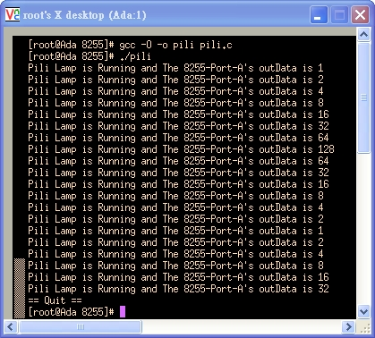

### C++

- There are some programs which can help us to verify the hardware and software.    

  |ID| 程式名稱       | 說明                                                |
  |--|----------------|-------------------------------------------------|
  |1 |hello.cpp       | Linux C++  的基本測試，印出 Hello C++ !             |
  |2 |io.cpp          | Linux I/O 埠 基本測試 -- 測試 剛組裝完成的 IO 板用        |
  |3 |class_io.cpp    | LED 跑馬燈。全暗, 全亮, 左移, 右移 測試     |    

- hello.cpp      

``` cpp
/******************************************************************************
Filename:  hello.cpp
Compiler:  g++  -Wno-deprecated -ohello hello.cpp
Function:  C++ 的基本測試，印出 Hello C++!。
Date:      3/23 2003
Reference:
******************************************************************************/

#include <iostream.h>
int main() {    
    cout << "Hello C++ !" << endl;
    return (0);
}
```
    
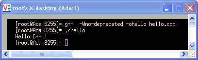

- io.cpp      

``` cpp
/******************************************************************************
Filename:  io.cpp
Function:  Linux I/O 埠 基本測試 -- 測試 剛組裝完成的 IO 板用
Compiler:  使用 `g++ -O -o io io.cpp',
Running:   以 root 的身份執行 `./io'.
Reference: 由<<CLDP -- Linux 中文文件計劃>>改寫
            http://www.linux.org.tw/CLDP/mini/IO-Port-Programming-9.html
******************************************************************************/

#include <stdio.h>
#include <unistd.h>
#include <sys/io.h>

  #define CCW 0x303                     /* 8255 CCW */
  #define PA  0x300                     /* 8255 PORT A */
  int main()
  {
    /* 取得埠位址的存取權限 */
    if (ioperm(CCW, 3, 1)) {perror("ioperm"); return (0);}
    if (ioperm(PA, 3, 1))  {perror("ioperm"); return (0);}

    /* 定義 8255 工作模式 */
    outb(0x80, CCW);

    /* 重置 8255 PORT A 的輸出資料信號 (D0-7) 全為零 (0) */
    outb(0, PA);

    /* PILI 燈  (1000 ms) 交互 閃爍 */
    for (int i=1; i<=10; i++){
    usleep(1000000);        
        if(i%2 == 0){
          outb( 0x00, PA);
          printf("-X-  step: %d\n",i); 
        }else{
          outb( 0xFF, PA);
          printf("-O-  step: %d\n",i);
        }
    } 

    /* 我們不再需要這些埠位址 */
    if (ioperm(CCW, 3, 0)) {perror("ioperm"); return (0);}
    if (ioperm(PA, 3, 0))  {perror("ioperm"); return (0);}
    return (0);
  }
```    
    
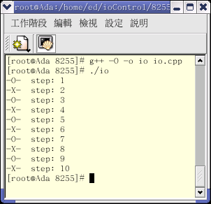

- class_io.cpp    

``` cpp
/******************************************************************************

Filename: class_io.cpp     
Compiler: g++ -Wno-deprecated -oclass_io  class_io.cpp
Author:   Jing-Wen.Lai
Function: 控制 8255 I/O 卡上的 LED , 使之能夠 向系統申請 8255卡所需的位置,
                      將 8255卡所需的位置還給系統,與
                      (1) LED 全部點亮,
                      (2) LED 全部熄滅,
                      (3) LED 由左往右跑,
                      (4) LED 由右往左跑.
******************************************************************************/

#include <iostream.h>
#include <stdio.h>
#include <termios.h>
#include <unistd.h>
#include <sys/io.h>

#define CCW  0x303                               /* 8255 CCW */
#define PA   0x300                               /* 8255 PORT A */

class ClassForPio8255Card                        // 類別Person宣告
  {
    private: 
      int pio8255CardPort_A_Data;
    public:                  
      int initAndApplySystemAddrFor8255Card();   // 向系統申請 8255卡所需的位置
      int releaseSystemAddrFor8255Card();	 // 將 8255卡所佔用的位置還給系統
      void piliLampFromMSBtoLSB();		 // 8255卡上的LED 會由高位元點亮到低位元
      void piliLampFromLSBtoMSB();		 // 8255卡上的LED 會由低位元點亮到高位元 	
      void brightAllLedOn8255Card();	         // 點亮 8255卡上的 LED
      void darkAllLedOn8255Card();		 // 熄掉 8255卡上的 LED  
  };

int main()
{
    int ch = 0;					           /*  鍵盤所按下的字元 */
    ClassForPio8255Card pio8255Card;   
    pio8255Card.initAndApplySystemAddrFor8255Card();       // 初始化 8255 卡
    while(ch!=5){
      cout  <<"1:Brighting all LED 2:Darking all LED 3:PILI LED(MSB->LSB)  4:PILI LED(LSB->MSB)\n";
      cin>>ch;
      cout<<"Selected Function is :"<<ch<<"\n";
      switch(ch){    
        case 1:
    pio8255Card.brightAllLedOn8255Card();			
    break;	
        case 2:
          pio8255Card.darkAllLedOn8255Card();
          break;
  case 3:
    pio8255Card.piliLampFromMSBtoLSB();
          break;
        case 4:
          pio8255Card.piliLampFromLSBtoMSB();	
          break;	
  default:
          cout << "undefine Function ,try again please!\n" ;
          break;
      }
    }
    pio8255Card.releaseSystemAddrFor8255Card();
    return (0); 
}

int ClassForPio8255Card::initAndApplySystemAddrFor8255Card(){
    //cout << "initAndApplySystemAddrFor8255Card\n";
    /* 取得埠位址的存取權限 */
    if (ioperm(CCW, 3, 1)) {perror("ioperm"); return (0);}
    if (ioperm(PA, 3, 1))  {perror("ioperm"); return (0);}
  
    /* 定義 8255 工作模式 */
    outb(0x80, CCW);
    /* 重置 8255 PORT A 的輸出資料信號 (D0-7) 全為零 (0) */
    outb(0, PA);	
}

void ClassForPio8255Card::brightAllLedOn8255Card(){
    //cout << "brightAllLedOn8255Card\n";
    outb( 0xff, PA); 
}

void ClassForPio8255Card::darkAllLedOn8255Card(){
    //cout << "darkAllLedOn8255Card\n";
    outb( 0x00, PA);
}

void ClassForPio8255Card::piliLampFromLSBtoMSB(){
    pio8255CardPort_A_Data=0x01;
    for(int i=0; i<8; i++){
      outb( pio8255CardPort_A_Data, PA);
      usleep(1000000);
      pio8255CardPort_A_Data*=2;
  }
}

void ClassForPio8255Card::piliLampFromMSBtoLSB(){
    pio8255CardPort_A_Data=0x80;
    for(int i=0; i<8; i++){
      outb( pio8255CardPort_A_Data, PA);
      usleep(1000000);
      pio8255CardPort_A_Data/=2;
    }
}

int ClassForPio8255Card::releaseSystemAddrFor8255Card(){
    //cout << "releaseSystemAddrFor8255Card\n";
    //  LED 暗 
    outb( 0x00, PA);

    /* 我們不再需要這些埠位址 */
    if (ioperm(CCW, 3, 0)) {perror("ioperm"); return (0);}
    if (ioperm(PA, 3, 0))  {perror("ioperm"); return (0);}

  }
```


## Windows

### Turbo C

``` c
//**********************************************************************************
//-- PC上介面實習 8255 與 8254 測試  
//-- 版本:     v0.1 6/6/2001 
//-- 說明:     測試 組裝 完畢 的 8255 與 8254 是否可動作    
//-- 使用方式: 隨意按任一按鍵,   螢幕上 顯示 "O", 此時 LED 1,2,5,6 亮, 並且喇叭發出聲音
//--           再隨意按任一按鍵, 螢幕上 顯示 "X", 此時 LED 全部  不亮, 並且喇叭不發出聲音                              
//--           按 "Esc" 鍵 可 離開本程式
//--================================================================================
//-- IO 位址  :  請 參考 下面 #define 的定義
//-- 配合硬體 :  參考 下面  參考文件 
//-- 元件列表 :  8255           X 1 ( 可程式規劃邏輯介面 ; PPI)
//--             8254           X 1 ( 可程式規劃計數(時)介面 / 最高輸入時序 8 MHz )
//--                                ( 日本 NEC 編號的 8254 為 D71054C )
//--
//--             74LS138        X 1 ( 解碼致能 8255 與 8254 用 )
//--             74LS00         X 1 ( 解碼致能 74LS138 與 喇叭電路 )
//--
//--             5K 可調式電阻  X 1 ( 喇叭電路用 )
//--             C1815          X 1 ( 喇叭電路用 , 編號面 接腳 ECB)
//--             喇叭           X 1 (  喇叭電路用, 使用 PC 上的喇叭即可)  
//--             LED            X 8 ( 檢視8255 portA 輸出用(十顆包裝型 LED 有時無法動作))
//--  
//--             金手指 AT 介面電路板
//--             上述 IC 所需腳座 及 一般焊接工具 
//--================================================================================  
//-- 編輯器   :  Jext  ( http://www.jext.org/ )
//-- 組譯器   :  Turbo C++
//-- 參考文件 :  PC XT/AT 介面設計與應用 Visual Basic 6.0 版(ISBN:957-499-229-2) / 儒林 
//--             8254 電路圖 P 5-57 
//--             8255 電路圖 P 3-49 (位址選取方式 改用 8255 選取方式)
//--             原書錯誤更正 : 
//                      p5-62 DEBUG 內的 倒數第八個指令為 -O 303 00
//--                                             應改為   -O 302 00
//--                                     倒數第七個指令為 -O 303 02
//--                                             應改為   -O 302 02   
//--                                     倒數第三個指令為 -O 303 01
//--                                             應改為   -O 302 01 
//--                                     倒數第二個指令為 -O 323 03
//--                                             應改為   -O 302 03
//--                                     倒數第一個指令為 -O 303 02  註解處為 禁能 蜂鳴器
//--                                             應改為   -O 302 02  應改為 禁能 第二計數器
//--                    p5-65 程式碼內作者把 PPI_PC 和 PPI_CW 的位址 有時弄混ㄋ 
//--                   ( 錯誤蠻多的 改的有點 眼花ㄋ ,不過依作者的錯誤程式碼卻可以執行,真令人訝異) 
//-- 備註:    無法在 我的 P-II 上測試(或許需調整 安邁 ROM 內 CLK 的設定,但與可以測試的 P-I 主機 ROM 設定內無法發現相同的 Function)
//--         ,改成於 檢來的 P-I 上測試 ,由於 P-I 的配備較陽春 故將程式碼 改成用 Turbo C++ 寫
//-- 注意:    在 #define 後的 註解 需以 " // " 開頭 不能使用 " ; "
//-- 更新Log:
//
//**********************************************************************************

#include <iostream.h>
//#include <bios.h>
//#include <dos.h>
#include <conio.h>

//>>>>>>>>>>>>>>>>>>>>>>>>>  8255  用 <<<<<<<<<<<<<<<<<<<<<<<<<<<<<<<<<<<<<
#define PPI_8255_CW        0x3f3         // 8255 內的 控制字組 位址
#define PPI_8255_CW_STATE  0x80          // 設定 8255 為 MODE0 全部 PORT 皆為輸出

//>>>>>>>>>>>>>>>>>>>>>>>>>  8255 portA LED 顯示 用 <<<<<<<<<<<<<<<<<<<<<<<
#define PPI_8255_PA        0X3f0         // 8255 內的 PORT A   位址
#define ledEnable          0x00          // 8255 port A 輸出至 LED  1,2,5,6  亮
#define ledDisable         0xff          // 8255 port A 輸出至 LED  全部     不亮

//>>>>>>>>>>>>>>>>>>>>>>>>>  8254  用 <<<<<<<<<<<<<<<<<<<<<<<<<<<<<<<<<<<<<
#define PPC_8254_CW        0x323         // 8254 內的  控制字組 位址
#define PPC_8254_CW_STATE  0XB6          // 設定 8254 第二計數器 為 模式三 ,讀寫 高低位元組 , HEX

//>>>>>>>>>>>>>>>>>>>>>>>>>    蜂鳴器 用    <<<<<<<<<<<<<<<<<<<<<<<<<<<<<<<<<<<<<
#define PPI_8255_PC        0X3f2         // 8255 內的 PORT C     位址 , PC 0 控制  8254 第二計數器 用 ,  PC 1 控制  蜂鳴器 用
#define PPC_8254_C2        0X322         // 8254 內的 第二計數器 位址
#define PPC_8254_C2_STATE  0XFF          // 8254 內的 第二計數器 的高低位元組計數值

#define bellDisable        0x00          // 禁能 第二計數器 ,禁能揚聲器
#define bellEnable         0xff          // 致能 第二計數器 ,致能揚聲器

void out(unsigned int ioAddr ,unsigned char ioData)
{
  asm{
    mov dx,ioAddr
    mov al,ioData
    out dx,al
  };
}

void main()
{   
  clrscr();
  cout<<"push Esc to exit"<<endl;
  //>>>>>>>>>   8255 初始化   <<<<<<<<<
  out(PPI_8255_CW, PPI_8255_CW_STATE);        // 設定 8255
  //outportb(PPI_8255_CW, PPI_8255_CW_STATE);        // 設定 8255
  out(PPI_8255_PC, bellDisable);              // 先禁能 蜂鳴器及 8254

  out(PPC_8254_CW, PPC_8254_CW_STATE);        // 設定 8254 第二計數器
  out(PPC_8254_C2, PPC_8254_C2_STATE);        // 計數值寫入 第二計數器的 低位元組
  out(PPC_8254_C2, PPC_8254_C2_STATE);        // 計數值寫入 第二計數器的 高位元組
  int i = 0,j=0;

  while( i<500){
    if(i%2==0){
      cout<<"O"<<endl;
      for (j=0;j<25000;j++)
        out(PPI_8255_PA ,ledEnable);	     // 致能 LED
//	out(PPI_8255_PC ,bellEnable);        // 致能 蜂鳴器
    }else{
  cout<<"X"<<endl;
  for (j=0;j<25000;j++)
  out(PPI_8255_PA ,ledDisable);	     // 禁能 LED
//	out(PPI_8255_PC ,bellDisable);       // 禁能 蜂鳴器
      } // -- if 迴圈 結束
      i++;
  } //-- while 迴圈 結束
}
```

## Advanced

FIXME: It could be more friendly if there is any GUI interface to manipulate the LED.

### Linux Device Driver

- Linux 在 `user-space` 由於都需以 `root` 權限驅動硬體，
- 若需讓一般使用者也能驅動硬體，需考慮撰寫使用 `kernal-space` 的Linux Device Driver`.

### QT 

- hello_qt.cpp    
``` cpp
/****************************************************************************
Filename:  hello_qt.cpp
Compiler:  g++ -I$QTDIR/include -L$QTDIR/lib -lqt -o hello_qt hello_qt.cpp
Running:   ./hello_qt& ( 丟到背景執行 )
Function:  Linux GUI 視窗程式 的基本測試，建立一個 Hello QT! 的基本視窗
Date:      3/23 2003
Reference: http://doc.trolltech.com/3.1/tutorial1-01.html
****************************************************************************/

#include <qapplication.h>
#include <qpushbutton.h>

int main( int argc, char **argv ){
  QApplication a( argc, argv );

  QPushButton hello( "Hello QT!", 0 );
  hello.resize( 100, 30 );

  a.setMainWidget( &hello );
  hello.show();
  return a.exec();
}
```

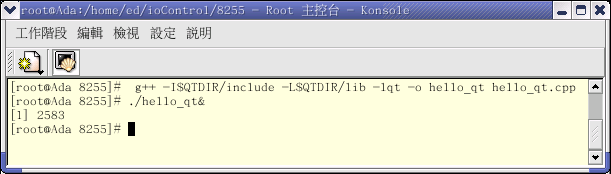    
    

- frame: moc 使用訊號 與╱或 溝槽的類別的一般骨架   
(摘錄於 [Programming](#http://www.oreilly.com/catalog/prowqt2/inx.html) with Qt  p.32)    

``` cpp
class MyClass : public Qobject 
{ 
  Q_OBJECT 
  ... 
  signals: 	
    // 將你的 訊號 放在這裡,如 	
    void somethingDone(); 
    ...
    public slots: 	
    // 將你 公開的溝槽 放在這裡,如 	
    viod soltDoSomething();  

    private slots:  
    // 將你 私有的溝槽 放在這裡,如 	
    void slotDoSomethingInternal();  	

    // 當然, 你可以加入其他的宣告 
};  
```    
訊號 與╱或 溝槽的 類別 (摘錄於 [Programming with Qt](#http://www.oreilly.com/catalog/prowqt2/inx.html)  p.35 )

- mocDemo2.cpp    

``` cpp
/****************************************************************************
Filename:   mocDemo2.cpp
Compiler:   g++ -I$QTDIR/include -L$QTDIR/lib -lqt -o mocDemo2 mocDemo2.cpp
Running:    ./mocDemo2& ( 丟到背景執行 )
Function:   了解 moc 的用法 。 
Reference:  出自 Programming with QT , exercise-2-4-1.cpp (p35 的 練習題 )
Date:       03/24 2003
Comment:    並沒有 用 Programming with QT 書中以 
            moc (moc -o moc_file.cpp myfile.h) 來處理 包含類別宣告的檔案亦可動作
            所以並不確定 qt3 以後的做法
****************************************************************************/
#include <qapplication.h>
#include <qpushbutton.h>
#include <qslider.h>
#include <qlcdnumber.h>

int main( int argc, char* argv[] )
{
  QApplication myapp( argc, argv );

  QWidget* mywidget = new QWidget();
  mywidget->setGeometry( 400, 300, 170, 150 );


  QSlider* myslider = new QSlider( 0,                   // minimum value
                                    9,                   // maximum value
                                    1,                   // step
                                    1,                   // initial value
                                    QSlider::Horizontal, // orientation
                                    mywidget            // parent
                                    );
  myslider->setGeometry( 10, 10, 150, 30 );

  QLCDNumber* mylcdnum = new QLCDNumber( 1,        // number of digits 
                                          mywidget // parent
                                        );
  mylcdnum->setGeometry( 60, 50, 50, 50 );
  mylcdnum->display( 1 ); // display initial value

  // connect slider and number display
  QObject::connect( myslider, SIGNAL( valueChanged( int ) ), 
                    mylcdnum, SLOT( display( int ) ) );

  // create two push buttons for decrementing and 
  // incrementing the slider values
  QPushButton* decrement = new QPushButton( "<", mywidget );
  decrement->setGeometry( 10, 110, 50, 30 );

  QPushButton* increment = new QPushButton( ">", mywidget );
  increment->setGeometry( 110, 110, 50, 30 );

  // connect the clicked() signal of the buttons to the slots that 
  // increment and decrement the slider value
  QObject::connect( decrement, SIGNAL( clicked() ),
                    myslider, SLOT( subtractStep() ) );
  QObject::connect( increment, SIGNAL( clicked() ),
                    myslider, SLOT( addStep() ) );

  myapp.setMainWidget( mywidget );
  mywidget->show();
  return myapp.exec();
}
```
- QT socket     
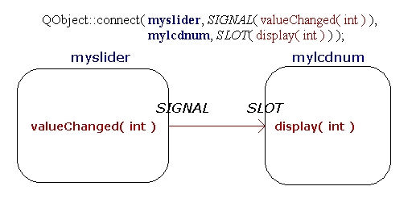  

- Running      
  
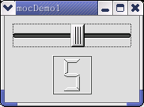

## Reference

|ID | 參考資料                                                                           | 說明                                         |
|---|------------------------------------------------------------------------------------|----------------------------------------------|
| 1 | [Programmer 深度論壇](http://forum.vclxx.org/)                                     | 程式寫作討論區                               |
| 2 | [32 Bit Delphi 深度歷險](http://vcl.vclxx.org/DELPHI/DEFAULT.HTM)                  | 可以下載 DLPORT 元件( 在 XP 平台上控制 I/O ) |
| 3 | [德州儀器](http://www.ti.com/)                                                     | 可以搜尋 IC 格資料                           |
| 4 | [興德資訊](http://www.sinter.com.tw/)                                              | 商業版驅動程式                               |
| 5 | [電腦達人養成計畫 4-3：歷代擴充介面卡標準 (上)](https://isite.tw/2016/06/13/16013) |                                              |
| 6 | [Welding、brazing、soldering三種差別](https://tw.answers.yahoo.com/question/index?qid=20060104000014KK04628) | |

## Appendix

### Appendix A - PC AT Interface Pinout

- A1~A31 and B1~B31 (8-Bit XT-Bus)    

| Input/Output | Description | Pin    | Pin    | Description | Input/Output|
|--------------|-------------|--------|--------|-------------|-------------|
|GROUND        | GND         | **B1** | **A1** | -I/O CH CK  | I           |
|O             |RESET DRV    | **B2** | **A2** | SD7         | I/O         |
|POWER         |+5V DC       | **B3** | **A3** | SD6         |I/O|
|I             |IRQ9         | **B4** | **A4** | SD5         |I/O|
|POWER         |-5V DC       | **B5** | **A5** | SD4         |I/O|
|I             |DRQ2         | **B6** | **A6** | SD3         |I/O|
|POWER         |-12V DC      | **B7** | **A7** | SD2         |I/O|
|I             |OWS          | **B8** | **A8** | SD1         |I/O|
|POWER         |+12V DC      | **B9** | **A9** | SD0         |I/O|
|GROUND        |GND          | **B10**| **A10**| -I/O CH RDY |I|
|O             |-SMEMW       | **B11**| **A11**| AEN         |O|
|O             |-SMEMR       | **B12**| **A12**| SA19        |I/O|
|I/O           |-IOW         | **B13**| **A13**| SA18        |I/O|
|I/O           |-IOR         | **B14**| **A14**| SA17        |I/O|
|O             |-DACK3       | **B15**| **A15**| SA16        |I/O|
|I             |DRQ3         | **B16**| **A16**| SA15        |I/O|
|O             |-DACK1       | **B17**| **A17**| SA14        |I/O|
|I             |DRQ1         | **B18**| **A18**| SA13        |I/O|
|I/O           |-REFRESH     | **B19**| **A19**| SA12        |I/O|
|O             |CLK          | **B20**| **A20**| SA11|I/O|
|I             |IRQ7         | **B21**| **A21**| SA10|I/O|
|I             |IRQ6         | **B22**| **A22**| SA9 |I/O|
|I             |IRQ5         | **B23**| **A23**| SA8 |I/O|
|I             |IRQ4         | **B24**| **A24**| SA7 |I/O|
|I             |IRQ3         | **B25**| **A25**| SA6 |I/O|
|O             |-DACK2       | **B26**| **A26**| SA5 |I/O|
|O             |T/C          | **B27**| **A27**| SA4 |I/O|
|O             |BALE         | **B28**| **A28**| SA3 |I/O|
|POWER         |+5V DC       | **B29**| **A29**| SA2 |I/O|
|O             |OSC          | **B30**| **A30**| SA1 |I/O|
|GROUND        |GND          | **B31**| **A31**| SA0 |I/O|

- C1~C18 and D1~D18    

| Input/Output | Description   | Pin    | Pin    |Description| Input/Output |
|--------------|---------------|--------|--------|-----------|--------------|
| I            | -MEM CS16     | **D1** | **C1** |SBHE       |I/O|
| I            |-I/O CS16      | **D2** | **C2** |LA23       |I/O|
| I            |IRQ10          | **D3** | **C3** |LA22       |I/O|
| I            |IRQ11          | **D4** | **C4** |LA21       |I/O|
| I            |IRQ12          | **D5** | **C5** |LA20       |I/O|
| I            |IRQ15          | **D6** | **C6** |LA19       |I/O|
| I            |IRQ14          | **D7** | **C7** |LA18       |I/O|
| O            |-DACK0         | **D8** | **C8** |LA17       |I/O|
| I            |DRQ0           | **D9** | **C9** |-MEMR      |I/O|
| O            |-DACK5         | **D10**| **C10**|-MEMW      |I/O|
| I            |DRQ5           | **D11**| **C11**|SD8        |I/O|
| O            |-DACK6         | **D12**| **C12**|SD9        |I/O|
| I            |DRQ6           | **D13**| **C13**|SD10       |I/O|
| O            |-DACK7         | **D14**| **C14**|SD11       |I/O|
| I            |DRQ7           | **D15**| **C15**|SD12       |I/O|
| POWER        |+5V DC         | **D16**| **C16**|SD13       |I/O|
| I            |MASTER         | **D17**| **C17**|SD14       |I/O|
| GROUND       |GND            | **D18**| **C18**|SD15       |I/O|

### Appendix B - Intel 82C55A Programmable Peripheral Interface Pinout

- Intel 82C55A PINOUT    

| Description | Pin   | Pin   | Description |
|-------------|-------|-------|-------------|
| PA3         |**1**  |**40** |PA4          |
| PA2         |**2**  |**39** |PA5          |
| PA1         |**3**  |**38** |PA6          |
| PA0         |**4**  |**37** |PA7          |
| -RD         |**5**  |**36** |-WR          |
| -CS         |**6**  |**35** |RESET        |
| GND         |**7**  |**34** |D0           |
| A1          |**8**  |**33** |D1           |
| A2          |**9**  |**32** |D2           |
| PC7         |**10** |**31** |D3           |
| PC6         |**11** |**30** |D4           |
| PC5         |**12** |**29** |D5           |
| PC4         |**13** |**28** |D6           |
| PC0         |**14** |**27** |D7           |
| PC1         |**15** |**26** |VCC          |
| PC2         |**16** |**25** |PB7          |
| PC3         |**17** |**24** |PB6          |
| PB0         |**18** |**23** |PB5          |
| PB1         |**19** |**22** |PB4          |
| PB2         |**20** |**21** |PB3          |


### Appendix C - Intel 8254 Programmable Interval Timer Pinout

- Intel 82C54 PINOUT    

| Description | Pin   | Pin   | Description |
|-------------|-------|-------|-------------|
|D7           |**1**  |**24** |VCC          |
|D6           |**2**  |**23** |-WR          |
|D5           |**3**  |**22** |-RD          |
|D4           |**4**  |**21** |-CS          |
|D3           |**5**  |**20** |A1           |
|D2           |**6**  |**19** |A0           |
|D1           |**7**  |**18** |CLK2         |
|D0           |**8**  |**17** |OUT2         |
|CLK0         |**9**  |**16** |GATE2        |
|OUT0         |**10** |**15** |CLK1         |
|GATE0        |**11** |**14** |GATE1        |
|GND          |**12** |**13** |OUT1         |

### Appendix D - Remote Access by VNC

以下列出 C 語言程式碼 與執行結果。 為了方便 撰寫程式碼、測試結果，撰寫此份說明文件，上網聽串流音樂，…
在主機端架設了 FTP Server ( 將 Win-XP 下編寫的程式碼上傳至 RedHat Linux ) 與 VNC Server( 遠端遙控 RedHat Linux )，
使用 VNC 軟體，由 Win-XP 遠端連線到 RedHat Linux 8.0 執行程式，在  Win-XP 執行結果。

- VNC Server 連線步驟.

|步驟   | RedHat Linux 8.0  |Win-XP                                |說明                                           |
|-------|-------------------|--------------------------------------|-----------------------------------------------|
|Step.0 |                   |                                      | 進入 終端機 ─ 超級使用者模式, 並輸入以下命令 |
|Step.1 | # adsl-start      |                                      | RedHat Linux 主機連線至網際網路               |
|Step.2 | # vncserver       |                                      | 啟動 vncserver                                |
|Step.3 | # ifconfig        |                                      | 查看 dhcp 所分配到的 IP                       |
|Step.4 |                   |Run VNC Viewer  | 啟動 VNC client 端, 輸入主機 IP|
|Step.5 |                   |                | 輸入登入的密碼 |
|Step.6 |                   |                | 登入完畢 |


<!--
//
//                |\_/|         |\__/|         |\_/|      |\﹏/|
//               = O.O =       = ⊙⊙ =       = >.< =    ~ @.@ ~
//                (m_m)~        (﹋﹋)﹏       (m_m)﹏    (m_m)∫
-->