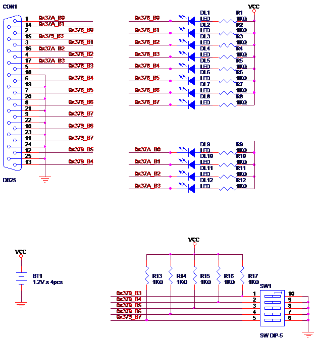
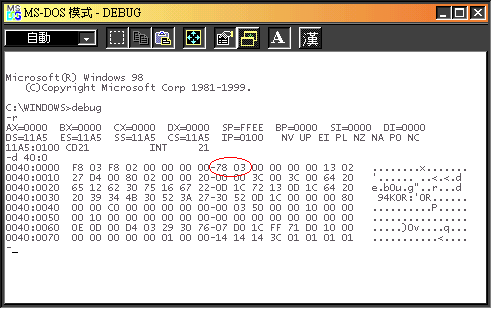
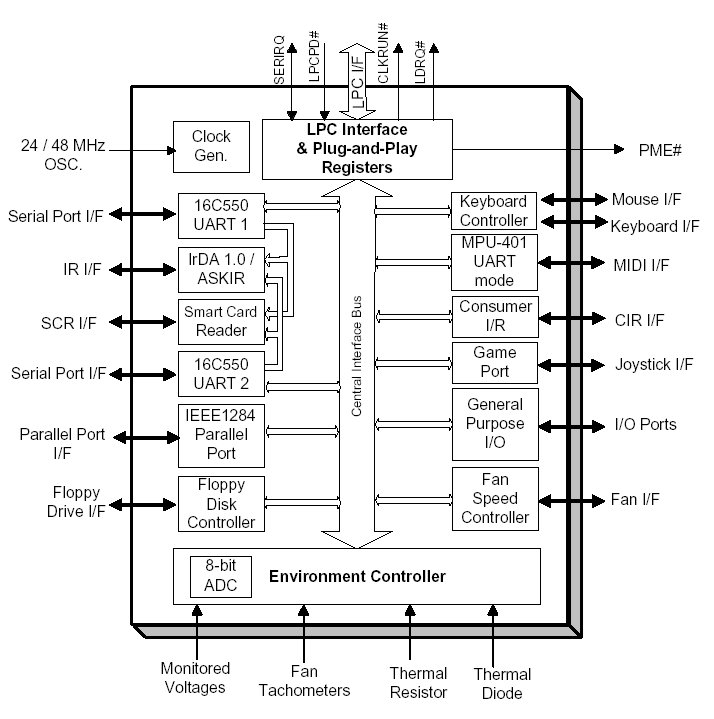
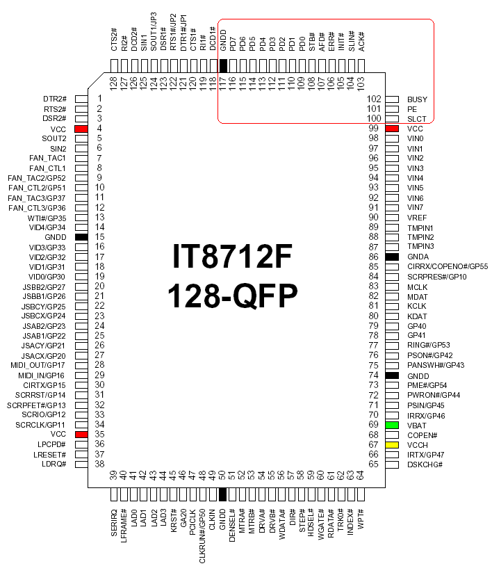
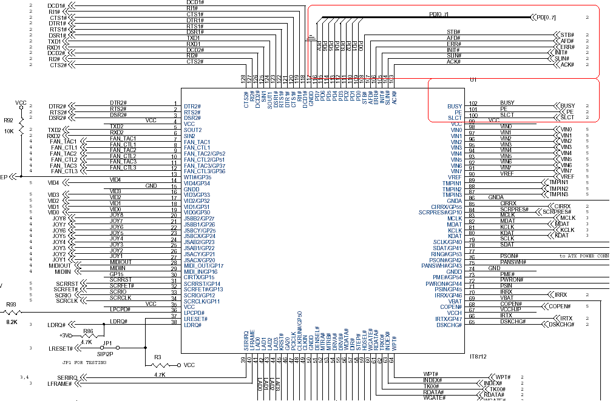
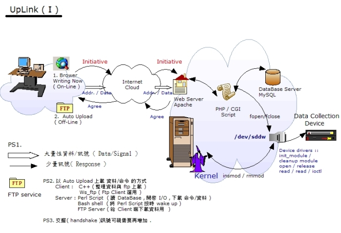
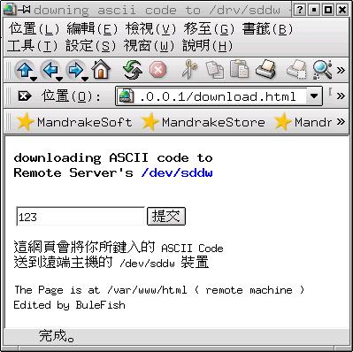
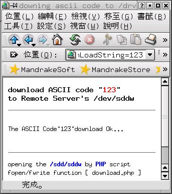

# Man-Machine Interfaces

## Parallel Port Device and Linux Device Driver

```
$author:   Jin-Wen (Ed) Lai, s9360511[at]ntut[dot]org[dot]tw
$date:     May. 2003
$revised:  Mar. 2018
$keywords: man, machine, interface
```

An exercise of an implementation of Linux Device Driver.

<!--
## Content

* [Concept](#concept)
* [Requirements](#requirements)
  * [Hardware](#hardware)
  * [Software](#software)
* [Programming](#programming)
  * [Stand-alone Edition](#stand-alone-edition)
  * [Online Edition](#online-edition)
* [Application](#application)
* [Demonstration](#demonstration)

* [Advanced](#advanced)
* [References](#reference)
* [Appendix](#appendix)
  * [Appendix A - Super I/O](#)
-->

## Concept

- Blink LED which connects to PC's Parallel Port.

<!--
  <svg width="600" height="110">
  <rect x="0" y="0"   width="100" height="100" style="fill:red;stroke:black;stroke-width:5;opacity:0.5" />
  <text x="50" y="50" alignment-baseline="middle" text-anchor="middle">Super I/O</text>
  <line x1="100" y1="50" x2="200" y2="50" style="stroke:rgb(255, 0, 0);stroke-width:2" />
  <rect x="200" y="0" width="100" height="100" style="fill:red;stroke:black;stroke-width:5;opacity:0.5" />
  <text x="250" y="50" alignment-baseline="middle" text-anchor="middle">Parallel Port</text>
  <line x1="300" y1="50" x2="400" y2="50" style="stroke:rgb(255, 0, 0);stroke-width:2" />
  <rect x="400" y="0" width="100" height="100" style="fill:red;stroke:black;stroke-width:5;opacity:0.5" />
  <text x="450" y="50" alignment-baseline="middle" text-anchor="middle">Breadboard</text>
  Sorry,  your browser does not support inline SVG.
  </svg>
-->

<pre><div class="mermaid">
  graph TD
  A[Super I/O] --> B[Parallel Port]
  B --> C[Breadboard]
</div></pre>

## Requirements

### Hardware

- PC (w/. Parallel Port)

### Software

- RedHat Linux
- Linux GCC

### Hardware

- Schematic    


- Breadboard    


## Background

### IO Port Address in PC    

| I/O埠      |  LPT1 |  LPT2 | Monochrome Display Adapter |
|------------|-------|-------|----------------------------|
| 資料輸出埠 | 0x378 | 0x278 | 0x3BC                      |
| 狀態輸入埠 | 0x379 | 0x279 | 0x3BD                      |
| 控制輸出埠 | 0x37A | 0x27A | 0x3BE                      |

### BIOS 數據區

- 當BIOS尋找到平行埠後, 除會標明LPT名稱外, 也會在BIOS數據區（Data Area）內儲存BIOS規劃給平行埠的位址.
- BIOS數據區是一個記憶體區域, 其內部儲存著記錄PC所有裝置的映射表(mapping table).
- 因此, 若無法利用作業系統獲得平行埠的`378`或`278`位址, 那就必須透過BIOS的映射表來取得.    


### Super IO  

- 目前 PC 上的 [`Parallel port`](https://en.wikipedia.org/wiki/Parallel_port),  幾乎有已整合到[`Super IO`](https://en.wikipedia.org/wiki/Super_I/O)裡面.
- 所以我們可以參考 `Super IO` 的規格.
- IT8712F 的方塊圖    
  
- IT8712F 腳位定義表格 (**P.100~P117**)    

|Pin	|Signal	        |Pin	|Signal	        |Pin	|Signal	            |Pin	  |Signal      |
|-----|---------------|-------|---------------|-------|-------------------|-------------|----------  |
|1	|DTR2#	        |33	|SCRIO/GP12	|65	|DSKCHG#	    |97	          |VIN1	       |
|2	|RTS2#	        |34	|SCRCLK/GP11	|66	|IRTX/GP47	    |98	          |VIN0	       |
|3	|DSR2#	        |35	|VCC	        |67	|VCCH	            |99	          |VCC	       |
|4	|VCC	        |36	|LPCPD#	        |68	|COPEN#	            |***100***	  |***SLCT***  |
|5	|SOUT2	        |37	|LRESET#	|       | 69	VBAT	    |***101***	  |***PE***    |
|6	|SIN2	        |38	|LDRQ#	        |70	|IRRX/GP46	    |***102***	  |***BUSY***  |
|7	|FAN_TAC1	|39	|SERIRQ	        |71	|PSIN/GP45	    |***103***	  |***ACK#***  |
|8	|FAN_CTL1	|40	|LFRAME#	|       | 72	PWRON#/GP44 |***104***	  |***SLIN#*** |
|9	|FAN_TAC2/GP52	|41	|LAD0	        |73	|PME#/GP54	    |***105***	  |***INIT#*** |
|10	|FAN_CTL2/GP51	|42	|LAD1	        |74	|GNDD	            |***106***	  |***ERR#***  |
|11	|FAN_TAC3/GP37	|43	|LAD2	        |75	|PANSWH#/GP43	    |***107***	  |***AFD#***  |
|12	|FAN_CTL3/GP36	|44	|LAD3	        |76	|PSON#/GP42	    |***108***	  |***STB#***  |
|13	|WTI#/GP35	|45	|KRST#	        |77	|RING#/GP53	    |***109***	  |***PD0***   |
|14	|VID4/GP34	|46	|GA20	        |78	|GP41	            |***110***	  |***PD1***   |
|15	|GNDD	        |47	|PCICLK	        |79	|GP40	            |***111***	  |***PD2***   |
|16	|VID3/GP33	|48	|CLKRUN#/GP50	|80	|KDAT	            |***112***	  |***PD3***   |
|17	|VID2/GP32	|49	|CLKIN	        |81	|KCLK	            |***113***	  |***PD4***   |
|18	|VID1/GP31	|50	|GNDD	        |82	|MDAT	            |***114***	  |***PD5***   |
|19	|VID0/GP30	|51	|DENSEL#	|83	|MCLK	            |***115***	  |***PD6***   |
|20	|JSBB2/GP27	|52	|MTRA#	        |84	|SCRPRES#/GP10	    |***116***	  |***PD7***   |
|21	|JSBB1/GP26	|53	|MTRB#	        |85	|CIRRX/COPENO#/GP55 |***117***	  |***GNDD***  |
|22	|JSBCY/GP25	|54	|DRVA#	        |86	|GNDA	            |118	  |DCD1#       |
|23	|JSBCX/GP24	|55	|DRVB#	        |87	|TMPIN3	            |119	  |RI1#	       |
|24	|JSAB2/GP23	|56	|WDATA#	        |88	|TMPIN2	            |120	  |CTS1#       |
|25	|JSAB1/GP22	|57	|DIR#	        |89	|TMPIN1	            |121	  |DTR1#/JP1   |
|26	|JSACY/GP21	|58	|STEP#	        |90	|VREF	            |122	  |RTS1#/JP2   |
|27	|JSACX/GP20	|59	|HDSEL#	        |91	|VIN7	            |123	  |DSR1#       |
|28	|MIDI_OUT/GP17	|60	|WGATE#	        |92	|VIN6	            |124	  |SOUT1/JP3   |
|29	|MIDI_IN/GP16	|61	|RDATA#	        |93	|VIN5	            |125	  |SIN1	       |
|30	|CIRTX/GP15	|62	|TRK0#	        |94	|VIN4	            |126	  |DCD2#       |
|31	|SCRRST/GP14	|63	|INDEX#	        |95	|VIN3	            |127	  |RI2#	       |
|32	|SCRPFET#/GP13	|64	|WPT#	        |96	|VIN2	            |128	  |CTS2#       |

- IT8712F 並列埠腳位定義描述

|Pin(s) No.| Symbol   | I/O   | Power | Description                                                                                  |
|----------|----------|-------|-------|----------------------------------------------------------------------------------------------|
| 100	     | SLCT     | DI    | VCC   |	Printer Select.            This signal goes high when the line printer has been selected.    | 
| 101	     | PE	| DI    | VCC   |	Printer Paper End.         This signal is set high by the printer when it runs out of paper. |
| 102	     | BUSY     | DI    | VCC   |	Printer Busy.              This signal goes high when the line printer has a local operation in progress and cannot accept data. |
| 103	     | ACK#     | DI    | VCC   |	Printer Acknowledge #.     This signal goes low to indicate that the printer has already received a character and is ready to accept another. |
| 104	     | SLIN#    | DIO24 | VCC   |	Printer Select Input #.    When low, the printer is selected. This signal is derived from the complement of bit 3 of the printer control register. |
| 105	     | INIT#    | DIO24 | VCC   |	Printer Initialize #,      active low. This signal is derived from bit 2 of the printer control register, and is used to initialize the printer.   |
| 106	     | ERR#     | DI    | VCC   |	Printer Error #.           When low, it indicates that the printer has encountered an error. The error message can be read from bit 3 of the printer status register.  |
| 107	     | AFD#     | DIO24 | VCC   |	Printer Auto Line Feed #,  active low. This signal is derived from the complement of bit 1 of the printer control register, and is used to advance one line after each line is printed. |
| 108	     | STB#     | DIO24 | VCC   |	Printer Strobe #,         active low. This signal is the complement of bit 0 of the printer control register, and is used to strobe the printing data into the printer. |
| 109 - 116| PD[0:7]  | DIO24 | VCC   |	Parallel Port Data Bus.    This bus provides a byte-wide input or output to the system. The eight lines are held in a high impedance state when the port is deselected. |

- IT8712F IC腳位定義    
  

- IT8712F 並列埠線路    
    
    

- IT8712F BIOS Initialize function    
- Borrowed from Specifications
- 主程式(Main):     

``` nasm
Main: 
        CALL    Enter_Configuration_mode 
        CALL    Check_Chip             ;Don't need in BIOS POST code 
        JNC     Initial_OK               ;Don't need in BIOS POST code 
        CALL    Earlyio_Program 
        CALL    Initialize_All_Device 
        CALL    Before_Boot 
        CALL    Exit_Configuration_mode 
        CALL    Reset_System           ;Don't need in BIOS POST code 
  Initial_OK: 
        CALL    Exit_Configuration_mode    ;Don't need in BIOS POST code 
        MOV	  AH, 4Ch 
        INT     21h
```

- 驅動週邊裝置:     

``` nasm
Initialize_All_Device PROC NEAR 
APC_PME_Status: 
KBC_Keyboard_Status: 
KBC_Mouse_Status: 
MIDI_Status: 
Game_Status: 
CIR_Status: 
FDC_Status: 
FDC_Function: 
Register: 
Serial1_Status: 
Serial2_Status: 
Serial2_Function: 
ConfigurationRegister2:
```

- 關於印表機埠的初值設定程式片段:    

``` nasm
Parallel_Status:
        MOV	BH, 03h			         ;LDN=03h -> Parallel port 
        MOV	BL, BYTE PTR CS:[Parallel]      ;Enable/Disable Parallel port 

        CALL 	Set_Device_Status 
        MOV	BX, WORD PTR CS:[Parallel+01h]  ;Set Parallel portbaseaddress
        CALL	Set_Device_Port 
        MOV	BL, BYTE PTR CS:[Parallel+03h]  ;Set Parallel port IRQ 
        CALL	Set_Device_IRQ 
Parallel_Function:
        MOV	AL, 0F0h                         ;(Index 0F0h) 
        MOV	AH, BYTE PTR CS:[P_Mode]        ;Parallel Port Special 
ConfigurationRegister:
        CALL	Write_Configuration_Data         ;P_Mode->SPP, EPP, ECP... 
        MOV	AH, BYTE PTR CS:[P_Mode] 
        AND	AH, 02h 
        JZ		No_Set_DMA 
        MOV	AL, 074h 
        MOV 	AH, BYTE PTR CS:[P_DMA]         ;Set Parallel DMA channel 
        CALL	Write_Configuration_Data         ;P_DMA->DMA channel 
No_Set_DMA:
        RET 
Initialize_All_Device ENDP
```

- 印表機參數預設值:   

``` nasm
;-------------------------------------------------------------------------------
Parallel       DB  01h   ;00h->Disable,  01h->Enable 
                DW  378h  ;3BCh->LPT0,    378h->LPT1,  278h->LPT2 
                DB  07h   ;07h->IRQ7,     05h->IRQ5 
P_Mode         DB  03h   ;00h->SPP,      01h->EPP,    02h->ECP, 03h->EPP&ECP 
P_DMA          DB  03h   ;01h->DMA1,     03h->DMA3 
;-------------------------------------------------------------------------------
```

## Programming

### Stand-alone Edition

#### Module Code

- Kernel Space Device Driver coding (`ldd.c`)

``` c
/******************************************************************************
Linux Device drivers

Compiler: $ sudo make
Enable:   $ sudo sdd_load    #<= loading it on your kernel
Disable:  $ sudo sdd_unload  #<= remove it on you kernel
Usage:    $ sudo echo -n "12345" > /dev/sddw
Files:    1. Makefile
          2. sdd_load
          3. sdd_unload
******************************************************************************/

#if defined(CONFIG_MODVERSIONS) && ! defined(MODVERSIONS)
#include <linux/modversions.h>
#define MODVERSIONS
#endif

#include <linux/kernel.h>
#include <linux/module.h>
#include <linux/fs.h>
#include <asm/uaccess.h>  // for put_user,
#include <linux/ioport.h> // for check_region...
#include <linux/sched.h>  // for request_irq ...
#include <linux/errno.h>  // for -EIO...
#include <asm/io.h>       // for inb_p outb_p
#include <linux/delay.h>  // for u_delay

/* Sub Proc */

int init_module(void);
void cleanup_module(void);
static int sdd_open(struct inode *, struct file *);
static int sdd_release(struct inode *, struct file *);
static int sdd_ioctl(struct inode *, struct file *,unsigned int ,unsigned long);
static int sdd_read(struct file *, const char *, size_t, loff_t *);
static int sdd_write(struct file *, const char *, size_t, loff_t *);
static void sdd_irq_handler(int ,void *,struct pt_regs *);

#define DEVICE_NAME "sdd"

// major device number 
#define SDD_MAJOR 0          // SDD_MAJOR = 0   表示由系統動態配置

// minor device number
#define SDD_WRITE 0
#define SDD_READ 1

// ioctl commands
#define SDD_TRON    _IO('M',0x01)
#define SDD_TROFF   _IO('M',0x02)

// I/O ports used by the device

#define SDD_BASE     0x378       // base port (the First Printer port )
#define SDD_REGSIZE  3           // size of I/O port regin

#define SDD_OUT (SDD_BASE + 0)
#define SDD_IN  (SDD_BASE + 2)

// interrupt line used by the device
#define SDD_IRQ 0x7

#define TRACE_CHR(chr) \
    if (sdd_trace) printk("%c",(chr));

#define TRACE_TXT(txt) \
    if (sdd_trace) printk(KERN_INFO"%s\n",(txt));

static int sdd_trace;
static int read_busy;
static int write_busy;

static int Major;                               // Major Device Number

static int myint;                               // for delay loop
MODULE_PARM (myint, "i");                       // i: integer

static int i;
MODULE_PARM (i, "i");

static char b;          // b: single byte
MODULE_PARM (b, "b");

static struct file_operations fops = {
    .read = sdd_read,
    .write = sdd_write,
    .ioctl = sdd_ioctl,
    .open = sdd_open,
    .release = sdd_release
};

// .............................. Functions .................................

int init_module(void)
{

    Major = register_chrdev(SDD_MAJOR, DEVICE_NAME, &fops);
    if (Major < 0) {
        printk (KERN_WARNING"SDD:Registering the character device failed with %d\n", Major);
        return Major;
        return -EIO;
    }

    if(check_region(SDD_BASE,SDD_REGSIZE)) {
          printk (KERN_WARNING"SDD:Cannot Register ports at %04x\n", SDD_BASE);
          unregister_chrdev(Major, "sdd");
          return -EIO;
    }

    request_region(SDD_MAJOR, SDD_REGSIZE,"sdd");
    if(request_irq(SDD_IRQ,sdd_irq_handler,SA_INTERRUPT,"sdd",NULL)){
        printk (KERN_WARNING"SDD:Cannot Register IRQ %d", SDD_IRQ);
        release_region(SDD_BASE, SDD_REGSIZE);
        unregister_chrdev(Major, "sdd");
        return -EIO;
    }

    sdd_trace=0;
    read_busy=0;
    write_busy=0;
    printk(KERN_INFO"\nSDD:Register\n");
    return 0;
}

void cleanup_module(void)
{
    free_irq(SDD_IRQ,NULL);
    release_region(SDD_BASE,SDD_REGSIZE);
    int ret = unregister_chrdev(Major, DEVICE_NAME);
    if (ret < 0){
        printk("Error in unregister_chrdev: %d\n", ret);
    }else{
        printk (KERN_INFO"SDD:unRegistered\n");
    }
}

static int sdd_open(struct inode *inode, struct file *file){
    TRACE_TXT("sdd_open");

    switch(MINOR(inode->i_rdev)){
        case SDD_WRITE:
            if(write_busy) return -EBUSY;
            write_busy = 1;
            break;
        case SDD_READ:
            if(read_busy) return -EBUSY;
            read_busy = 1;
            break;
        default:
            return -ENXIO;
    }
    MOD_INC_USE_COUNT;
    return 0;
}

static int sdd_release(struct inode *inode, struct file *file){
    TRACE_TXT("RELEASE");
    switch(MINOR(inode->i_rdev)){
        case SDD_WRITE:
            write_busy = 0;
            break;
        case SDD_READ:
            read_busy = 0;
            break;
        default:
            return -ENXIO;
    }
    MOD_DEC_USE_COUNT;
    return 0;
}

static int sdd_read(struct file *file,const char *buf,size_t count,loff_t *ppos){
    
    TRACE_TXT("sdd:read");

    if(MINOR(file->f_dentry->d_inode->i_rdev) != SDD_READ){
        return -EINVAL;
    }

    printk("<1>%d\n",count);

    for(i = 0;i < count;i++){
        if(put_user(inb_p(SDD_IN),buf+i)){
            return -EFAULT;
        }
        TRACE_CHR('r');
    }
    TRACE_CHR('\n');
    return i;
}

/*  Called when a process writes to dev file: echo "hi" > /dev/hello */
static int sdd_write(struct file *file,const char *buf,size_t count,loff_t *ppos)
{
    TRACE_TXT("sdd:write");
    if(MINOR(file->f_dentry->d_inode->i_rdev) != SDD_WRITE)
        return -EINVAL;

    for(i=0;i< count;i++){
        if(get_user(b,buf+i)){
            return -EFAULT;
        }else{
            outb_p(b,SDD_OUT);
            for (myint=1;myint<=1000;myint++){
                udelay(1000);
            }
        }
        TRACE_CHR('w');
    }
    TRACE_CHR('\n');
    return i;
}

static int sdd_ioctl(struct inode *inode,struct file *file,unsigned int cmd, unsigned long arg){
    
    TRACE_TXT("sdd:ioctl");
    
    switch(cmd){
        case SDD_TRON:
            sdd_trace=1;
            return 0;
        case SDD_TROFF:
            sdd_trace=0;
            return 0;
        default:
            return -EINVAL;
    }

}

static void sdd_irq_handler(int irq,void *dev_id,struct pt_regs *regs){
    sdd_trace = 1- sdd_trace;

}

MODULE_LICENSE("GPL");
MODULE_AUTHOR("SDD");
MODULE_DESCRIPTION("Smart Device Drivers");
MODULE_SUPPORTED_DEVICE("Smart Device Drivers");
```

- `Makefile`, 編譯成 `obj` 檔,使之可載入系統核心.    

```
WARN    := -W -Wall -Wstrict-prototypes -Wmissing-prototypes
INCLUDE := -isystem /lib/modules/`uname -r`/build/include
CFLAGS  := -O2 -DMODULE -D__KERNEL__ ${WARN} ${INCLUDE}
CC      := gcc-3.2
OBJS    := ${patsubst %.c, %.o, ${wildcard *.c}}
all: ${OBJS}
.PHONY: clean
clean:
    rm -rf *.o
```

#### User Space Utility, for inputting value to `Kernel Space`.    

``` perl
sub echoString {
    $mainArea->delete("1.0", "end");
    unless ($echoString eq ""){
        $status->configure(-text=>"echo String ".$echoString." to SDD.");
        $command ="echo -n \"".$echoString ."\" > /dev/sddw";
        system($command);
        $mainArea->insert('end',  "Finish Downloaded ASCII Code ".$echoString ." by shell command(echo) ". " ..");
        $status->configure(-text=>"download ok");
        $echoString="";
    }else{
        $status->configure(-text=>"Empty !! Please make sure again!!");
    }
}
# ---------------------------------------------------------------------------
# 下載資料到裝置 ( 經由 Perl Script open/Close Function下載  ): 
# 同上述 STEP 1 至 STEP 7
# 輸入欲傳輸的 ASCII Code 輸入 Entry 按下 『 SUMIT  to SDD by open a Device 』 
# 裝置上的 LED 會將 送到裝置上的 ASCII Code 依序 顯示在  LED 上
# 使用shell command (echo) 輸出程式碼說明 Perl code
# 紅色部分即是用 Perl開啟(open)與 關閉(close)裝置的Script
# ---------------------------------------------------------------------------
sub writeDevice{
    $mainArea->delete("1.0",  "end");
    unless ($echoString eq ""){
        $devicepath="> \/dev\/sddw";
        @_=split(//, $echoString);

        $mainArea->insert('end',  "Downloading ASCII Code ".$echoString." now\n");
        $status->configure(-text=>"sending". $_." now ");

        foreach $_ (@_) {
              open(FILE, $devicepath);  
            print "download ASCII code --> ".$_." now \n";
            print FILE $_;
            close(FILE);
        }
        $mainArea->insert('end',  "Finish Downloaded by ASCII Code ".$echoString." PERL Script open\/close Function..");
        $status->configure(-text=>"Writing to SDD ok");
        $echoString="";
    }else{

            $status->configure(-text=>"Empty !! Please make sure again!!");
        }
}
```

#### Loading module 

- The Steps        
1. 動態載入模組
2. 找出 裝置主要代碼
3. 不管裝置存不存在安全起見先移除裝置
4. 建立節點 ( 次要 節點 Minor Number )
5. 製作檔案連結
6.列出該裝置資訊


- Shell Script

```
#!/bin/sh

module="sdd"
device="sdd"
mode="666"

##########################################
# Step <1> 動態載入模組
##########################################

/sbin/insmod  ${module}.o || exit 1

###########################################
# Step <2> Finding Device drivers's major Number
#          找出裝置的主要代碼
###########################################

major=`cat /proc/devices | grep sdd | awk '{ print $1 }'`

#####################################################
# Step <3> Remove Old SDD Device drivers If it's exist ...
#          不管裝置存不存在 安全起見 先移除裝置
#####################################################

rm -f /dev/${device}0
rm -f /dev/${device}1
rm -f /dev/${device}r
rm -f /dev/${device}w

#####################################################
# Step <4> 建立 節點 ( 次要 節點 Minor Number )
#####################################################

mknod --m=${mode} /dev/${device}0 c ${major} 0
mknod --m=${mode} /dev/${device}1 c ${major} 1

##########################################
# Step <5> 制作 捷徑
##########################################

ln -sf sdd0 /dev/${device}w
ln -sf sdd1 /dev/${device}r

##########################################
# Step <6> 列 出  建 立 好 的 裝 置
##########################################

ls -l /dev | grep sdd
```

#### Module Unloading `sdd_unload`  

- The Steps
1. 如果不再使用移除該模組
2. 移除檔案連結
3. 自系統中移除模組

- Shell Script   

```
#!/bin/sh
module="sdd"
device="sdd"

rm -f /dev/${device}0
rm -f /dev/${device}1
rm -f /dev/${device}r
rm -f /dev/${device}w
```
#### Running

- Input
```
$ sudo echo -n "12345" > /dev/sddw
```

- Output
```
# sudo cat /dev/sddr
```

- Running automatically, 
- user can add the script to `/etc/rc.d/rc.local`

#### Utility

- User Space Utility (sddHelper.pl), use Perl/TK to create the WebUI for helping users to `insert`, `remove` module and so on.   

- GUI    
      

- Coding    

``` perl
#!/usr/bin/perl -w

use Tk;

# Create main window.
my $main = new MainWindow;
$main->title("SDD HELPER");

# A menu bar is really a Frame.
$menubar = $main->Frame(-relief=>"raised", -borderwidth=>2);

# Menubuttons appear on the menu bar.
$filebutton = $menubar->Menubutton(-text=>"Module", -underline => 0, 
                -menuitems => [[ 'command' =>"make SDD", 
                        -command => \&make_choice], 
                        ['command' =>"Load SDD", 
                        -command => \&loadSDD_choice], 
                        ['command' =>"unload SDD", 
                        -command => \&unloadSDD_choice], 
                        "-", 
                        ['command' =>"lsmod", 
                        -command => \&lsmod_choice], 
                        ['command' =>"Exit", 
                        -command =>\&exit_choice]]);
$filebutton->pack(-side=>"left");

# Resource menu.
$resousebutton = $menubar->Menubutton(-text=>"Resouse", -underline => 0, 
                -menuitems => [[ 'command' =>"I/O...", 
                        -command => \&ioResouse ], 
                        ['command' =>"Modules(lsmod)", 
                        -command => \&modulesResouse ], 
                        ['command' =>"Ksyms", 
                        -command => \&KsymsResouse ], 
                        ['command' =>"Devices", 
                        -command => \&DevicesResouse ], 
                        ['command' =>"IRQ", 
                        -command => \&IrqResouse ], 
                        "-", 
                        ['command' =>"Loglevel String", 
                        -command => \&logLevelResouse ], 
                        ['command' =>".....", 
                        -command => \&modulesResouse ]]);
$resousebutton->pack(-side=>"left");

# Command menu.
$commandbutton = $menubar->Menubutton(-text=>"Command", -underline => 0, 
                -menuitems => [[ 'command' =>"ps", 
                        -command => \&psCommand ], 
                        ['command' =>"dmesg", 
                        -command => \&dmesgCommand ], 
                        ['command' =>"ls -l /dev", 
                        -command => \&lsDevCommand ], 
                        ['command' =>"--", 
                        -command => \&DevicesResouse ], 
                        ['command' =>".....", 
                        -command => \&modulesResouse ]]);
$commandbutton->pack(-side=>"left");


# Help menu.
$helpbutton = $menubar->Menubutton(-text=>"Help", -underline => 0, 
        -menuitems => [[ 'command' =>"About...", 
        -command => \&about_choice ]]);

# Help menu should appear on the right.
$helpbutton->pack(-side=>"right");
$menubar->pack(-side=>"top",  -fill=>"x");

$echoString="";

#  ........................................
$main->Label(-text => "send String By Echo command Shell / Open Print Port:")->pack(-side => 'top',  -anchor => 'w', -fill => 'x',  -expand => 1);
$main->Entry(-textvariable => \$echoString)->pack(-side => 'top',  -anchor => 'w', -fill => 'x',  -expand => 1);

#  ........................................
$main->Button(-text => "SUMIT to SDD by SHELL (Echo) command",  -relief=>'ridge', -command => \&echoString )->pack(-side => 'top', -anchor => 'w', -fill => 'x',  -expand => 1);
$main->Button(-text => "SUMIT to SDD by OPEN a Device",  -relief=>'ridge', -command => \&writeDevice )->pack(-side => 'top', -anchor => 'w', -fill => 'x',  -expand => 1);
$main->Button(-text => "read the Data From SDD Device",  -relief=>'ridge', -command => \&readDevice )->pack(-side => 'top', -anchor => 'w', -fill => 'x',  -expand => 1);


# Create a label widget for the main area.
$mainArea=$main->Scrolled(qw/Text -setgrid true -width 100 -height 10 -scrollbars e -wrap word/);
$mainArea->pack(qw/-expand yes -fill both  -side top/);

$main->Button(-text => "makeing SDD ",  -relief=>'ridge', -command => \&make_choice )->pack(-side => 'top', -anchor => 'w', -fill => 'x',  -expand => 1);
$main->Button(-text => "Loading SDD ",  -relief=>'ridge', -command => \&loadSDD_choice )->pack(-side => 'top', -anchor => 'w', -fill => 'x',  -expand => 1);
$main->Button(-text => "Remove  SDD ",  -relief=>'ridge', -command => \&unloadSDD_choice )->pack(-side => 'top', -anchor => 'w', -fill => 'x',  -expand => 1);
$main->Button(-text => "Who am I",  -relief=>'ridge', -command => \&whoAmI_choise )->pack(-side => 'top', -anchor => 'w', -fill => 'x',  -expand => 1);


# Create a status area.
$status = $main->Label(-text=>"Status area", -borderwidth=>2, -anchor=>"w");
$status->pack(-side=>"top",  -fill=>"x");


# Let Perl/Tk handle window events.
MainLoop;

sub echoString {
    $mainArea->delete("1.0",  "end");
    unless ($echoString eq ""){
        $status->configure(-text=>"echo String ".$echoString." to SDD.");
        $command ="echo -n \"".$echoString ."\" > /dev/sddw";
        system($command);
        $mainArea->insert('end',  "Finish Downloaded ASCII Code ".$echoString ." by shell command(echo) ". " ..");
        $status->configure(-text=>"download ok");
        $echoString="";
    }else{
        $status->configure(-text=>"Empty !! Please make sure again!!");
    }
}

# Todo 要有裝置 lock 功能

sub writeDevice{
    $mainArea->delete("1.0",  "end");
    unless ($echoString eq ""){
        $devicepath="> \/dev\/sddw";
        @_=split(//, $echoString);

        $mainArea->insert('end',  "Downloading ASCII Code ".$echoString." now\n");
        $status->configure(-text=>"sending". $_." now ");

        foreach $_ (@_) {
              open(FILE, $devicepath);
            print "download ASCII code --> ".$_." now \n";
            print FILE $_;
            close(FILE);
        }
        $mainArea->insert('end',  "Finish Downloaded by ASCII Code ".$echoString." PERL Script open\/close Function..");
        $status->configure(-text=>"Writing to SDD ok");
        $echoString="";
    }else{

            $status->configure(-text=>"Empty !! Please make sure again!!");
        }
}

sub readDevice{
    $devicepath="\/dev\/sddr";
    $mainArea->delete("1.0",  "end");

    open(FILE, $devicepath);
        while(<FILE>){
            print $_."\n";
            ; # next | last | last if ($i == 1)
        }
    close(FILE);
}

sub whoAmI_choise{
    $mainArea->delete("1.0",  "end");
    exeCommand("whoami");
        $status->configure(-text=>"Who are You !!");
}

# .................................................
# Subroutine to handle button click.
sub exit_choice {
    print "Bye!\n";
    exit;
}
sub lsmod_choice {
    exeCommand("lsmod");
    $status->configure(-text=>"List Module .");
}
sub make_choice {
    exeCommand("make");
    $status->configure(-text=>"making SDD. ok");
}

sub loadSDD_choice {
    exeCommand("./sdd_load");
    $status->configure(-text=>"Loading SDD.");
}

sub unloadSDD_choice {

    exeCommand("./sdd_unload");
    $status->configure(-text=>"unLoad SDD.");
}

sub about_choice {
    $mainArea->delete("1.0",  "end");
    $mainArea->insert('end',  "SDD Helper 1.0");
    $status->configure(-text=>"About the SDD.");

}

# .................................................
sub ioResouse{
    &readFile("/proc/ioports");
    $status->configure(-text=>"IO port List p.53 ");
}

sub modulesResouse{
    &readFile("/proc/modules");
    $status->configure(-text=>"Module Info p.51");
}
sub KsymsResouse{
    &readFile("/proc/ksyms");
    $status->configure(-text=>"Kernel Table p.53");
}
sub DevicesResouse{
    &readFile("/proc/devices");
    $status->configure(-text=>" Devices p.61");
}
sub IrqResouse{
    &readFile("/proc/interrupts");
    $status->configure(-text=>" Devices p.245");
}
sub logLevelResouse{
    &readFile("/usr/src/linux-2.4.19-16mdk/include/linux/kernel.h");
    $status->configure(-text=>" logLevel String p.95");
}
# .................................................
sub psCommand{
    exeCommand("ps");
    $status->configure(-text=>"PS OK");
}
sub dmesgCommand{
    exeCommand("dmesg");
    $status->configure(-text=>"Dmesg OK");
}

sub lsDevCommand{
    exeCommand("ls -l /dev");
    $status->configure(-text=>"finding Major and Minor number(c:char node/ b:block node) p.58");
}
# .................................................
sub exeCommand{
    $command=$_[0].">response.txt";
    system($command);
    &readFile("response.txt");
    system("rm -f response.txt");
}
# .................................................
sub readFile{
    $mainArea->delete("1.0",  "end");
    open( FILENAME, $_[0] );
    @context=<FILENAME>;
    close(FILENAME);

    foreach $i(@context){
        $mainArea->insert('end',  $i);
    }
```

## Online Edition

- Topology
- Client:Personal Computer,Brower,FTP Client,AP(off-line)    
- Server:Apache HTTP Server,PHP Script,GD,Database,Perl Script, Bash shell      


- Uplink (I)     


- Uplink (II)     


- Running

1. 打開瀏覽器,連接前端靜態Form網頁,鍵入預傳給裝置之值,之後按下提交送出    

2. 如果該值有效的話,PHP Script 開啟裝置並送出ASCII code 到該裝置,裝置收到該值並顯示在LED上,HTTP Server 並回報成功    

3. 如果該值無效的話,裝置不動作HTTP Server回報失敗    


- Static Web page (`index.html`), providing this web page for user to input the value remotely.

``` html
<!DOCTYPE HTML PUBLIC "-//W3C//DTD HTML 4.0 Transitional//EN">
<html>
<head>
<title>downing ascii code to /drv/sddw</title>
</head>
<body>
<h3> downloading ASCII code to <br>
    Remote Server's <font color=#0000ff> /dev/sddw </font>
</h3>
<p>
<form action="download.php" method="GET" target="_parent">
    <table cellpadding="0"><tr>
    <td> <input type="text" name=downLoadString> </td>
    <td><input name="sumit" type="submit"> </td>
    </tr></table>
</form>
<p>

這網頁會將你所鍵入的 ASCII Code <br>
送到遠端主機的 /dev/sddw 裝置
<p>
The Page is at /var/www/html ( remote machine )<br>
Edited by BuleFish
</body>
</html>
```

-  Dynamic Web Pages (`download.php`), opening the device and feed the value to device driver via `PHP` code.  

``` php
<!DOCTYPE HTML PUBLIC "-//W3C//DTD HTML 4.0 Transitional//EN">
<html>
<head>
<title>Download ASCII code to /drv/sddw</title>
</head>
<body>
<?
echo "<h3> Download ASCII code \"<font color=#ff0000>". $downLoadString. "</font>\"  <br> to Remote Server's  /dev/sddw </h3>";
echo "<hr><p><p>";
if ($downLoadString != ""){
    echo "The ASCII Code\"" . $downLoadString . "\"download Ok...";
    $fp=fopen ( "/dev/sddw", "w" );
        fwrite($fp,  $downLoadString);
    fclose($fp);
}else{
    echo " Empty!! Please make sure again  !!<p>";
    echo "<a href='download.html'> Try Again </a><p>";
}
?>
<p>
<p>
<hr>
Opening the <font color=#0000ff><b>/sdd/sddw </b></font>
by <font color=#0000ff><b> PHP </b></font> script <br>
fopen/fwrite function [ download.php ]

<p>
PS. if download speed is too slow,  <br>try to mak a under downloading page
</body>
</html>
```

## Application

- Data Collection    


## Demonstration

- Please click `▶` to play below video.      
  
<video width="400" controls>
  <source src="report.mp4" type="video/mp4">
  Your browser does not support HTML5 video.
</video>