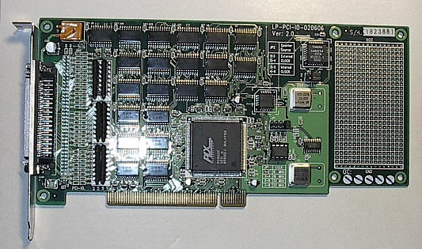
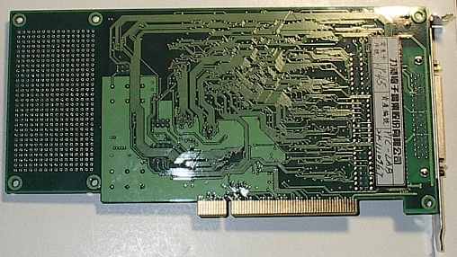
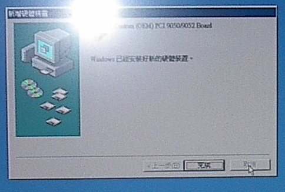
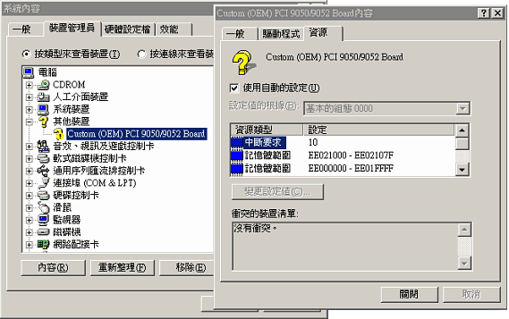
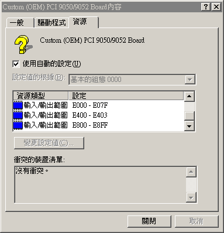
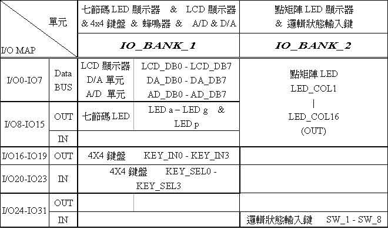
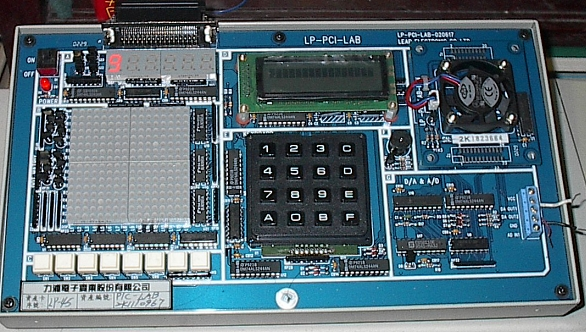
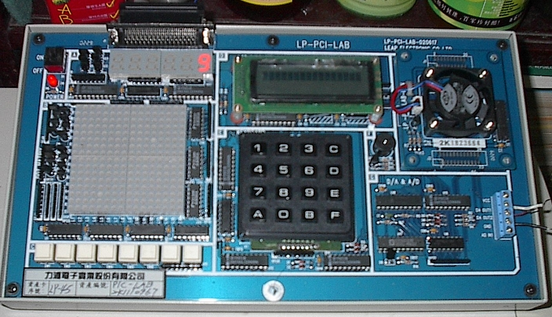

# Man-Machine Interfaces

## Peripheral Component Interconnect (PCI)

```
$author:   Ching-Wen (Ed) Lai
$date:     May. 2003
$revised:  Mar. 2018
$keywords: man, machine, interface, peripheral component interconnect, pci
```

An exercise of PCI interface control by `Assembly`. 

## Content

* [Concept](#concept)
* [Requirements](#requirements)
* [Hardware](#hardware)
* [Software](#software)
* [Programming](#programming)
* [Advanced](#advanced)

## Concept

- `ISA`的缺點就是可能會發生I/O Port衝突的問題, 最深刻的印象就是在`DOS`時代, 玩遊戲有時後會出現，[聲霸卡](https://zh.wikipedia.org/wiki/Sound_Blaster)與其它ISA卡位址衝突，而需特別手動調整聲霸卡或其它ISA卡的I/O位置.
- `PCI`的出現，而透過電腦自動與PCI卡指定PCI介面卡 `I/O`或 `Memory` 位置.
- `PCI`自動指定`I/O`或 `Memory` 位置, 主要是透過以下兩個 I/O Port來得到動態 I/O address.    

| I/O Port Address | Name                     |
|------------------|--------------------------|
| 0x0cf8           | PCI CONFIG Address Port  |
| 0x0cfc           | PCI DATA Port            |

- 但在此次的練習為了方便起見,`Leap PCI Target Board`還是以固定IO為主.

## Requirements

- Microsoft Windows ME
- Microsoft MASM (Macro Assembler)
- Leap PCI Card and Target Board

## Hardware

- PCI Card - Front View (Master)  


- PCI Card - Rear View (Master)  


- Leap PCI Target Board    


## Software

- 安裝

1. 將 `Leap PCI card` 插入 電腦主機的 `PCI Solt` 內, 重開機後  
OS 會提示已經發現下列硬體 – `PCI Early non-VGA Device`.  

2. 選擇 `指定驅動程式的位址(進階)(S)` 安裝裝置驅動程式。    
適當的選擇驅動程式的位址(`\Win32\Driver\Wdn`),並點選『下一步』。    
    

3. 安裝後出現上面視窗,點選 `完成`,完成安裝驅動程式。    
    

4. 開啟 `開始/ 設定/ 控制台/ 系統/ 硬體/ 裝置管理員`, 點選
`其他裝置/ Custom(OEM) PCI 9050/9052 Board` 即可查看該裝置內容。    
    

5. 輸入輸出範圍      
    

6. 每台電腦上的裝置內容不盡相同,我電腦上的裝置內容整理如下    

| 中斷要求               | 10                |
|------------------------|-------------------|
| 記憶體範圍	            | EE021000-EE02107F |
| 記憶體範圍	            | EE000000-EE01FFFF |
| 輸入輸出範圍(最低 I/O) | E000-E07F         |
| 輸入輸出範圍(次低 I/O) | E400-E403         |
| 輸入輸出範圍(最高 I/O) | E800-E8FF         |  

7. Leap PCI 裝置可用的 裝置 I/O 定義為      
    
     

## Programming

- 以下程式以控制七段顯示器的上數. 七段顯示器位址線位於 IO_Bank_1 IO-8~15, 資料線位於IO_Bank_1 IO-40~47, 透過與 Base 的加權,即可找出相對應的位址。   

``` nasm
MODEL  SMALL                           
.386
.STACK

.DATA

IO_PORT0       EQU     0E811H  ;  io_bank_1 io-8~15
IO_PORT1       EQU     0E815H  ;  io_bank_1 io-40~47
OUT_DISABLED   EQU     0E808H  ;  io_bank_0
IO_PORT0D      EQU     0E800H  ;  io_bank_0
IO_PORT1D      EQU     0E804H  ;  io_bank_0

.CODE
BEGIN:
        PUSH    DS
        MOV     AX,0
        PUSH    AX
        MOV     AX,@DATA
        MOV     DS,AX
DISP_BEGIN:                             
        
        MOV     DX,IO_PORT1            ;第一個七段碼亮
        MOV     AX,0005H               ;0000-0005 不同位址輸出
        OUT     DX,AX
        CALL    COUNT_7SEG
        CALL    WAIT_1S

        MOV     AH,0BH                 ;按任意鍵結束程式
        INT     21H                    ;中斷向量21h
        CMP     AL,0FFH
        JNZ     DISP_BEGIN
        JMP     EXIT                   ;程式結束

COUNT_7SEG:                            ;顯示0~9數字
        MOV     DX,IO_PORT0            ;顯示 O
        MOV     AX,003FH               ;0011_1111
        OUT     DX,AX
        
        CALL    WAIT_1S
        
        MOV     DX,IO_PORT0            ;顯示 1
        MOV     AX,0006H               ;0000_0110  
        OUT     DX,AX
        
        CALL    WAIT_1S
        
        MOV     DX,IO_PORT0            ;顯示 2
        MOV     AX,005BH               ;0101_1011
        OUT     DX,AX
        
        CALL    WAIT_1S
        
        MOV     DX,IO_PORT0            ;顯示 3
        MOV     AX,004FH               ;0100_1111
        OUT     DX,AX
        
        CALL    WAIT_1S
        
        MOV     DX,IO_PORT0            ;顯示 4
        MOV     AX,0066H               ;0110_0110
        OUT     DX,AX
        
        CALL    WAIT_1S
        
        MOV     DX,IO_PORT0            ;顯示 5
        MOV     AX,006DH               ;0110_1101
        OUT     DX,AX
        
        CALL    WAIT_1S
        
        MOV     DX,IO_PORT0            ;顯示 6
        MOV     AX,007DH               ;0111_1101
        OUT     DX,AX
        
        CALL    WAIT_1S
        
        MOV     DX,IO_PORT0            ;顯示 7
        MOV     AX,0007H               ;0000_0111
        OUT     DX,AX
        
        CALL    WAIT_1S
        
        MOV     DX,IO_PORT0            ;顯示 8
        MOV     AX,007FH               ;0111_1111
        OUT     DX,AX
        
        CALL    WAIT_1S
        
        MOV     DX,IO_PORT0            ;顯示 9
        MOV     AX,006FH               ;0110_1111
        OUT     DX,AX
        
        CALL    WAIT_1S
        
        RET

WAIT_1S:
        MOV     BX,0007FH
WAIT_LOOP:
        CALL    WAIT_1MS
        DEC     BX
        CMP     BX,0000H
        JBE     WAIT_1S_EXIT
        LOOP    WAIT_LOOP
WAIT_1S_EXIT:
        RET

WAIT_1MS:
        MOV     CX,03FFFH
WAIT_LOOP1:
        MOV     BX,BX
        MOV     BX,BX
        MOV     BX,BX
        MOV     BX,BX
        MOV     BX,BX
        MOV     BX,BX
        MOV     BX,BX
        LOOP    WAIT_LOOP1
        RET

EXIT:
        MOV     DX,OUT_DISABLED                 ;清除所有設定。
        MOV     AX,0000H
        OUT     DX,AX
        MOV     DX,IO_PORT0D
        MOV     EAX,00000000H
        OUT     DX,EAX
        MOV     DX,IO_PORT1D
        MOV     AX,0000H
        OUT     DX,AX
        MOV     AH,4CH
        INT     21H
        END     BEGIN

```

## Running

1. 使用`MASM`編譯程式碼  
``` sh
C:\MASM\ML 7SEG-1.TXT
```
2. 執行之後產成 OBJ 與 EXE 檔, 直接執行  
``` sh
C:\MASM\7SEG-1
```
3. 即可看到 7-SEG 群 的左側第一個由 0 開始往上數至9, 並且一直循環.  
  

<!--
 

-->

## Advanced

- PCI Host
- PCI Bridge