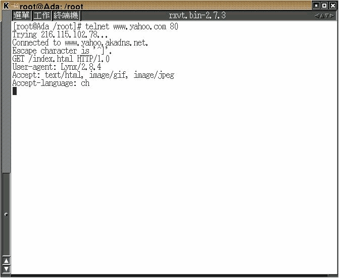

# HyperText Transfer Protocol (HTTP)


Do the HTTP experiment as explained in the lecture.
- At last try to get a html file, show your process and partial result (no need to print all stuff you get to hand in).
- You are welcome and hand them in for grading (refer to `RFC2068` if you want).

## Concept

Users use below application

- Web Browsers (e.q. Microsoft `Internet Explorer`; Netscape `Navigator` and so on) to access the Web Services.

but we will not use any client-side application to access above HTTP Services, instead of `telnet`. It will help us to know more detail of HTTP protocol.

## Requirements

- Red-Hat Linux 6.2 + KDE/X-window
- Perl/TK

## Telnet

### Step-by-Step by telnet

- Issue below command on Terminal to access Yahoo Website

  ```bash
  telnet www.yahoo.com.tw 80
  ```

- Issue below HTTP commands talking with Yahoo Website to fetch Web content `index.html`

| # | PROMPT                                                  | DESCRIPTION                                                                  |
|---|---------------------------------------------------------|------------------------------------------------------------------------------|
| 1 | GET /index.html HTTP/1.0                 <kbd>⏎</kbd>  | GET `index.htm` page using HTTP/1.0 property                                 |
| 2 | USER-agent: Lynx/2.8.4                   <kbd>⏎</kbd>  | Tell Yahoo server our client-side application is `Lynx`                      |
| 3 | Accept: text/html, image/gif, image/jpeg <kbd>⏎</kbd>  | This client accepts html, gif and jpeg format images                         |
| 4 | Accept-language: ch                      <kbd>⏎</kbd>  | The http client is able to accept `ch` language, according to [`RFC1766`][1] |
| 5 | <kbd>Enter</kbd> <kbd>Enter</kbd>        <kbd>⏎</kbd>  | Press two <kbd>Enter</kbd> keys                                              |

  [1]: https://www.ietf.org/rfc/rfc1766.txt

### Screenshots of running telnet

- Initial  the connection to `yahoo` website, and issue the HTTP commands to grab `index.html` page  
   
  

- It'll display the HTML result on Terminal
   
  

- User can also save `index.html` to the file `yahoo.txt` by using Shell command 

  ```bash
  telnet 140.124.13.2 80 >> yahoo.txt`   
  ```  
     
  

- Check the result by reading file `yahoo.txt` (the same `index.html`) by using Shell command also  
  
  ```bash
  cat yahoo.txt | more
  ```   
     
     

- Users can read the file `yahoo.txt` by using Web Browser also  


## A Tiny Browser

### Proposal
- **Basic Concept:**    
  - 使用 Socket 開啟遠端的 http port (80),讀取其 網頁檔案,剖析 其檔案內容的 HTML tag , 並將之轉成 給瀏覽器的所看到的外觀 。
- **Current Status:**    
  - 目前只能剖析基礎的 A tag(超連結 Tag) .
- **Languages used:**    
  - Perl (GUI framework is Tk) .
- **Screenshot:**     
  - 於網址處輸入欲連結網址即可讀取該網頁檔案，讀取後,游標移到有超連結功能處顏色會改變,按一下後,即可連結到該網頁並開啟。
  

### Programming

```perl
#!/usr/local/bin/perl
###################################  webget.pl  ###############################
# Proposal:    a tiny browser
#
# Description: 1. 初級功能  
#              2. 連線 HTTP Server 後 
#              3. 取得 Html Tag 做出 <A> tag (超連結) 的功能
#
# Usage:       1.  Unix-like OS
#              1.1 install Perl on Unix-like OS (Unix ,Linux ,Free BSD ,Sun..)
#              1.2 invoke Terminal mode on Xwindow 
#                  <s9360511@sun:~/task/ss>[46] chmod 755 webget.pl (chmod to 755)
#                  <s9360511@sun:~/task/ss>[48] ./webget.pl        (Running)
#
#              2.  MS Windows 平台 
#              2.1 需先安裝 Perl(www.perl.org)
#              2.2 在直接按本檔案啟動或進入 MS-DOS 底下啟動
#                  C:\>perl     webget.pl   (以 Perl直譯 本程式檔)
#                      ^^^^    ^^^^^^
#                      直譯器 本程式
#
# Limitation:  1. A tag 功能 並不完全
# Reference:  
# Issue :
# History:     n/a
###############################################################################

use Tk;
use IO::Socket;

$FONT='#a0b7ce';
###############################################################################
##    GUI Layout                                                      [ Start ]
###############################################################################

$mw = MainWindow->new;
$mw->title("Perl 瀏覽器");
$f = $mw->Frame->pack(-side => 'top', -fill => 'x');

# IP Address/or URL
$f->Label(-text => "網址:")->pack(-side => 'left', -anchor => 'w');
$f->Entry(-textvariable => \$url_name)->pack(-side => 'left', -anchor => 'w', -fill => 'x', -expand => 1);

# Button
$f->Button(-text => "Exit", -relief=>'ridge',-command => sub { exit; } )-> pack(-side => 'right');
$f->Button(-text => "首頁", -relief=>'ridge',-command => \&home_web)->  pack(-side => 'right', -anchor => 'e');
$f->Button(-text => "連結", -relief=>'ridge',-command => \&link_web)->  pack(-side => 'right', -anchor => 'e');

# Display Area
$t =$mw->Scrolled(qw/Text -setgrid true -width 60 -height 24 -scrollbars e -wrap word/, -font => $FONT);
$t->pack(qw/-expand yes -fill both/);

# Set up display styles
    my(@bold, @normal, $tag);
    if ($mw->depth > 1) {
        @bold   = (-background => '#43ce80', qw/-relief raised -borderwidth 1/);
        @normal = (-background => undef, qw/-relief flat/);
    } else {
        @bold   = (qw/-foreground white -background black/);
        @normal = (-foreground => undef, -background => undef);
    }

MainLoop;
###############################################################################
##    GUI Layout                                                        [ End ]
###############################################################################

# ...................   Access Website ........................................
sub link_web { 
  @ARGV= split /\//,$url_name;
  &show_page;
}

# ..............   Default Portal Site is "www.yahoo.com.tw"   ................
sub home_web { 
  @ARGV= qw(www.yahoo.com.tw /index.html);
  &show_page;
}

sub linkSite{
    @ARGV=@_;
    $_=$ARGV[0];   
    s#/##;
    $ARGV[0]=$_;
    $ARGV[1]="/index.html";   
    $t->delete("1.0", "end");   
    &show_page;   
}

# ...........    Grab the http pages from http server    ......................
sub show_page {

  ## 下方顯示連接網址
  $info = "目前連接 '$url_name'";

  ## 清除顯示區
  $t->delete("1.0", "end");

  ## 檢查網址是否正確
  unless (@ARGV > 1 ) { die "usage: $0 host document ...\n" }
 
  $host = shift( @ARGV);  
  foreach $document (@ARGV) {

    #使用 socket 連接 http server
    $remote = IO::Socket::INET->new(Proto => "tcp",PeerAddr => $host,PeerPort => "http(80)",);
    unless($remote){ die "cannot connect to http daemon on $host"}
    $remote->autoflush(1);
    ## 與 http 交談 抓取網頁
    print $remote "GET /$document HTTP/1.0\n\n";
   
    $counter=0;
    #使 HTML 的 A Tag 作用
    while(<$remote>){ 
    
       #去掉 A Tag 中不用顯示的字元
       if (index($_,"<a href=")==0) {           
            ~s#<a href="http://##;    
            $where=index($_,">");           
            $tt1=substr($_,0,($where-1));                                       
            ~s#$tt1">##;               
            $where=index($_,"</a>");
            $tt2=substr($_,0,$where);                       
            $counter++;
            $aTag{'d'.$counter}=$tt1;   
            $t->insert('end', $tt2."\n", 'd'.$counter);     
            
        }#目前其他的 HTML Tag 直接顯示
        else{$t->insert("end", $_);}               
    }   
    # ................    Display A tag     ...................................
    foreach $tag (%aTag) {
   
        ## 顯示 A tag 並且游標移到 A tag 會將 該 A tag 字串背景變成 綠色
        $t->tag('bind', $tag, '<Any-Enter>' =>sub {shift->tag('configure', $tag, @bold)});
        $t->tag('bind', $tag, '<Any-Leave>' =>sub {shift->tag('configure', $tag, @normal)});

        ## 使 A tag 超連結 功能生效
        $t->tag("bind",$tag,"<1>" => sub {&linkSite($aTag{$tag})});     
    }   
    $t->mark(qw/set insert 0.0/);   
    close $remote;
  }
}
```

## Advanced

- User can press <kbd>F12</kbd> to observative how Chrome works step-by-step.
    
  

```
$author:   Jin-Wen (Ed) Lai
$date:     Oct. 2001
$revised:  Mar. 2018
$keywords: computer, networks, network, http, RFC.
```