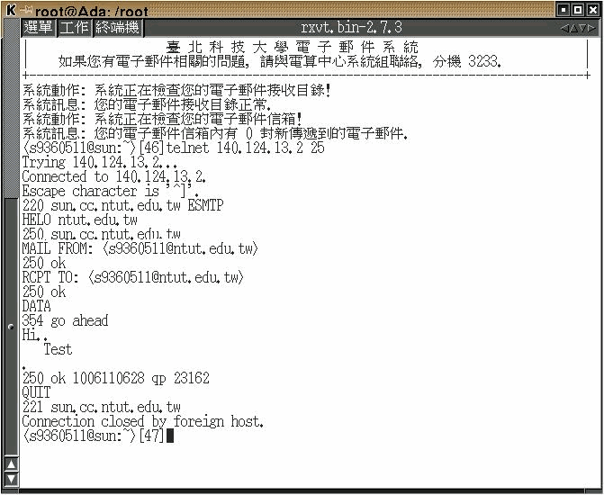
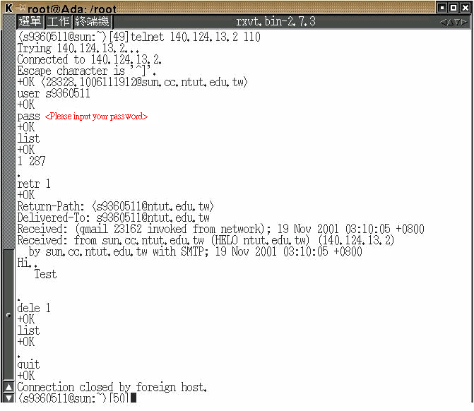

# Simple Mail Transfer Protocol and Post Office Protocol - Version 3 (SMTP and POP3)

Read the E-mail materials, do the experiments: 
Send an E-mail without using application S/W.
Connect to your POP3 server (not the POP3 client which is yourself) and experience the POP3 commands (e.g. message retrivel ).

## Concept

Users use below applications

- Email Agents (e.q. outlook...) to access the Mail Services

but we will not use any client-side applications to access above Services. instead of `telnet`. It will help us to know more detail of each low-level protocol.

## Requirements

- Red-Hat Linux 6.2 + KDE/X-window

## SMTP

### Step-by-Step of telnet

1. Login NTUT's Telnet Server
2. Telnet to NTUT's `SNMP` Services (TCP Port 25)    
   ```bash
   # telnet 140.124.13.2 25
   ```
3. Issue SMTP Commands    

| STEP | PROMPT                             | DESCRIPTION                                                  |
|------|------------------------------------|--------------------------------------------------------------|
| 1    | helo ntut.edu.tw                   | Initiate the SMTP conversation           |
| 2    | MAIL FROM: <s9360511@ntut.edu.tw>  | Specifies the e-mail address of the sender |
| 3    | RCPT TO: <s9360511@ntut.edu.tw>    | Specifies the e-mail address of the recipient (send to myself in this case |
| 4    | DATA                               | Start the transfer of the message contents, then Server will answer `go ahead` |
| 5    | .                                  | A single dot (`.`) must be sent in a line by itself `.` ,then Server will answer mail's number in queue |
| 6    | QUIT                               | Exit the Mail Server |


### Screenshot

- Screenshot      
  

## POP3

### Step-by-Step

Following above step. After waiting around 10 minutes (depends on setting of Mail Server), we can test `POP3` Service.

1. Login NTUT's Telnet Server
2. Telnet to NTUT's `POP3` Services (TCP Port 110)    
   ```bash
   # telnet 140.124.13.2 110
   ```

- POP3 Command

| STEP | PROMPT                             | DESCRIPTION                                                  |
|------|------------------------------------|--------------------------------------------------------------|
| 1    | user s9360511                      | Specifies the `USERNAME`                                     |
| 2    | pass <password>                    | Specifies the `PASSWORD`                                     |
| 3    | LIST                               | List Message (how many) and size of message (according to above, my will have one mail at least |
| 4    | RETR 1                             | Retrieve selected message `1` |
| 5    | DELE 1                             | Delete selected message `1` if we will not keep it |
| 6    | LIST                               | List Message (how many), there is no message now, beacuse will delete it before |
| 7    | QUIT                               | Exit POP3 Service |

<!---
(Timeout)
--->

### Screenshot

- Screenshot      
  


```
$author:   Ching-Wen (Ed) Lai
$date:     Oct. 2001
$revised:  Mar. 2018
$keywords: computer, networks, network, http, RFC.
```