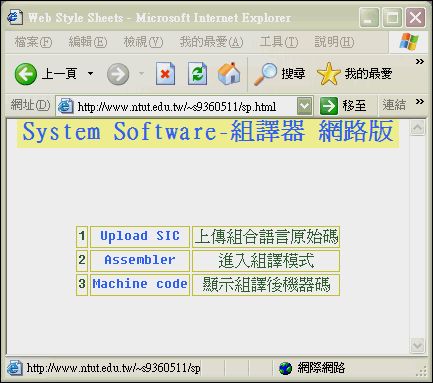
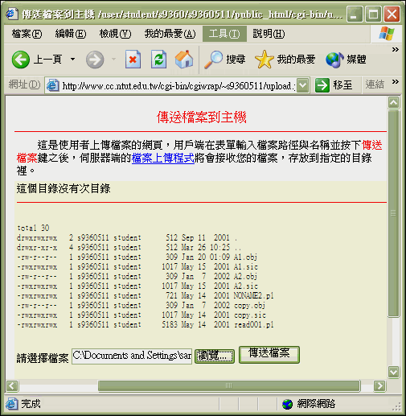
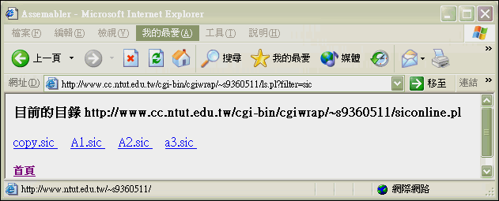
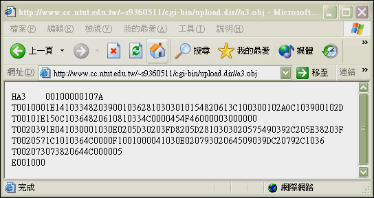
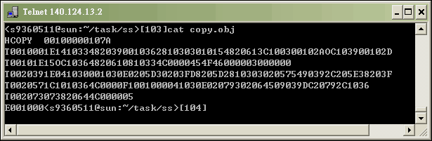
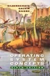

# An Assembler Compiler

An implementation of an Assembler Compiler.

## Concept

- **為何你會撰寫 可上網操作的 組譯器?**  
  使用中高階語言( C/Basic...) 與低階語言(組合語言)來撰寫的範例太多了，我想試用與網路結合性較佳的語言來寫組譯器。 可單機操作亦可上網操作，單機版並可發展出 DOS模式相容/Win9X/WinNT/Unix-like(Linux,FreeBSD...)平台的終端機模式或 X-window下 皆可使用的跨平台組譯器。
- **Script語言這麼多(JSP,PHP,ASP...)， 為何你會選用 Perl/CGI 來撰寫?**  
  基本上，Perl 是免費功能強大且跨平台的語言，且其 字串比較(樣板比對) 與 Hash Table 的能力 ，讓我在短時間內開發出 核心程式碼不超過200行的組譯器，並且可依照需求開發出單機版(無網路環境)與網路版(有網路環境)的組譯器。PHP是不錯的 Script 語言， 有機會的話，也可試試看。 
- **可說明一下 你的組譯器的開發流程？**  
  先開發出 單機版核心程式， 再加強為網路版程式(PERL/CGI) 或 單機版GUI 程式(PERL/TK) 。 
- **可說明一下 你的組譯器的開發流程？***  
  先開發出 單機版核心程式， 再加強為網路版程式(PERL/CGI) 或 單機版GUI 程式(PERL/TK) 。 
- **可說明一下 網路版組譯器 的優點？**  
  - **可攜性會加大**: 可上網執行只需在一台機器安裝組譯器 其他機器不需安裝 可隨時可上網組譯。
  - **學習曲線提高**: 可加強為 搭配網路資料庫的功能， 學習者/使用者 可隨時上網查詢 指令的定義 、說明及用法 。 並可建立自己的線上Library ，與網友分享自己所寫的副程式、巨集與函式 。加入討論區可讓使用者分享心得、線上發問 ， 提高學習效率。
  - **組譯器版本更新時**: 當組譯器更新版本時 ，使用者不需要在 Client 端一直安裝/更新，由Server 端更新。
  - **擁有跨平台執行的能力**: 目前Unix-like 與 Win32 和 機器皆可使用。 Mac 應該也可以， 不過我沒機器試驗。
  - **擁有跨平台使用的能力**: 不管使用者是Mac 或 安裝 MS Windows/FreeBSD/Linux OS 的 x86的電腦。只要能 上網皆可使用 。 當然 ，因為組合語言有關係到硬體的功能(ex.x86機器 的 INT 21...) ，需相同的硬體才可驗證 ；亦需依照特定的硬 體 撰寫特定I/O功能。
  - **主機試驗**: 有時使用者所撰寫的程式並無錯誤 ，但卻因為硬體有誤而無法驗證(ex.主機板I/O被其他介面佔去)。 可搭配下載器(Loader)下載到專定硬體(遠端專用測試系統)去執行 ，不過這部分功能我並未撰寫。
- **網路版便利性蠻高的 ，那他有缺點嗎？**  
  有的 。
  - 網路版在沒有網路的環境下不能使用。不過目前電腦可搭配 `PHS` 上網。我的意思是，隨著網路的普及，這種缺點會慢慢改善。
  - 網路版在多人使用時 ，組譯速度可能會變慢 。不過可以加大 Server 端配備加大承載能力 與 使用分散式處理功能 來改善。
  不過，老實說 。我覺得以上兩點，並不能算是缺點。  
  另外硬體下載對映方式(下載器；Loader)需分平台撰寫。 
- **在單機版中如何只散播執行檔？**  
  Perl 為直譯器語言 ，在執行需有安裝Perl 的機器才可 。不過你可以使用可將Perl Script轉成.exe (MS Windows 下的 執行檔) 的軟體來散播。
- **如果我要寫一個該組譯器用的線上直接編輯器 ，那我該如何下手呢？** 
  單機版可使用現成的 記事本 或 PEIII 等編輯器編輯 。你當然也可以用 Perl/Visual Basic 撰寫一個功能更強的編輯器 。若你要寫一個網頁版線上編輯器 ，你可使用JavaScript來寫 ，如果你需要更強的功能可使用JavaApplet 來寫， 並與後端指令資料庫搭配提供更豐富的GUI功能。 
- **依照語言的歷史來看，先有機器語言， 發展組合語言， 再有中高階語言 。我的意思是， 你會考慮用機器語言 或 組合語言來撰寫 組合語言組譯器嗎？**   
  我沒有這個想法 ，打個比方，人類生火的技術是先有 鑽木取火 ，再發明用 使用打火石取火 ，然侯一直演進 發明用打火機或其他先進的方法來取火 。用機器語言或組合語言來寫組合語言組譯器等於你現在取火還在用鑽木取火， 既吃力又不討好 撰寫速度又慢 。這樣你了解我的意思吧 。除非我想更加鍛鍊自己低階語言的功力 ，否則我是不會這麼作的。 
- **我該如何自己設計一顆 mPU， 並寫一個該mPU 的組譯器呢？**   
  就一般學生而言 ，以全客戶製程來設計一顆mPU不但費時費力 。且就算完成了除非是教育性晶片否則也難以下單給代工廠。 你可以考慮使用FPGA/VHDL 來撰寫一顆小型 mPU ，並發展該 mPU 的組譯器 與 載入器 。將機器碼載入該mPU實際驗證，這可能會比較方便一點。
- **可詳述一下，若不同機器的組譯器該如何撰寫嗎？**  
  對於Sun(Ultra-Enterprise) 的機器或 VAX架構機器(DEC) x86的機器(IBM)等機器而言，系統程式有分為與硬體有關和與硬體無關部分， 可先一起撰寫與硬體無關部份再分別撰寫與硬體有關部分。 
- **可稍微敘述一下撰寫組譯器的重點？**  
  組譯器的處理可分為PASS I 與 PASS II ，其他依照此寫組譯器的演算法大綱下去撰寫即可。

## Requirements

- Sun OS
- Perl 

## Demonstration

There are two versions of this Assembler Compiler

- Online Edition
- Stand-alone Edition (Personal Edition)

### Online Edition

- [Demo Site](http://www.ntut.edu.tw/~s9360511/sp.html) (It’s unavailable now after I was graduated from NTUT)  
- We will use some examples to introduce the features of this Assembler Compiler.

0. 進入系統首頁    

1. 選擇 `(1) Upload SIC` 上傳組合語言原始碼.  
    

2. 按下瀏覽 鍵 選定你的 Client 端 的 組合語言原始碼檔(ex:`a3.sic`)     
    

3. 按下 傳送檔案 並 傳送組合語言原始碼(ex:`a3.sic`)至 Server 端。   
    

4. 檔案 (ex:`a3.sic`) 傳送完成。  
    

5. 回 `Picture (1)` 選擇 `(2) Assembler` 進入組譯模式 選擇要組譯的檔案(ex:`a3.sic`)。  
    

6. 組譯完成 顯示載入位址 與 組譯後的機器碼 於網頁上. `[ 顯示格式 :: 載入位址 ==> 機器碼 ]` 。  
    

7. 回 Picture (1) 選擇 `(3) Machine code` 顯示組譯後機器碼. 選擇 剛剛完成組譯組合語言(ex:`a3 .sic`)的 的機器碼檔(ex:`a3.obj`).   
    

8. 顯示機器碼(ex:`a3.obj`).  
    

### Stand-alone edition

1. 連上 學校 Sun OS 主機, 輸入帳號與密碼。
   ``` sh
   $ telnet://140.124.13.2
   ```
    
2. 編輯組合語言並存檔。
   ``` sh
   $ vim copy.sic
   ```
    
3. 組譯組合語言( 內定 組譯 copy.sic 檔) 即可輸出組譯結果。 
   ``` sh
   $ perl sic.pl copy.sic
   ```
    
4. 檢視機器碼檔(shell command : cat copy.obj).
   ``` sh
   $ cat copy.obj
   ```
    


## Advanced

- **你所撰寫的組譯器還有其他的發展空間嗎？**  
  是的。撰寫組譯器只是學校系統程式課程的一部分，並不是全部 ，為了有時間學習其他部分， 我並沒有花許多時間寫的特別完整 。所以發展空間蠻大的 ，基本上可加強以下的功能。  
  - 功能的完整性,除錯器和...
  - 改成 SIC/XE 版 。
  - 以 Perl/Tk 加入親和性更佳的 GUI 介面。
  - 以 Perl/Tk 加入 GUI 編輯器,並可依顏色區別內部特殊字串 。
  - 加入虛指令及M+碼 。
  - Macro及Sub的延伸... 
  - 可以改成針對實際的 系統 來寫 。
  - 完成載入器(Loader)軟體及硬體部分。

## Reference

- [Operating System Concepts](https://www.amazon.com/Operating-System-Concepts-Silberschatz-Abraham/dp/B009NGFMIM)
  - by Peter B. Galvin, Greg Gagne and A Silberschatz Abraham Silberschatz (Author)    
  

<!--
- [MPLAB® Xpress Cloud-based IDE](https://mplabxpress.microchip.com/mplabcloud/ide)
-->

```
$author:   Jin-Wen (Ed) Lai  
$date:     May. 2001
$revised:  Mar. 2018
$keywords: operating, systems, assembler, compiler, perl
```