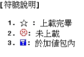

# Perl - An Online Quizzes

<!--
```
$author:   Ching-Wen (Ed) Lai
$date:     May. 2001
$revised:  Mar. 2018
$keywords: perl, online, quiz, exercises, file system
```
-->

An implementation of an On-Line Quizzes.

<!--
## Content

* [Concept](#concept)
* [Requirements](#requirements)
* [Function List](#function-list)
* [Demonstration](#demonstration)
* [Copyright](#copyright)
* [Advanced](#advanced)
-->

## Concept

使用`檔案系統`撰寫一程式，使之能透過`網際網路`，`上傳`與`瀏覽`由每位同學自行出題的線上題庫, 並可由程式整理題庫進行 線上測驗.

## Prerequisites

- Perl

## Function List

There are all of functions about the implementation of this Online Quiz.

| ID | Item           | Function |
|----|----------------|------------------------------------------------------|
| 1  | **開懷**        | 讓同學貼笑話，看看笑話放鬆一下，休息是為了走長遠的路 |
| 2  | **上傳題庫**     | 提供同學上傳題庫               |
| 3  | **更正題庫**     | 提供同學手動更正上傳的題庫     |
| 4  | **閱讀題庫**    | 選擇所要閱讀的要章節           |
| 5  | **檢試題庫**    | 確認每一個人的題庫上傳進度     |
| 6  | **個人題庫**    | 檢示確認個人上船的題庫是否有誤 |
| 7  | **講義下載**    | 老師上課的講義下載             |
| 8  | **系統說明**    | 關於本題庫系統的說明           |
| 9  | **題庫加值包**  | 將題庫轉檔成 Word 或 PDF 格式  |
| 10 | **語音討論區**  | 在 Winba 申請一個語音討論區，可以用麥克風與喇叭直接語音留言 |

## Demonstration

- [Demo Site](http://www.cc.ntut.edu.tw/cgi-bin/cgiwrap/~s9360511/os.pl) (It's unavailable now after I was graduated from NTUT)

- We will use one example to go thru and introduce the features on this online quiz.

### 系統首頁:

進入系統首頁，列出所有功能，以下一一說明


### 上傳題庫 (使用網頁上傳):

填入你所出的題目，四個選擇的答案和正確的答案，按下 Sumit 上傳。


### 上傳題庫格式 (代人上傳):


### 瀏覽題庫 (全部展開模式):

將題庫以精美排版方式展開，方便線上閱讀。


### 瀏覽題庫 ( 精簡模式 ):

將提庫以精簡方式顯示，方便用紙列印。


### 瀏覽題庫 ( 只顯示正確答案 ):

只顯示正確答案，萬一來不及看書，也能考前抱佛腳，有個印象


### 瀏覽題庫 ( 線上測驗模式 I ):


進行線上複習測驗。有以下功能︰

- **錯誤提醒**: 程式會顯示一對話框告訴你答錯了,若不需要,可以將打勾取消。
- **複習標示**: 答錯時會在答案處顯示正確答案並標上色彩(淡藍色),方便你複習。
- **離線使用**: 請選擇檔案,另存新檔,將本網頁儲存後,即可離線使用(不上網亦可線上測驗)。
- **檔案型態**: 需離線使用將網頁存檔時，若顯示格式不符,沒關係,存成HTML檔后亦可使用。
- **題庫管理**: 顯示每一章內題庫共有幾題題目。
- **時間管理**: 顯示測驗階段，總共耗費的時間。
- **進度管理**: 進行測驗時，所完成的題數與百分比(完成題數/全部題數)。
- **錯誤管理**: 系統顯示測驗時，答錯幾題與錯誤百分比(答錯題數/完成題數)。

### 瀏覽題庫 ( 線上測驗模式 II )

承上，如果答錯了，會顯示一Window告訴你的答案錯誤，系統除會顯示正確答案外，並標示顏色。


### 題庫上傳狀態:

檢視題庫的上傳狀況，得知尚有那位同學尚未上傳題庫。


以符號代表上傳狀況，



| Symbol   | Function                                |
|----------|-----------------------------------------|
|星號      | 代表上傳完畢                            |
|人頭      | 代表還未上傳個人題庫                    |
|磁片符號  | 代表於加值包內( PDF檔內 ，詳見下面說明) |

### 系統加值包:

HTML網頁顯示圖片與表格需再經過幾道手續的處理，為了避免麻煩，並節省時間，所以將含有表格或圖片的題目製成 MS Word 或 PDF 檔。直接線上閱讀(如果瀏覽器有該格式的 Plug-in 的話 )或下載，簡化處理手續。

左邊列出 PDF線上顯示 shortCut 。


### 瀏覽個人題庫:

只單純瀏覽個人的題庫。


<!--
## Copyright

我只負責撰寫程式而題庫內容 屬於全班同學所有。
-->

## Advanced

- 本程式是以`檔案系統`搭配`Perl`的`Hash-Table`寫成，利用 Perl 來寫入檔案，讀取與並顯示出所欲閱覽的格式.
- 通常這類的程式會比存取`資料庫系統`的程式來的難以維護，程式撰寫時間較多，資料保密性亦不佳. 
- 所以之後的屬於這類的程式建議以PHP語言搭配`資料庫系統`(MySQL)寫成.
