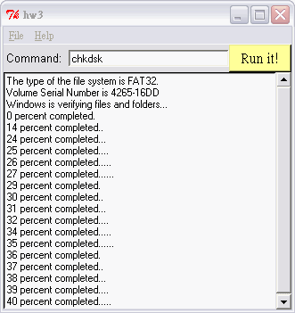

# Computer Programming

## Tcl/Tk - An Execution Logger

The purpose of this exercise is for you to create an execution logger. You type commands into the GUI and the result of the command is shown in the text widget below it, as the following screenshot (taken from Linux) illustrates.



## Content

* [Requirements](#requirements)
* [Programming](#programming)

## Requirements

- Create the user interface as shown in the screenshot.

  - This actually comprises four columns and three rows: the rightmost column contains only the scrollbar, and the Help and Run it! buttons both span two columns.
  - The buttons labelled File and Help are not ordinary buttons but menubuttons. You should change the item_name property of the File menubutton to be fileMenubutton and the menu property to be m; this corresponds to the first two lines of code given below. Similarly, you should change the item_name property of the Help menubutton to be helpMenubutton and the menu property to be m.

- You should create the text widget, which receives the output of the command, before the accompanying scrollbar. You should then use the Commands=&gt;Attach scrollbars command to associate the scrollbars with the text widget.
- The command property of the Run it! button should be set to GoGoGo.
- The item_name property of the text widget should be set to log. It should also have a groove relief.
- Enter the following code into the code editor:  

  ```tcl
     menu .fileMenubutton.m

  1.      .fileMenubutton.m add command -label Exit -command exit
  2.   
  3.      menu .helpMenubutton.m
  4.      .helpMenubutton.m add command -label About -command About
  5.   
  6.      proc GoGoGo {} {
  7.         global entry
  8.         .log insert end [exec $entry]\n
  9.      }
  10.   
  11.    proc About {} {
  12.        tk_messageBox -message \
  13.        "Written by acd@essex.ac.uk" -type ok
  14.    }
  ```

You should insert your own contact information in the About procedure.
- Save and test your program, confirming that it works for the ls command. If you are working in the Windows environment, try some suitable MSDOS commands such as attrib (displays attributes of files in the current directory) or chkdsk (checks the current disk and displays a status report).
- Find the code file generated by your execution logger and paste it into your assignment documentation. Add comments to explain the function of each part of the code. Also submit a screendump of your execution logger design. This user interface could probably have been created more easily using one of Tk's other geometry managers, the packer.

## Programming

```tcl
#!/usr/bin/wish -f
#                An execution logger
# % Author   %   Ching-Wen.Lai
# % Version  %   0.2
# % Env.     %   tclPro/wish(直譯器 window shell ;Linux平台 ; 請自行設定 wish 路徑 (程式第一行) ) 
#                Window XP/ Red Hat 7.0 (平台) 
#                EditPlus(Editor;可有可無 ; Ms Windows )
#                Visual Tcl(Editor; 可將 .tcl 轉成 .exe 檔 ;可有可無 ; Ms Windows )
# %  Run     %   1. Red Hat 7.0 
#                  Ada$ chmod 755 hw3.tcl
#                  Ada$ ./hw3.tcl
#                            use 'ls' command to test it    
#                2. Window XP
#                  after you installed tclPro , double click the hw3.tcl file     
#                  use 'attrib/chkdsk' command to test it
# % Function %  基本作業上所說的功能                 
#
# %  未完成.  %  menu 的 help 不知如何向右對齊 
#               可依作業所言 改成 pack 的 geometry management    
#
# %  缺點.    %  Entry 不太會用 有些地方寫的 不是 很好
#
# %  參考.    %  洪朝貴的首頁 http://www.cyut.edu.tw/~ckhung/
#               tclPro 內部 demo / Demos-IWidgets( 非常有用 )
#               Beginning Linux Programming 基峰 isbn 957-566-692-5
# %  備註.    %  無完全按照作業指定 menu 的樣式定義      
#

set entry  ""

# ..........  Drawing GUI      ..............................

### Menu

menu .menu -tearoff 0 -type menubar
set  m .menu.fileMenubutton
menu $m -tearoff 0
.menu add cascade -label "File" -menu $m -underline 0
$m add command -label "Exit"  -underline 0 -command exit
set  h .menu.helpMenubutton
menu $h -tearoff 0    
.menu add cascade -label "Help" -menu $h -underline 0 
$h add command -label "About"  -underline 0 -command About
. configure -menu .menu

### Label , Entry , Button , Text , ScrollBar

label     .lab      -text "Command:"  -width 2 -anchor w -font "Helvetica 10" 
entry     .ent      -justify "left"   -textvariable entry
button    .run      -text "Run it!"   -background "#FFFF99"  -borderwidth "2" -font "lucidasans-10"  -command GoGoGo
scrollbar .yscroll  -orient vertical  -command ".log yview"
text      .log      -height 20 -width 50 -bg white -yscrollcommand ".yscroll set" 

# ..........  Geometry management   ..............................

grid .lab    -row 0 -column 0 -sticky "we"
grid .ent    -row 0 -column 1 -sticky "ew"
grid .run       -row 0 -column 2 -columnspan 2 -sticky "ew"
grid .log       -row 1 -column 0 -columnspan 3 -sticky "news"
grid .yscroll   -row 1 -column 3 -sticky "ns"

# .................Response .......................................

proc GoGoGo { } {
    global entry    
    .log insert end [exec $entry]\n    
}

proc About { } {
    tk_messageBox -message "Written by ed@url.com.tw" -type ok            
}
```