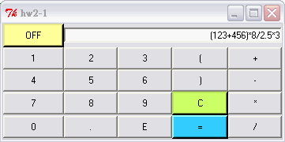

# Computer Programming

## Tcl/Tk - A Simple Calculator

It is possible to build a simple, but fully functional, calculator entirely within SpecTcl -- though the error handling leaves something to be desired!



## Content

* [Requirements](#requirements)
* [Programming](#programming)

## Requirements

1. Although all the required button functions for a basic calculator are included in the design shown above, the overall layout is less than ideal. By examining a variety of real and/or virtual (PC/workstation desk accessory) calculators, produce a paper design for an improved layout for your version of the calculator. (Note: Your design must only include the keys shown above -- this is not an exercise in adding all the bells and whistles of a fully-fledged programmable scientific calculator!)
2. Create a new user interface and populate it with the buttons and an entry widget shown in the screenshot above, but laid out according to your own design. Note that the text appearing in the entry widget should be right-justified. The textvariable associated with the entry widget should be called answer.
3. For the OFF button, associate the built-in Tcl command exit with this button's command. This will cause the application to exit when this button is pressed.
4. With the button labelled C (for clear), associate the command Clear in its properties list.
5. With the button labelled =, associate the command Evaluate in its properties list.
6. Every other button should have its command property set to AddChar followed by the label of the button; for example, the button labelled * should be associated with the command AddChar * In the code editor, enter Tcl procedures to implement AddChar, Clear and Evaluate. (Hint: You will need to use the string processing facilities of Tcl, in particular the append command within the AddChar procedure. The textvariable answer needs to be declared global within each procedure, as the Tk GUI code generated by SpecTcl is outside the scope of the procedures you are writing.) 
7. Save your application and test it. Enter a simple arithmetic expression by clicking on your calculator buttons, then press the = button to evaluate it. Enter an invalid arithmetic expression and see what happens. 
8. Copy and paste the code for AddChar, Clear and Evaluate into your assignment submission. Explain, on no more than one page of A4 how the calculator application works, and how you have improved the GUI compared with the design shown above. Include your hand-drawn improved GUI and a screenshot of the one produced using SpecTcl. 

## Programming

```tcl
#!/usr/bin/wish -f
#                    A Simple calculator (advanced)
# % Author        %  Ching-Wen.Lai
# % Version       %  0.1
# % Requirement   %  1. TclPro(直譯器 ; from : http://www.activeperl.com/Products/TclPro/ )
#                    2. Windows XP(平台)
#                    3. Visual Tcl(Editor; 可將 .tcl 轉成 .exe 檔 ;可有可無)
# % Execution     %  after you installed tclPro , double click the .tcl file
# % Function      %  1. 基本作業上所說的功能
#                    2. 除 0 錯誤可偵測出
#                    3. 基本 錯誤 可轉向 至 對話盒 顯示
#
# % Undone.       %  1. 科學符號 E 的功能 還未寫 需看是否可經 函式 直接轉換
#                    2. Entry 輸入字串長度控制
#    
# % Disadvantages %  Entry 不太會用 有些地方寫的 不是 很好
#
# % Reference     %  1. 洪朝貴的首頁 http://www.cyut.edu.tw/~ckhung/
#                    2. tclPro 內部 demo / Demos-IWidgets( 非常有用 )
#                    3. Beginning Linux Programming 基峰 isbn 957-566-692-5


set answer ""
set temp   ""

#  ...............    Drawing GUI    ...........................
#  my mistakes: there is more than one space between -text and "

option add *off.width 10
option add *ent.width 45
button .off -text "OFF"    -background "#FFFF99"  -borderwidth "3" -command {exit}
entry  .ent -justify "right" -textvariable answer

foreach i {1 2 3 4 5 6 7 8 9 0 } {
    button .f$i -text "$i" -command [list AddChar $i]
    if { $i == "0" } {
        grid .f$i -row 4 -column 0 -sticky "ew"
    } else {      
        grid .f$i -row    [expr {(($i%3) != 0 ) ? (($i/3)+1) : ($i/3)}] \
        -column [expr {(($i%3) == 0 ) ? (($i%3)+2) : ($i%3)-1}] -sticky "ew"
    }
}

button .fdot -text "."  -command [list AddChar .]
button .fe   -text "E"  -command [list AddChar E]
button .frightBrackets -text "(" -command [list AddChar (]
button .fleftBrackets  -text ")" -command [list AddChar )]
button .fclr  -text "C"  -background "#CCFF66" -borderwidth "3" -command Clear
button .fequ  -text "="  -background "#33CCFF" -borderwidth "3" -command Evaluate
button .fadd -text "+" -command [list AddChar +]
button .fsub -text "-" -command [list AddChar -]
button .fmul -text "*" -command [list AddChar *]
button .fdiv -text "/" -command [list AddChar /]


# ............   Geometry Management (else 0-9 )   ..................

grid .off -row 0 -column 0 -sticky "ew"
grid .ent -row 0 -column 1 -columnspan 4 -sticky "ew"
grid .fdot -row 4 -column 1 -sticky "ew"
grid .fe   -row 4 -column 2 -sticky "ew"
grid .frightBrackets -row 1 -column 3 -sticky "ew"
grid .fleftBrackets  -row 2 -column 3 -sticky "ew"
grid .fclr -row 3 -column 3 -sticky "ew"
grid .fequ -row 4 -column 3 -sticky "ew"
grid .fadd -row 1 -column 4 -sticky "ew"
grid .fsub -row 2 -column 4 -sticky "ew"
grid .fmul -row 3 -column 4 -sticky "ew"
grid .fdiv -row 4 -column 4 -sticky "ew"

#......................................................................
# response
# my mistakes  : prog  xxx { yyy } {   be care yyy was capsuled by { }
# .....................................................................
# after < 0-9 + - * / ( ) > buttoms is pressed  , display them on display area
proc AddChar { i } {
    .ent insert [.ent index end] $i      
}

# .....   Clear display area   .....
proc Clear { } {          
    .ent delete 0 end
}

# .....   Display the result   .....
proc Evaluate { } {
    global answer  
    global temp
    set temp $answer
    if [ catch { set temp [expr $temp]} res ] {      
        set i [tk_dialog .info "Info" $res info O Ok ]
        set temp ""      
    }  
    .ent delete 0 end
    .ent insert 0 $temp  
}
```