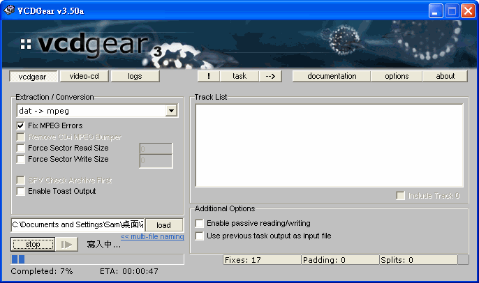
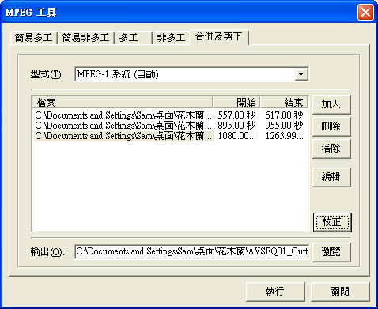
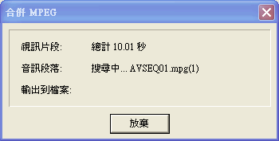
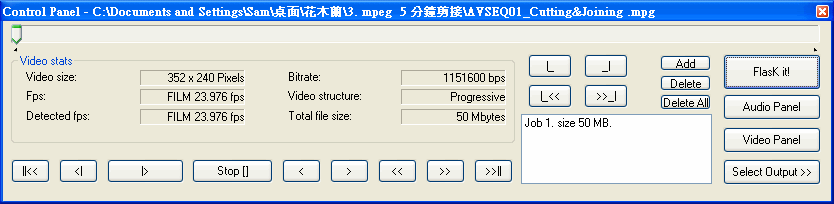
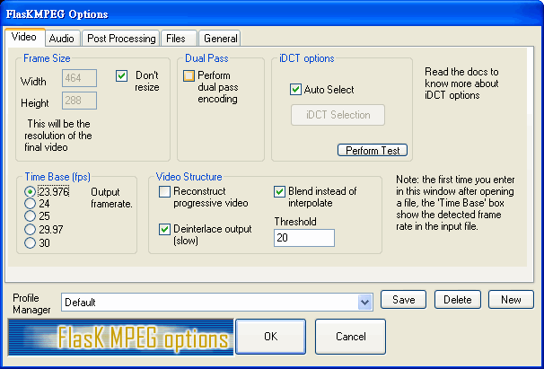
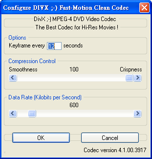
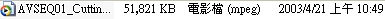
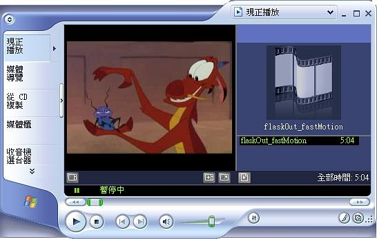
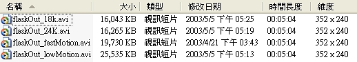

# Television Engineering

## Digital Video Conversion -- MPEG-1

```
$author:   Ching-Wen (Ed) Lai
$date:     May. 2003
$revised:  Mar. 2018
$Keywords: digital, video, conversion, mpeg1
```

An exercise of Digital Video Conversion for below cases

1. Extracting MPEG-1 file from Standard VCD
2. Cutting and Joining MPEG-1 file
3. MPEG-4 Compression
4. Compare Picture Quality and File Size in Step 3

## Content

* [Requirements](#requirements)
* [Running](#running)
  1. [Extracting MPEG-1 file from Standard VCD](#1-extracting-mpeg-1-file-from-standard-vcd)
  2. [Cutting and Joining MPEG-1 file](#2-cutting-and-joining-mpeg-1-file)
  3. [MPEG-4 Compression](#3-mpeg-4-compression)
  4. [Compare Picture Quality and File Size](#4-compare-picture-quality-and-file-size)
* [Observation](#observation)
* [Advanced](#advanced)
* [Reference](#reference)

## Requirements

### Software 
  - VCDGear
  - TMPGEnc
  - FlaskMPEG 

### Media File
  - Mulan (`.DAT` Format)

## Running

### 1. Extracting MPEG-1 file from Standard VCD 

將 VCD 內所使用的`.DAT` 的檔案格式 轉換成影像處理軟體所能處理的影片檔 `.MPG` 格式，

1. Download and Install VCDGear
  - 由 VCDGear 官方網站[下載](http://www.vcdgear.com/)，下面以 3.50a 板進行操作。
  - 解壓縮後，直接點選 `vcdgear.exe` 檔案後，進入 `VCDGear` 。
2. Using VCDGear to convert AVSEQ01 data file to MPEG-1 format file
  - 定義`Extraction / Conversion `為  `dat - > mpeg` 
  - 按下 `load` 指定欲處理的 `.dat` 檔。(`C:\Documents and Settings\Sam\桌面\花木蘭\AVSEQ01.DAT`)
  - 與 轉換後儲存的檔名。(`C:\Documents and Settings\Sam\桌面\花木蘭\AVSEQ01.mpg`)
    
3. 按下`start`開始進行轉換。    
   
4. 如果有 `Fix MPEG Errors`，轉換後會回報錯誤修正數目。在本檔案中有 `266` 個已修正 ( `Fixes : 226` )    
   

### 2. Cutting and Joining MPEG-1 file 

1. Download and Install `TMPGEnc`
  - 由 `TMPGEnc` 官方網站[下載](http://www.tmpgenc.net/)。 
  - 或直接下載[中文化後版本](ftp://ftp.ntust.edu.tw/vendor/slime/Cpatch/high-q/TMPGEnc(2.50.32.120CT).exe) (以下由此中文化後版本軟體進行操作 )。
  - 直接按下 `TMPGEnc(2.50.32.120CT).exe` 檔案進行安裝 。
2. Cut and Join 5-minutes vedio clip from MPEG-1 file
  - 開啟 `TMPGEnc` ，進入 `檔案 / MPEG 工具 / 合併及剪下`, 適當的加入你所要剪輯的檔案。並將選定剪輯與合併的區段, 適當的加入清單中。選定輸出檔案名稱。    
    
  - 按下 `執行` 即可開始執行。    
    

### 3. MPEG-4 Compression

1. Download and Install FlaskMPEG
   - 由`FlaskMPEG`官方網站[下載](http://www.flaskmpeg.net/)。
2. Using different in `FlashMPEG` to convert `MPEG-1` video clip to `DivX `
   - 點選 `FlasKMPEG.exe` 啟動`FlaskMPEG` 。    
     
   - 選擇 `File / Open Media`, 打開欲處理的檔案    
     (例如 `C:\Documents and Settings\Sam\桌面\花木蘭\3. mpeg  5 分鐘剪接\AVSEQ01_Cutting&Joining .mpg`). 選定後會將該 mpeg 檔的屬性顯示於`Control Panel` Window。    
     
   - 選擇`Options/ Advanced Options`，檢視設定
     - **Video** : 將 `Deinterlace output (slow)` 打勾，取得較高的輸出品質。    
       
     - **Post Processing** : 選 `HQ Bicubic Fultering` 。    
       
     - **Files** : 輸出檔案按系統內定放於 `C:\flaskOut` 。
       
   - 選擇 `Options/ Select Output Format`，將 `AVI Output` 打勾。使輸出為 `AVI` 格式。
   - 選擇 `Options/ Output Format Options`，打開 `Flask MPEG AVI Output Options`Window。
   - 此片 ( 花木蘭 )不算是愛情文藝片，偶有些較快的場景，故將
     - **Video Codecs.Double Click to configure** :  設為 `Dix ;-) MPEG-4 Fast-Motion`. 
           
     - 按下 `Configure`進行以下設定，將 **Keyframe** 調成每秒 `12`；**Smoothness** 最佳化 `100 %`；**Data Rate** 為 `600`    
       
     - **Audio Codecs** 設成 `MPEG Layer-3 Codec (professional)`,
       **Available formats for audio codec** 設為 `MPEG Layer-3 - 112 kBit/s, 44,100 Hz, Stereo`, 調整完設定後按下 `OK`。
   - 在`Control Panel` Window  按下 `Flask it!`進行 轉成 `MPEG 4` 壓縮。    
     ▼壓縮中畫面    
        
   - 最後的壓縮結果會存於內定的 `C:\flaskOut.avi` 檔案內。

### 4. Compare Picture Quality and File Size

- 右圖為原本壓縮前( MPEG-1 規格 ) 的畫面，檔案大小為 51,821 KB.    
      
  

- 經過  **FlaskMPEG** 中 MPEG-4     
  - **Video Codecs.Double Click to configure :**  設為 `Dix ;-) MPEG-4 Fast-Motion`   
  - **Audio Codecs**: 設成 `MPEG Layer-3 Codec (professional)`    
  - **Available formats for audio codec**: 設為 `MPEG Layer-3 - 112 kBit/s, 44,100 Hz, Stereo` 。    
    壓縮后的大小為 `19,730KB`，比原先檔案足足少了 `2.62` 倍。    
    但亦可由右圖看出來，畫面品質精細度亦變的較差。    
        

- 在 `FlaskMPEG` 將 `Video Codecs` 改成  `Low-Motion` 其他設定維持不變，發現檔案大小變大成 `25,535 KB`，雖然畫面細緻度增加了，但檔案大小亦增大`1.29`倍 。    
  

- 在  `FlaskMPEG` 將 中
  - **Video Codecs**:  設囘原來的 `Dix ;-) MPEG-4 Fast-Motion` 
  - **Available formats for audio codec** 改成`MPEG Layer-3 - 24 kBit/s, 44,100 Hz, Stereo`, 可以發現檔案大小減小 0.21倍 ，但音質亦可以接受。
  - 再將 **Available formats for audio codec** 改成 `MPEG Layer-3 - 18 kBit/s, 44,100 Hz, Stereo` ,檔案大小雖減少了，但卻不多，音質也還可以接受。
  - 但從 `24 k` 調成 `18 k` 因其檔案大小減少不多，有時卻也不是很必要。    
  

## Observation

- 檔案大小相關比較 

  | ID  | Description                                           | Filename                     | Runtime    | File Size  |
  |-----|-------------------------------------------------------|-------------------------------------------|------------|
  |1    | 原始 AVI 格式                                         | AVSEQ01.DAT                  | 21:45 secs | 224,846KB  |
  |2    | 轉成 MPEG -1 格式                                     | AVSEQ01.mpg                  | 21:45 secs | 221,611KB  |
  |3    | 剪接成 5 分鐘左右 MPEG-1 格式影片                     | AVSEQ01_Cutting&Joining .mpg | 5:04 secs  | 54,821KB   |
  |4    | 將 5 分鐘左右影片轉成 MPEG-4 ( Fast-Motion )格式      | flaskOut_fastMotion.avi      | 5:04 secs  | 19,730KB   |
  |5    | 將 5 分鐘左右影片轉成 MPEG-4 ( Low-Motion )格式       | flaskOut_lowMotion.avi       | 5:04 secs  | 25,535KB   |
  |6    | 將 5 分鐘左右影片轉成 MPEG-4 ( Fast-Motion/ 24k )格式 | flaskOut_24k.avi             | 5:04 secs  | 16,256KB   |
  |7    | 將 5 分鐘左右影片轉成 MPEG-4 ( Fast-Motion/ 18k )格式 | flaskOut_18k.avi             | 5:04 secs  | 16,043KB   |

## Advanced

- There is another free Movie [`Big Buck Bunny`](https://peach.blender.org/download/), we can use it to do this test also.

## Reference

- `VCDGear`軟體說明 
  - [Link](http://toget.pchome.com.tw/intro/multimedia_transfer/10282.html)
- `TMPGEnc`軟體操作 
  - [Link 1](http://hw-driver.nctu.edu.tw/pub/slime/teach/TMPGEnc-MPEG-t.htm) 
  - [Link 2](http://www.hkgolden.com/user_report/TMPGEnc_Plus_25/main.asp)
- `VCDGear`與`FlaskMPEG`軟體教學
  - [Link](http://www.geocities.com/movie2u/dvd2mpeg1.htm)