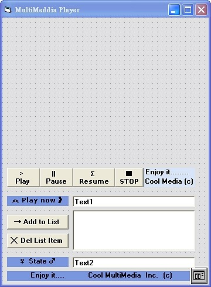
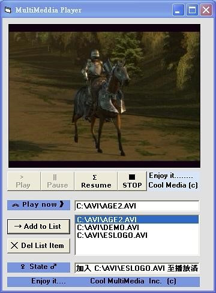

# Television Engineering

## Multimedia Player

```
$author:   Ching-Wen (Ed) Lai
$date:     May. 2003
$revised:  Mar. 2018
$keywords: television, engineering, multimedia, player
```

An implementation of Multimedia Player

## Content

* [Concept](#concept)
* [Requirements](#requirements)
* [Background](#background)
* [GUI Interface](#gui-interface)
* [Programming](#programming)
* [References](#reference)

## Concept

設計一多媒體程式,  可以播放`AVI`與`MIDI`類型的多媒體檔案。

## Requirements

- Visual Basic 6.0

## Background

- 使用 `Visual Basic` 的 API 中的 `MCI(Media Control Interface)` 語音播放函式, 播放多媒體檔. 
- 在程式內即是利用API 的 `mciSendString`函式,來播放 `*.wav` , `*.mid` , `*.avi` 檔.
- 宣告 API 函數,在表單或模組作以下宣告    

``` vb
Public Const WS_CHILD = &H40000000
Declare Function mciSendString Lib "winmm" Alias "mciSendStringA" (ByVal lpstrCommand As String, ByVal lpstrReturnString As String, ByVal uReturnLength As Long, ByVal hwndCallback As Long) As Long
Public FrameNO As Integer
```

- 使用 [`mciSendString`](https://msdn.microsoft.com/zh-tw/library/windows/desktop/dd743373(v=vs.85).aspx) 函數播放多媒體檔    

``` vb
Ret=mciSendString ("MCI Command",0,0,0 )
```

- 以`flags`參數指定方式播放語音檔 

- ret 為呼叫 mciSendString 的傳回值 其值為 0 代表失敗,為 1 代表成功

- MCI Command Strings    

  | MCI Command Strings | Parameters                                  | Function |
  |---------------------|---------------------------------------------|----------|
  |open                 | 設備名稱  `[tape 設備形式]` `[alias 別名 ]` | 開啟設備 |
  |close                | 設備名稱                                    | 關閉     |
  |play                 | 設備名稱                                    | 播放     |
  |pause                | -                                           | 暫停     |
  |resume	        | 設備名稱                                    | 恢復播放 |
  |seek	                | 設備名稱 `[ to 位置 | to start | to end ]`  | 移到     |
  |stop	                | 設備名稱	                              | 停止     |

## GUI Interface

- 表單設計    

      

  - **播放區**: 最頂端為 播放區 ,放映多媒體檔案
  - **播放清單**: 可加入五筆資料 雙擊播放清單可播放選定的曲目
  - **Play**: 播放選定的曲目
  - **Pause**: 暫時停止播放
  - **Resume**: 解除暫停播放的狀態 繼續播放
  - **STOP**: 停止播放
  - **Add to List**: 開啟通用型檔案對話盒 將所選定的檔案加入 播放清單
  - **Del List Item**: 刪除播放清單內的選定的資料 
  - **Play now**: 目前播放的曲目
  - **State**: 顯示系統狀態

- 物件重要屬性值    

      

  | 物件	| Name (物件名稱)|
  |-------------|----------------|
  |Buttom       | cmdPlay        |
  |Buttom       | cmdPause       |
  |Buttom       | cmdResume      |
  |Buttom       | stopComm       |
  |Text	Text1   | Text1          |
  |Text	Text2   | Text2          |
  |List	List1   | List1          |
  |Buttom       | openComm       |
  |Buttom       | delListComm    |
  |CommonDialog | CommonDialog1  |

## Programming

``` vb
Dim item(5) As String
Dim sel As Integer
Dim delCounter As Integer

Private Sub cmdPause_Click()
  Ret& = mciSendString("pause Animation", 0&, 0, 0)
  cmdPause.Enabled = False
  cmdResume.Enabled = True
End Sub

Private Sub cmdPlay_Click()
  cmdPause.Enabled = True
  cmdResume.Enabled = False
  Call List1_DblClick
End Sub

Private Sub cmdResume_Click()
    Ret& = mciSendString("resume Animation", 0&, 0, 0)
    cmdPause.Enabled = True
    cmdResume.Enabled = False
End Sub

Private Sub Command1_Click()
  Form_Unload (True)
End Sub

Private Sub delListComm_Click()
If List1.ListIndex <> -1 Then
    Text2 = "刪除" + item(List1.ListIndex)
    delCounter = Val(List1.ListIndex)
    List1.RemoveItem List1.ListIndex
    If sel < 6 Then
        For delCounter = delCounter To sel
            item(delCounter) = item(delCounter + 1)
        Next
    End If
    sel = sel - 1
    If sel = -1 Then
        delListComm.Enabled = False
    End If
Else
    Text2 = "播放清單是空的"
    delListComm.Enabled = False
End If
End Sub

Private Sub Form_Load()
  Form1.Show
  delListComm.Enabled = False
  Text1 = "使用 Add to List 加入播放清單"
sel = -1
End Sub

Private Sub Form_Unload(Cancel As Integer)
    Ret& = mciSendString("close Animation", 0&, 0, 0)

End Sub

Private Sub List1_DblClick()
  
  If List1.ListIndex > -1 Then
    Call mciSendString("close Animation", 0, 0, 0)
    cmdPlay.Enabled = False
    CmdString$ = ("open " + item(List1.ListIndex) + " type MPEGVideo alias Animation parent " + Str$(Form1.hWnd) + " style " + Str$(WS_CHILD))
    Ret& = mciSendString(CmdString$, 0&, 0, 0)
    Ret& = mciSendString("break Animation on 114", 0&, 0, 0)
    Ret& = mciSendString("set Animation time format frames", 0&, 0, 0)
    Ret& = mciSendString("put Animation window at 10 10 320 240", 0&, 0, 0)
    Ret& = mciSendString("play Animation", 0&, 0, 0)
    Text1 = item(List1.ListIndex)
  Else
    Text1 = "請選擇曲目"
  End If
End Sub

Private Sub openComm_Click()
    If sel < 4 And sel > -2 Then
        CommonDialog1.ShowOpen
        List1.AddItem CommonDialog1.FileName
        sel = sel + 1
        Text2 = "加入 " + CommonDialog1.FileName + " 至播放清單"
        item(sel) = CommonDialog1.FileName
        delListComm.Enabled = True
     Else
        Text2 = "播放清單已滿,請移除不需要的清單資料"
     End If
End Sub


Private Sub stopComm_Click()
    Call mciSendString("close Animation", 0, 0, 0)
    cmdPlay.Enabled = True
End Sub
```

## Running



- 按下 `Add to List` 將影片加入播放清單, 雙擊播放清單內的`Item`即可播放多媒體檔案 ,
- 播放中可以按下`Pause`暫停,`Resume`繼續,  或`STOP`停止播放。 若需將該筆資料由播放清單內移除,請按`Del List Item`。

## Reference

- [Visual Basic 6.0學習範本 黃世陽等編著 松崗](http://ipac.nlpi.edu.tw/cgi-bin/spydus.exe/FULL/OPAC/ALLENQ/83062/831033,9)