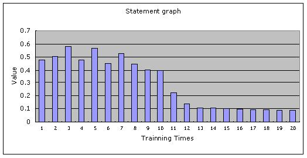
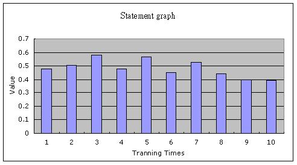
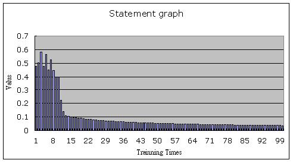

Artificial Neural Network : Back-propagation Network - XOR
==========================================================

驗証 BPN 網路, 使用範例 : XOR    

```
$author:   Jin-Wen (Ed) Lai
$initial:  Nov. 2002
$revised:  Mar. 2018
$Keywords: neural, control, artificial, back, propagatio, network, php, xor 
```

## Content

* [Requirements](#requirements)
* [Programming](#programming)
* [Running](#running)
* [Analysis](#analysis)
* [Conclusion](#conclusion)
* [Advanced](#advanced)
* [Comment](#comment)
* [Reference](#reference)

## Requirements

- PHP
- PHP/GTK

## Programming

- 學習次數 = 20 次    

``` php
  <?
  
  # .............................. Start ........................................
  
  # 12種參數值定義
  $inputNode  = 2;        # * %inputNode  = input('1.輸入層節點數：');
  $hiddenNode = 2;        # * %hiddenNode = input('2.隱藏層節點數：');
  $outputNode = 1;        # * %outputNode = input('3.輸出層節點數：');
  $learn      = 10;       # * %learn      = input('4.學習速率：');
  
  $learnTime = 20;        # * %learnTime  = input('5.總共學習次數：');
  
  $count = 4;             # * %count = input('6.樣本總數：');
  
  $t_hy[0] = 1;           #   %t_hy = input('7.輸出層臨界值(一維陣列)：');
  
  # %thh=input('8.隱藏層臨界值(一維陣列)：');
  $t_hh[0] = 1;
  $t_hh[1] = 1;
  
  # * %why=input('9.隱藏層與輸出層鏈結值(二維陣列)：');
  $w_hy[0][0] = 1;        # * W35
  $w_hy[1][0] = 1;        # * W45    
  
  # * %wxh=input('10.輸入層與隱藏層鏈結值(二維陣列)：');
  $w_xh[0][0] = 1;        # * W13
  $w_xh[0][1] = -1;       # * W23
  $w_xh[1][0] = -1;       # * W14
  $w_xh[1][1] = 1;        # * W24
  
  # * %inputx=input('11.樣本輸入值(陣例大小：範例數×輸入層節點數)：');
  
  $input_x[0][0] = -1;    # * 範例一
  $input_x[0][1] = -1;
  $input_x[1][0] = -1;    # * 範例二
  $input_x[1][1] = 1;
  $input_x[2][0] = 1;     # * 範例三
  $input_x[2][1] = -1;
  $input_x[3][0] = 1;     # * 範例四
  $input_x[3][1] = 1;
  
  
  
  # * %outt=input('12.樣本輸出值(陣例大小：範例數×輸出層節點數)：');
  $out_t[0][0] = 0;       # * 輸出 PE
  $out_t[1][0] = 1;
  $out_t[2][0] = 1;
  $out_t[3][0] = 0;
  
  
  # .............................. Start ........................................
  
  for ($t = 0; $t < $learnTime; $t++) {
  
      $sum_w_hy[0][0] = 0;
      $sum_w_hy[1][0] = 0;
      
      $sum_w_xh[0][0] = 0;
      $sum_w_xh[0][1] = 0;
      $sum_w_xh[1][0] = 0;
      $sum_w_xh[1][1] = 0;
      
      $sum_t_hy[0] = 0;
      
      $sum_t_hh[0] = 0;
      $sum_t_hh[1] = 0;
      
      $aeer = 0;
      
      for ($k = 0; $k < $count; $k++) { # % 範例數 count  = 4
          
          /*...................(一) 計算隱藏層輸出值  .........................*/
          
          for ($i = 0; $i < $hiddenNode; $i++) { # % hiddenNode = 2
              $node_h[$i] = 0;
              
              for ($j = 0; $j < $inputNode; $j++) { # 計算 net3 與 net4 , % inputNode = 2
                  $node_h[$i] = $w_xh[$j][$i] * $input_x[$k][$j] + $node_h[$i];
              }
              
              $node_h[$i] = $node_h[$i] - $t_hh[$i];
              $net[$i]    = $node_h[$i]; # net3 與 net4
              $node_h[$i] = 1 / (1 + exp(-1 * $node_h[$i])); # 計算 H1 與 H2 
          }
          
          /*....................(二)計算輸出層 輸出值 ..........................*/
          
          for ($i = 0; $i < $outputNode; $i++) { # % output=1
              
              $out_y[$k][$i] = 0;
              
              for ($j = 0; $j < $hiddenNode; $j++) { # % hidden = 2            
                  $out_y[$k][$i] = $node_h[$j] * $w_hy[$j][$i] + $out_y[$k][$i];
              }
              
              $out_y[$k][$i] = $out_y[$k][$i] - $t_hy[$i];
              $out_y[$k][$i] = 1 / (1 + exp(-1 * $out_y[$k][$i])); # 計算 Y
          }
          
          
          /*...................(三) 計算輸出層差距量 delta .........................*/
          
          for ($i = 0; $i < $outputNode; $i++) { #%output              
              
              $delta_y[$i] = $out_y[$k][$i] * (1 - $out_y[$k][$i]) * ($out_t[$k][$i] - $out_y[$k][$i]);
              
          }
          
          
          /*...................(四) 計算隱藏層差距量 delta  ........................*/
          
          for ($i = 0; $i < $hiddenNode; $i++) { #%hidden
              
              $temp = 0;
              
              for ($j = 0; $j < $outputNode; $j++) { #%output             
                  $temp = $temp + $delta_y[$j] * $w_hy[$i][$j];
              }
              
              $delta_h[$i] = $node_h[$i] * (1 - $node_h[$i]) * $temp;
          }
          
          /* ..........(五) 計算輸出層加權值矩陣修正量 及偏權值向量修正值............*/
          
          for ($i = 0; $i < $outputNode; $i++) { # % output = 1   
              
              for ($j = 0; $j < $hiddenNode; $j++) { # % hidden = 2                
                  $tri_w_hy[$j][$i] = $learn * $delta_y[$i] * $node_h[$j]; # 大 delta W35,W45                
              }
              
              $tri_t_hy[$i] = (-1) * $learn * $delta_y[$i];
          }
          
          /*...................(六)  計算隱藏層 偏權值向量修正值.................*/
          
          for ($i = 0; $i < $hiddenNode; $i++) {
              
              for ($j = 0; $j < $inputNode; $j++) { #%input       
                  $triwxh[$j][$i] = $learn * $delta_h[$i] * $input_x[$k][$j];
              }
              
              $tri_t_hh[$i] = (-1) * $learn * $delta_h[$i];
          }
          
          /*......................   計算誤差 均方根............................*/
          
          for ($i = 0; $i < $outputNode; $i++) {
              
              $aeer = $aeer + pow($out_t[$k][$i] - $out_y[$k][$i], 2);
          }
          
          
          /*................(七.一)計算新的加權值 與 閥值 step.1....................*/
          
          for ($i = 0; $i < $hiddenNode; $i++) {
              $sum_w_hy[$i][0] = $tri_w_hy[$i][0] + $sum_w_hy[$i][0];
              
          }
          
          for ($i = 0; $i < $hiddenNode; $i++) {
              for ($j = 0; $j < $inputNode; $j++) {
                  $sum_w_xh[$i][$j] = $triwxh[$i][$j] + $sum_w_xh[$i][$j];
              }
          }
          
          
          for ($i = 0; $i < $outputNode; $i++) {
              $sum_t_hy[$i] = $sum_t_hy[$i] + $tri_t_hy[$i];
          }
          
          
          for ($i = 0; $i < $inputNode; $i++) {
              $sum_t_hh[$i] = $sum_t_hh[$i] + $tri_t_hh[$i];
          }
          
      }
      
      
      
      /*...................(七.一)計算新的加權值 與 閥值  step.2....................*/
      
      $errorvalue[$t] = pow($aeer / ($count * $outputNode), 1 / 2);
      
      for ($i = 0; $i < $hiddenNode; $i++) {
          $w_hy[$i][0] = $w_hy[$i][0] + $sum_w_hy[$i][0];
      }
      
      for ($i = 0; $i < $hiddenNode; $i++) {
          for ($j = 0; $j < $inputNode; $j++) {
              $w_xh[$i][$j] = $w_xh[$i][$j] + $sum_w_xh[$i][$j];
          }
      }
      
      for ($i = 0; $i < $outputNode; $i++) {
          $t_hy[$i] = $t_hy[$i] + $sum_t_hy[$i];
      }
      
      for ($i = 0; $i < $inputNode; $i++) {
          $t_hh[$i] = $t_hh[$i] + $sum_t_hh[$i];
      }
      
  }
  
  /*................... 輸出結果 ....................*/
  
  echo ("修正後輸出層鏈結值：\n");
  
  for ($i = 0; $i < $hiddenNode; $i++) {
      echo ($w_hy[$i][0] . "\t");
  }
  echo ("\n");
  
  echo ("修正後輸出層臨界值：\n");
  
  for ($i = 0; $i < $outputNode; $i++) {
      echo ($t_hy[$i] . "\t");
  }
  echo ("\n");
  
  echo ("修正後隱藏層鏈結值：\n");
  
  for ($i = 0; $i < $hiddenNode; $i++) {
      for ($j = 0; $j < $inputNode; $j++) {
          echo ($w_hy[$i][$j] . "\t");
      }
      echo ("\n");
  }
  echo ("\n");
  
  echo ("修正後隱藏層臨界值：\n");
  
  for ($i = 0; $i < $inputNode; $i++) {
      echo ($t_hh[$i] . "\t");
  }
  echo ("\n");
  
  echo ("最後誤差均方根：\n");
  echo ($errorvalue[$learnTime - 1] . "\n");
  echo ("\n");
  
  echo ("每次的誤差均方根：\n");
  for ($x = 0; $x < $learnTime; $x++) {
      echo ('第' . $x . "次的誤差均方根 :: \t\t" . $errorvalue[$x] . "\n");
  }
  
  # ................ End .............. 
  
  ?>
```

## Running

- Result

  ``` txt
  修正後輸出層鏈結值:
  5.30826704257    5.30826704257 
  
  修正後輸出層臨界值:
  2.65442460853    
  
  修正後隱藏層鏈結值:
  5.30826704257        
  5.30826704257        
  
  修正後隱藏層臨界值:
  3.44461351124              3.44461351124   
   
  最後誤差均方根：
  0.0868101496131
  
  每次的誤差均方根：
  第1次的誤差均方根::          0.478312190692
  第2次的誤差均方根::          0.504960939172
  第3次的誤差均方根::          0.580996038044
  第4次的誤差均方根::          0.479101221766
  第5次的誤差均方根::          0.566574441937
  第6次的誤差均方根::          0.453303940654
  第7次的誤差均方根::          0.527754117859
  第8次的誤差均方根::          0.446298229069
  第9次的誤差均方根::          0.402032829666
  第10次的誤差均方根::         0.397852477978
  第11次的誤差均方根::         0.220603875397
  第12次的誤差均方根::         0.139004869443
  第13次的誤差均方根::         0.10831326194
  第14次的誤差均方根::         0.10412075591
  第15次的誤差均方根::         0.100575006292
  第16次的誤差均方根::         0.0973480738758
  第17次的誤差均方根::         0.0943896156837
  第18次的誤差均方根::         0.0916652801196
  第19次的誤差均方根::         0.0891467357734
  第20次的誤差均方根::         0.0868101496131
  ```

## Analysis

      

由於目前 PHP/GTK 對於 GtkCurve ( Widget that allows editing of a curve ) 的支援 尚未完整, 無法畫出曲線, 故將 誤差均方根 結果 放入 MS Excel 將曲線繪出. 觀察曲線圖可發現該值趨近於收斂.

## Conclusion

| Learning Time(s) | 10 times                  | 20 times                   | 100 times                  |
| -----------------|-----------------------|------------------------|-------------------------|
| Result           | |  |  |

- 在學習次數為10次時,會發現收斂不夠,但在學習次數為100次時,雖然會趨於收斂, 卻又花費太多的時間了。如何在之間取得平衡,是一個值得研究的課題。
- 本次的語言使用PHP, 這是一個跨平台與使用廣泛的網路後端語言.鑑於目前使用者對於網路的使用頻繁, 如何在網頁上與使用者即時互動,股票分析,期貨交易應用, 保險承保評估… , 皆可以之來拓展其應用。
- 在網路上的繪圖功能可以以GD函數來完成, 此程式目的只為完成 BP的核心, 在網頁上,若有畫圖需求可以以 GD函數 來完成.。
- Client端的繪圖可以以GTK 來完成,但目前 GTK 支援PHP 部分尚不完整,完整后亦可產成更佳人機介面間的互動。

## Advanced

- n/a

## Comment

- n/a

## Reference

- [類神經網路模式應用與實作](http://www.sanmin.com.tw/Product/index/000764682)
  - ISBN13：9789574998630 (ISBN:957-499-313-2)
  - 出版社：儒林出版社
  - 作者：葉怡成    
    