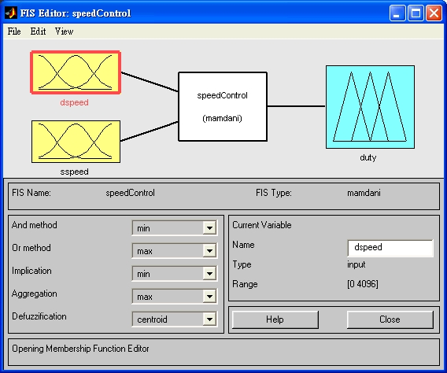
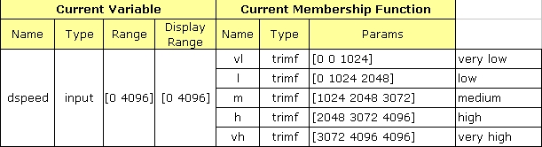
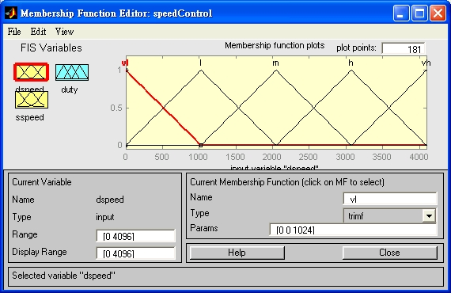
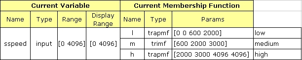
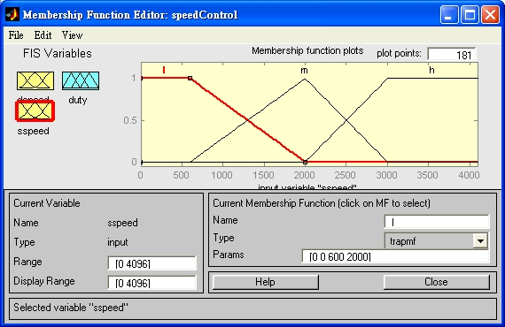
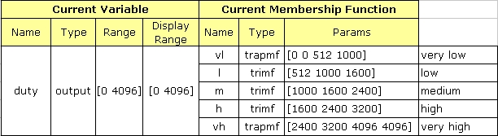
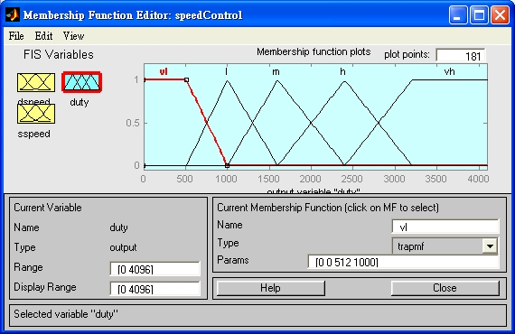
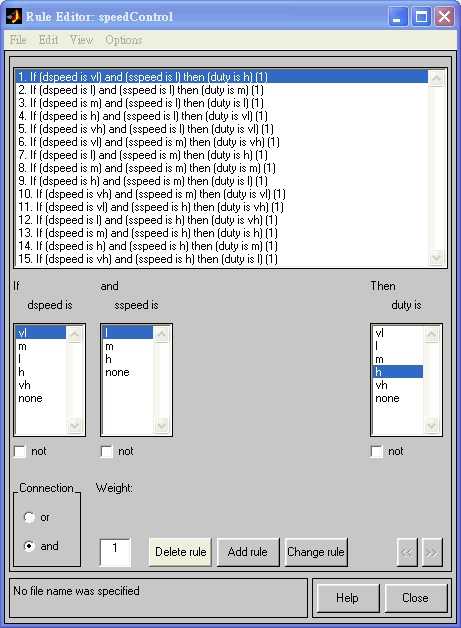
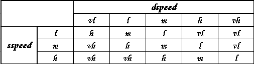
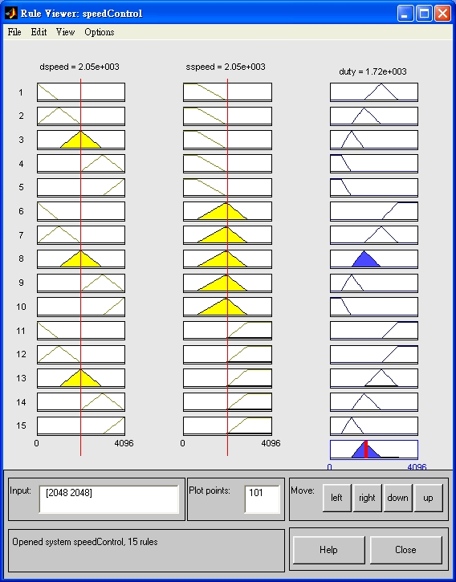

# Neural and Fuzzy Logic Control

## Fuzzy Control - DC Motor Speed Control

```
$author:   Ching-Wen (Ed) Lai
$date:     Jan. 2003
$revised:  Mar. 2018
$Keywords: fuzzy, control, matlab
```

使用鑽孔圓盤配合光藕合器測出馬達的每分鐘轉數值(RPM)

```
  PRM = 60 X (N/16)
```
- 輸出語言變數為 PWM的工作週期(Duty).
- 輸入語言變數為轉數誤差(dspeed)與目前轉速(sspeed).

## Requirements

- Matlab 6.5

## Fuzzy Logic Controller

控制知識庫

- **架構:** Two Inputs(dspeed, sspeed), One Output(duty).  
  

- **dspeed:** 內部的規劃, 依序定義如下,    
      
  Membership Function Editor: dspeedControl    
  

- **sspeed:** 內部的規劃, 依序定義如下,    
      
  Membership Function Editor: sspeedControl    
      
        
- **duty:** 內部的規劃, 依序定義如下,    
      
  Membership Function Editor: duty    
      

## Fuzzy Control Rule Base

控制規則庫

- **Rule Editor:** 規則庫定義       
  

- **FAM 圖**    
  
  
## speedControl.fis

- save above settings to `speedControl.fis`    

<!--<div class="panel-heading"><h3>將上述定義存於 speedControl.fis 檔案內, 儲存內容如下。</h3></div>-->

```matlab
[System]
Name='speedControl'
Type='mamdani'
Version=2.0
NumInputs=2
NumOutputs=1
NumRules=15
AndMethod='min'
OrMethod='max'
ImpMethod='min'
AggMethod='max'
DefuzzMethod='centroid'

[Input1]
Name='dspeed'
Range=[0 4096]
NumMFs=5
MF1='vl':'trimf',[0 0 1024]
MF2='m':'trimf',[1024 2048 3072]
MF3='l':'trimf',[0 1024 2048]
MF4='h':'trimf',[2048 3072 4096]
MF5='vh':'trimf',[3072 4096 4096]

[Input2]
Name='sspeed'
Range=[0 4096]
NumMFs=3
MF1='l':'trapmf',[0 0 600 2000]
MF2='m':'trimf',[600 2000 3000]
MF3='h':'trapmf',[2000 3000 4096 4096]

[Output1]
Name='duty'
Range=[0 4096]
NumMFs=5
MF1='vl':'trapmf',[0 0 512 1000]
MF2='l':'trimf',[512 1000 1600]
MF3='m':'trimf',[1000 1600 2400]
MF4='h':'trimf',[1600 2400 3200]
MF5='vh':'trapmf',[2400 3200 4096 4096]

[Rules]
1 1, 4 (1) : 1
3 1, 3 (1) : 1
2 1, 2 (1) : 1
4 1, 1 (1) : 1
5 1, 1 (1) : 1
1 2, 5 (1) : 1
3 2, 4 (1) : 1
2 2, 3 (1) : 1
4 2, 2 (1) : 1
5 2, 1 (1) : 1
1 3, 5 (1) : 1
3 3, 5 (1) : 1
2 3, 4 (1) : 1
4 3, 3 (1) : 1
5 3, 2 (1) : 1

```

## Viewer

- **Rule Viewer:** 調整紅色線段的位置即可觀看 duty 相對的輸出。     
  

- **Surface Viewer**    
  

## Advanced

- 可以將 SIMULINK 將此 Fuzzy Control 系統模擬出來。    

## References

- Book: Fuzzy 控制 理論、實作與應用 孫宗瀛．楊英魁　編著　全華圖書 (ISBN: 957-21-0733-X)
- Book: Matlab 5 專業設計技巧　蒙以正　碁峰資訊 (ISBN: 957-21-0733-X)
- [模糊控制介紹及Matlab模糊控制工具箱使用](https://kknews.cc/zh-tw/education/e836ky4.html)