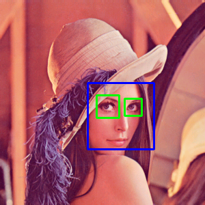
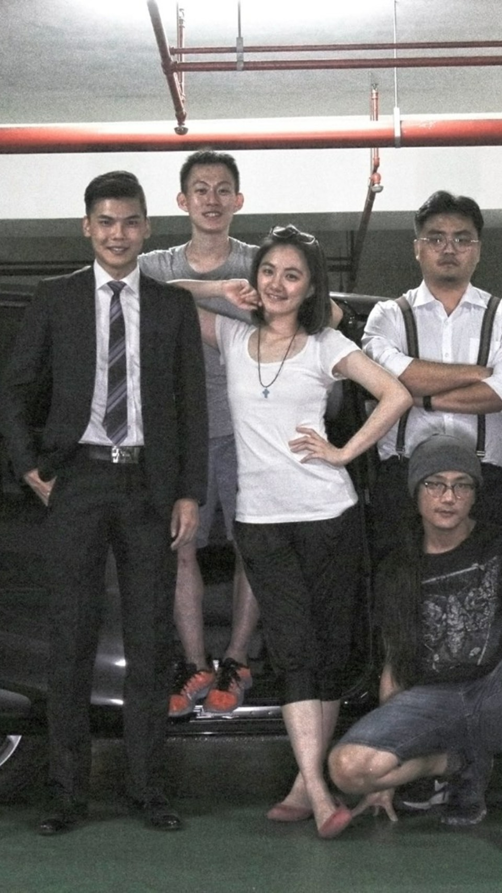
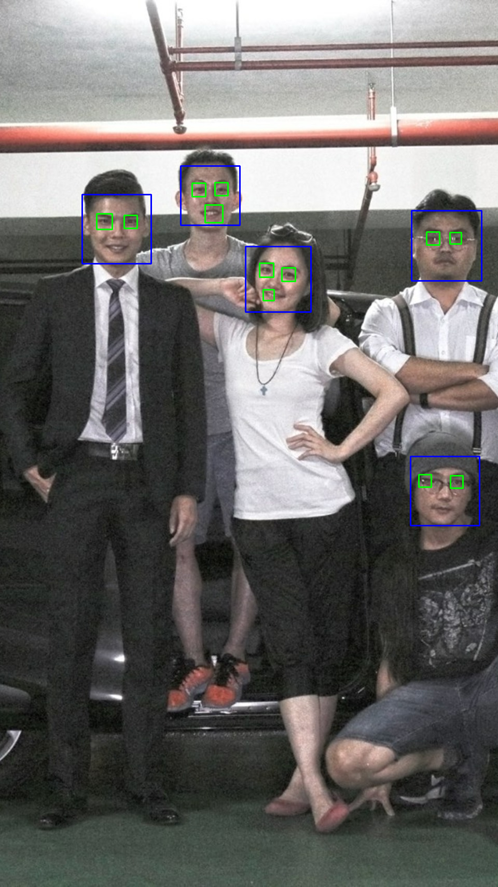

# [Image Processing](../../)

## Eyes Detection

An implementation of digital image processing for Face Detection.

## Content

* [Requirements](#requirements)
* [Programming](#programming)
* [Running](#running)
* [Advanced](#advanced)
* [Reference](#reference)

## Requirements

- Python
- OpenCV `apt install python-opencv`
- Numpy `apt install python-numpy`
- Matplotlib `apt install python-matplotlib`
- [haarcascade_frontalface_default.xml](haarcascade_frontalface_default.xml)
- [haarcascade_eye.xml](haarcascade_eye.xml)

## Programming

- save below code to `eyes.py`

  ``` python
  import numpy as np
  import cv2
  from matplotlib import pyplot as plt

  face_cascade = cv2.CascadeClassifier('haarcascade_frontalface_default.xml')
  eye_cascade = cv2.CascadeClassifier('haarcascade_eye.xml')

  img = cv2.imread('../../lena.png')
  gray = cv2.cvtColor(img, cv2.COLOR_BGR2GRAY)

  faces = face_cascade.detectMultiScale(gray, 1.3, 5)

  for (x,y,w,h) in faces:
    cv2.rectangle(img,(x,y),(x+w,y+h),(255,0,0),2)
    roi_gray = gray[y:y+h, x:x+w]
    roi_color = img[y:y+h, x:x+w]
    eyes = eye_cascade.detectMultiScale(roi_gray)
    for (ex,ey,ew,eh) in eyes:
        cv2.rectangle(roi_color,(ex,ey),(ex+ew,ey+eh),(0,255,0),2)
  cv2.imwrite('lena_eyes.png',img)
  ```


## Running

- The result of single face detection 

  | Original            | Single-Eyes Detection |
  |---------------------|-----------------------|
  | |    | 

- The result of multiple-face detection

  | Original            | Multiple-Eyes Detection |
  |---------------------|-------------------------|
  |        |       |


## Advanced

- n/a

## Reference

- [FOBJECT DETECTION : FACE DETECTION USING HAAR CASCADE CLASSFIERS](http://www.bogotobogo.com/python/OpenCV_Python/python_opencv3_Image_Object_Detection_Face_Detection_Haar_Cascade_Classifiers.php)


