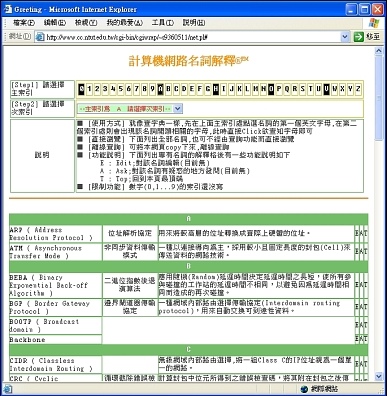
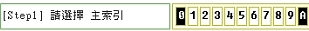
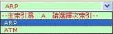
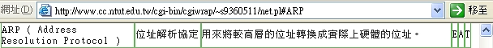
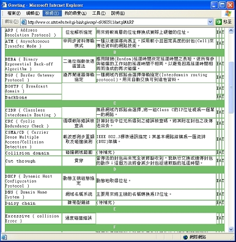
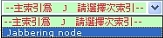
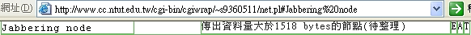
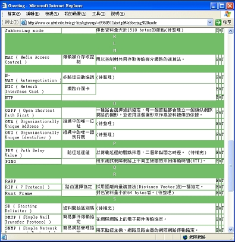

# Perl - An Online Dictionary

<!--
```
$author:   Ching-Wen (Ed) Lai
$date:     May. 2001
$revised:  Mar. 2018
$keywords: perl, online, dictionary
```
-->

An implementation of an On-line Directory, users can check the `Network Terminology` in this directory.

<!--

## Content

* [Requirements](#requirements)
* [Demonstration](#demonstration)
  * [ARP case](#arp-case)
  * [Jabbering node](jabbering-node)
-->

## Requirements

- Perl

## Demonstration

- [Demo Site](http://www.cc.ntut.edu.tw/cgi-bin/cgiwrap/~s9360511/os.pl) (it's unavailable now after I was graduated from NTUT)
- We will use two examples (`ARP` and ` Jabbering node`) to go through and introduce the features on this on-line directory.

### ARP case

1. Take the terminology `ARP` as our first case, click the link to open main page  
     
2. Click its primary index (the first alphabet) `A` of `ARP`  
     
3. System will ask us to pick up secondary index  
     
4. Pick up the secondary index `ARP` on drop-down menu  
      
5. There is the result about `ARP`   
     
6. It will show the result on the first column of browser  
     

### Jabbering node

1. Take an example on `Jabbering node`  
2. Click the `Primary Index`  `J` of `Jabbering node`  
     
3. Pick up the secondary index 'Jabbering node`  
     
4. There is the result about 'Jabbering node`  
      
3. It will show the result on the first column of browser  
     