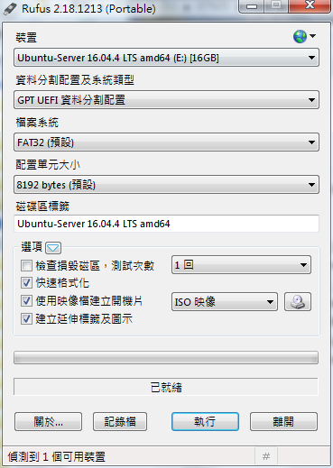
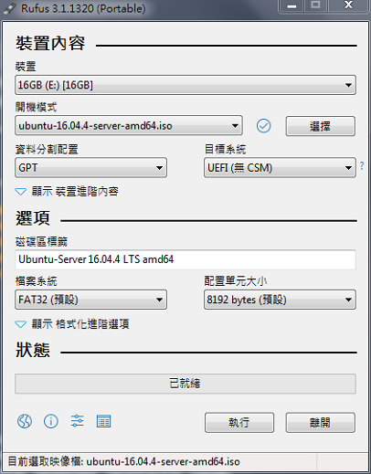
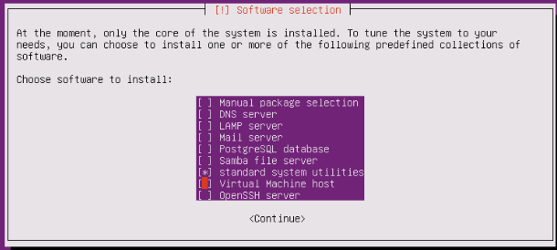
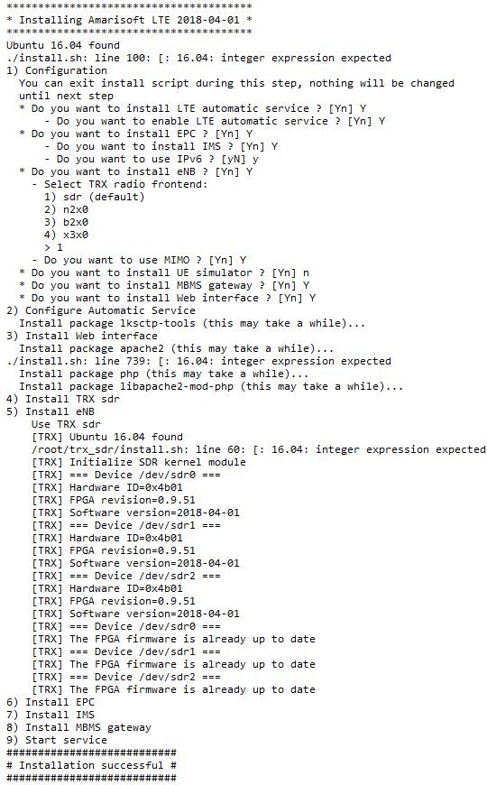

# Software Define Radio - Amarisoft AMARI LTE 100 SDR

<!--
$keywords: amarisoft, cellular
-->

An exercise of running personal 4G LTE base station software on Linux PC.

- Install and run `Amarisoft AMARI LTE 100 SDR` on Linux PC to build `Personal 4G-LTE Service`.
- UE should be able to connect `SDR` in this case.

<!--
## Content

* [Concept](#concept)
* [Requirements](#requirements)
* [Installation](#installation)
* [Running]
* [Functionality]
  - [4G LTE]
  - [Cat M1]
  - [NBIoT]
  - [VoLTE]
  - [EAP-SIM]
* [Restful API](#restful-api)
* [Reference](#reference)
* [Appendix](#appendix)
  - [Writable SIM card](#programming-sim-cards)
-->

## Requirements

### Hardware

- Ubuntu Linux PC
- Radio frontend: [PCIe SDR board](https://www.amarisoft.com/products-lte-ue-ots-sdr-pcie/#sdr) x 3
- RTL8111/8168/8411 PCI Express Gigabit Ethernet Card (Optional)
  ``` sh
  $ lspci
  05:00.0 Ethernet controller: Realtek Semiconductor Co., Ltd. RTL8111/8168/8411 PCI Express Gigabit Ethernet Controller (rev 07)
  06:00.0 Ethernet controller: Realtek Semiconductor Co., Ltd. RTL8111/8168/8411 PCI Express Gigabit Ethernet Controller (rev 07)
  07:00.0 Ethernet controller: Realtek Semiconductor Co., Ltd. RTL8111/8168/8411 PCI Express Gigabit Ethernet Controller (rev 07)
  08:00.0 Ethernet controller: Realtek Semiconductor Co., Ltd. RTL8111/8168/8411 PCI Express Gigabit Ethernet Controller (rev 07)
  ```
- WLAN Card (Optional)

### Software

- LTE Network: [AMARI LTE 100](https://www.amarisoft.com/products-lte-ue-ots-sdr-pcie/#network)
- [Ubuntu 16.04.4 LTS (Xenial Xerus) Server ISO Image](http://releases.ubuntu.com/16.04/)
- [rufus](https://rufus.akeo.ie/)

## Installation

### Topology

```
 -------------------------------------
/             Internet               /
-------------------------------------
                   /        * Outbound Interface of Router:
                  /           - IPv4: 61.228.45.217
                 /            - IPv6: 2001:b011:200b:1d1:1262:ebff:fe90:7320/64
  ------------------------------------
 /             Router                /
/                                   /
------------------------------------
                   /        * Inbound Interface of Router:
                  /           - IPv4: 192.168.167.1
                 /            - IPv6: 2001:b011:200b:129a:1262:ebff:fe90:7320/64  (for example)
   -----------------------------------
  /    Amarisoft AMARI LTE 100       /   * SDR
 /                                  /      - IPv4: 192.168.167.20
/  APN: {default | internet...}    /       - IPv6: 2001:b011:200b:129a:6245:cbff:fe87:5612/64   (for example)
-----------------------------------
         /\                     /\       * UE: APN1 (Default APN) ... APN-2, APN-3, APN-4
        /  \       APN1        /  \        - IPv4:                 - IPv6:
       /    \		              /    \         * tun0: 192.168.2.1      * tun0:
   ---------------        ---------------    * tun1: 192.168.3.1      * tun1:
  /     UE 1     /       /     UE 2 ... /    * tun2: 192.168.4.1      * tun2: 2001:468:3000:1::/48
  ---------------        ---------------     * tun3: 192.168.5.1      * tun3: 2001:468:4000:1::/48
  IPv4: 192.168.2.x     IPv4: 192.168.3.x
```

### Ubuntu PC

- Download `Ubuntu Server ISO Image` and burn it into USB dongle by [`rufus`](https://rufus.akeo.ie) with below setting.

  |  rufus2.18       | rufus3.1         |
  |------------------|------------------|
  |  |  |

- Plug `Ubuntu dongle` to PC and bootup PC by using this Bootable dongle (selecting USB Bootup in `BIOS/UEFI` boot menu)

- Install `Ubuntu Server` to Linux PC, enable `Standard system utilities`, `Virtual Machine host` and `OpenSSH server`
  

- there will be some network interfaces

  ``` console
  # ifconfig
  enp0s31f6 Link encap:Ethernet  HWaddr 60:45:cb:87:56:12
            inet addr:192.168.0.12  Bcast:192.168.0.255  Mask:255.255.255.0
            inet6 addr: fe80::6245:cbff:fe87:5612/64 Scope:Link
            UP BROADCAST RUNNING MULTICAST  MTU:1500  Metric:1
            RX packets:144 errors:0 dropped:0 overruns:0 frame:0
            TX packets:140 errors:0 dropped:0 overruns:0 carrier:0
            collisions:0 txqueuelen:1000
            RX bytes:22555 (22.5 KB)  TX bytes:23194 (23.1 KB)
            Interrupt:16 Memory:f7700000-f7720000
  
  enp5s0    Link encap:Ethernet  HWaddr 00:e0:4c:68:4e:c9                      #<= for KVM
            UP BROADCAST MULTICAST  MTU:1500  Metric:1
            RX packets:0 errors:0 dropped:0 overruns:0 frame:0
            TX packets:0 errors:0 dropped:0 overruns:0 carrier:0
            collisions:0 txqueuelen:1000
            RX bytes:0 (0.0 B)  TX bytes:0 (0.0 B)
  
  enp6s0    Link encap:Ethernet  HWaddr 00:e0:4c:68:4e:ca
            UP BROADCAST MULTICAST  MTU:1500  Metric:1
            RX packets:0 errors:0 dropped:0 overruns:0 frame:0
            TX packets:0 errors:0 dropped:0 overruns:0 carrier:0
            collisions:0 txqueuelen:1000
            RX bytes:0 (0.0 B)  TX bytes:0 (0.0 B)
  
  enp7s0    Link encap:Ethernet  HWaddr 00:e0:4c:68:4e:cb
            UP BROADCAST MULTICAST  MTU:1500  Metric:1
            RX packets:0 errors:0 dropped:0 overruns:0 frame:0
            TX packets:0 errors:0 dropped:0 overruns:0 carrier:0
            collisions:0 txqueuelen:1000
            RX bytes:0 (0.0 B)  TX bytes:0 (0.0 B)
  
  enp8s0    Link encap:Ethernet  HWaddr 00:e0:4c:68:4e:cc
            UP BROADCAST MULTICAST  MTU:1500  Metric:1
            RX packets:0 errors:0 dropped:0 overruns:0 frame:0
            TX packets:0 errors:0 dropped:0 overruns:0 carrier:0
            collisions:0 txqueuelen:1000
            RX bytes:0 (0.0 B)  TX bytes:0 (0.0 B)
  
  lo        Link encap:Local Loopback
            inet addr:127.0.0.1  Mask:255.0.0.0
            inet6 addr: ::1/128 Scope:Host
            UP LOOPBACK RUNNING  MTU:65536  Metric:1
            RX packets:185 errors:0 dropped:0 overruns:0 frame:0
            TX packets:185 errors:0 dropped:0 overruns:0 carrier:0
            collisions:0 txqueuelen:1
            RX bytes:13781 (13.7 KB)  TX bytes:13781 (13.7 KB)
  
  virbr0    Link encap:Ethernet  HWaddr 00:00:00:00:00:00                      #<= KVM
            inet addr:192.168.122.1  Bcast:192.168.122.255  Mask:255.255.255.0
            UP BROADCAST MULTICAST  MTU:1500  Metric:1
            RX packets:0 errors:0 dropped:0 overruns:0 frame:0
            TX packets:0 errors:0 dropped:0 overruns:0 carrier:0
            collisions:0 txqueuelen:1000
            RX bytes:0 (0.0 B)  TX bytes:0 (0.0 B)
  ```

- Install `ubuntu-desktop` to PC

  ``` sh
  $ sudo apt-get update
  $ sudo apt-get install ubuntu-desktop
  $ sudo apt-get install lxde           #<= (Optional)
  $ sudo startx
  ```

- Install below packages to Ubuntu PC

  ``` sh
  $ sudo apt-get install wireshark    #<= packet capturer
  $ sudo apt-get install shutter      #<= Screenshot capturer (Optional)
  ```

- Use Fixed IP on SDR, put below setting to `/etc/network/interfaces` (Optional)

  ``` sh
  auto lo
  iface lo inet loopback
  
  auto enp0s31f6                                           #<= Interface
  iface enp0s31f6 inet static  
  address 192.168.167.20                                   #<= Fixed IP
  netmask 255.255.255.0
  gateway 192.168.167.1
  dns-nameserver 8.8.8.8
  dns-nameserver 8.8.4.4
  
  # IPv6
  iface enp0s31f6 inet6 auto
  ```

- Issue below command to restart netwoek service

  ``` sh
  $ sudo /etc/init.d/networking restart
  ```

<!--
- PS. Orginal

  ``` sh
  # The primary network interface
  auto enp0s31f6
  iface enp0s31f6 inet dhcp
  # This is an autoconfigured IPv6 interface
  iface enp0s31f6 inet6 auto
  ```
-->

### AMARI LTE 100

- Place key to `.amarisoft` folder    

  ``` sh
  $ sudo mkdir /root/.amarisoft
  $ sudo cp lteenb.key /root/.amarisoft/
  $ sudo cp ltemme.key /root/.amarisoft/
  ```

- Untar SDR software `amarisoft.yyyy-mm-dd.tar.gz` (e.q `amarisoft.2018-04-01.tar.gz`)     

  ``` sh
  $ sudo tar xvf amarisoft.yyyy-mm-dd.tar.gz
  $ sudo cd yyyy-mm-dd
  $ sudo ./install.sh
  ```

- Installation   

  
  
- There will be four network interfaces (tun0 ~ tun3) for APN 1 to 4 as default  

  ``` sh
  $ sudo ifconfig

  tun0      Link encap:UNSPEC  HWaddr 00-00-00-00-00-00-00-00-00-00-00-00-00-00-00-00              #<= APN 1
            inet addr:192.168.2.1  P-t-P:192.168.2.1  Mask:255.255.255.0
            UP POINTOPOINT RUNNING NOARP MULTICAST  MTU:1500  Metric:1
            RX packets:0 errors:0 dropped:0 overruns:0 frame:0
            TX packets:2 errors:0 dropped:0 overruns:0 carrier:0
            collisions:0 txqueuelen:500
            RX bytes:0 (0.0 B)  TX bytes:152 (152.0 B)
  
  tun1      Link encap:UNSPEC  HWaddr 00-00-00-00-00-00-00-00-00-00-00-00-00-00-00-00              #<= APN 2
            inet addr:192.168.3.1  P-t-P:192.168.3.1  Mask:255.255.255.0
            UP POINTOPOINT RUNNING NOARP MULTICAST  MTU:1500  Metric:1
            RX packets:0 errors:0 dropped:0 overruns:0 frame:0
            TX packets:2 errors:0 dropped:0 overruns:0 carrier:0
            collisions:0 txqueuelen:500
            RX bytes:0 (0.0 B)  TX bytes:152 (152.0 B)
  
  tun2      Link encap:UNSPEC  HWaddr 00-00-00-00-00-00-00-00-00-00-00-00-00-00-00-00              #<= APN 3
            inet addr:192.168.4.1  P-t-P:192.168.4.1  Mask:255.255.255.0
            inet6 addr: 2001:468:3000:1::/48 Scope:Global
            UP POINTOPOINT RUNNING NOARP MULTICAST  MTU:1500  Metric:1
            RX packets:0 errors:0 dropped:0 overruns:0 frame:0
            TX packets:2 errors:0 dropped:0 overruns:0 carrier:0
            collisions:0 txqueuelen:500
            RX bytes:0 (0.0 B)  TX bytes:152 (152.0 B)
  
  tun3      Link encap:UNSPEC  HWaddr 00-00-00-00-00-00-00-00-00-00-00-00-00-00-00-00              #<= APN 4
            inet addr:192.168.5.1  P-t-P:192.168.5.1  Mask:255.255.255.0
            inet6 addr: 2001:468:4000:1::/48 Scope:Global
            UP POINTOPOINT RUNNING NOARP MULTICAST  MTU:1500  Metric:1
            RX packets:0 errors:0 dropped:0 overruns:0 frame:0
            TX packets:2 errors:0 dropped:0 overruns:0 carrier:0
            collisions:0 txqueuelen:500
            RX bytes:0 (0.0 B)  TX bytes:152 (152.0 B)
  ```

### Troubleshooting

- Try to run MME, IMS, MBMS and eNB step-by-step, it will show the message if there is any problem while running each service.
   
   ``` sh
   $ sudo cd /root/mme
   $ sudo ./ltemme config/mme.cfg
   $
   $ sudo cd ../ims
   $ sudo ./lteims config/ims.cfg
   $
   $ sudo cd ../mbms
   $ sudo ./ltembms
   $
   $ sudo cd ../enb
   $ sudo ./lteenb config/enb.cfg
   ```

## Amarisoft LTE Service

- There are the command which tunning Amarisoft LTE Service ON/OFF    

  ``` sh
  $ sudo service lte start           #<= START   the LTE Service
  $ sudo service lte stop            #<= STOP    the LTE Service
  $ sudo service lte restart         #<= RESTART the LTE Service
  ```

- Monitor Amarisoft Console

  ``` sh
  # screen -x lte
  (enb) t            # <= to active debug mode
  (enb) ue           # <= to list ue which connect to 
  ```

- Screen Switching 
  
  | Hot-Key      | Prompt | Message                                            | Comment      |
  |--------------|--------|----------------------------------------------------|--------------|
  | `CTRL-A + 0` | (mme)  | (mme) log file.rotate=50M,file.path=/var/log/lte/  |              |
  | `CTRL-A + 1` | (enb)  | (enb) log file.rotate=50M,file.path=/var/log/lte/  |              |
  | `CTRL-A + 2` | (mbms) | (mbms) log file.rotate=50M,file.path=/var/log/lte/ |              |
  | `CTRL-A + 3` | (ims)  | (ims) log file.rotate=50M,file.path=/var/log/lte/  |              |
  | `CTRL-A + D` |  n/a   | [detached from 9541.lte]                           | Exit Console |

## Scripts

### eNB

- Turn-Key Scripts: There are some default scripts for `1CC`, `2CC`, `3CC`, `Multi-Cell`, `Cat-M1` and `NB-IoT` connections in this case.

  | #| Turnkey                     | BW (n_rb_dl) | DL Antenna (n_antenna_dl) | UL Antenna (n_antenna_ul) | PCC (dl_earfcn) | SCC1(or Cell2) | SCC2     | 
  |--|-----------------------------|--------------|---------------------------|---------------------------|-----------------|----------------|----------| 
  | 1| [enb-1_4mhz.cfg][1]         | 6    (1.4M)  | 1                         | 1                         |    1692 (B3)    | n/a            | n/a      | 
  | 2| [enb-2cc-mimo.cfg][2]       | 100  ( 20M)  | 2                         | 1                         |    900  (B2)    | 2150 (B4)      | n/a      | 
  | 3| [enb-3cc-mimo.cfg][3]       | 50   ( 10M)  | 2                         | 1                         |    900  (B2)    | 2150 (B4)      | 300 (B1) | 
  | 4| [enb-ca.cfg][4]             | 25   (  5M)  | 1                         | 1                         |    900  (B2)    | 2150 (B4)      | n/a      | 
  | 5| [mimo-2x2-5mhz.cfg][5]      | 25   (  5M)  | 2		              | 2                         |    3350 (B7)    | n/a            | n/a      | 
  | 6| [mimo-2x2-20mhz.cfg][6]     | 100  ( 20M)  | 2		              | 2                         |    3350 (B7)    | n/a            | n/a      | 
  | 7| [multi-cell.cfg][7]         | 25   (  5M)  | 1			      | 1                         |    3350 (B7)    | 3299 (B7)      | n/a      | 
  | 8| [enb-nbiot.cfg][8]          | n/a          | 1	     	              | 1                         |    6300 (B20)   | n/a            | n/a      | 
  | 9| [enb-nbiot-inband.cfg][9]   | 25   (  5M)  | 1		              | 1                         |    6300 (B20)   | n/a            | n/a      | 
  |10| [enb-catm1.cfg][10]         | n/a          | N_ANTENNA_DL	      | 1                         |    3350 (B7)    | n/a            | n/a      | 

  [1]: poc/tester/amari/settings/lteenb/enb-1_4mhz.cfg
  [2]: poc/tester/amari/settings/lteenb/enb-2cc-mimo.cfg
  [3]: poc/tester/amari/settings/lteenb/enb-3cc-mimo.cfg
  [4]: poc/tester/amari/settings/lteenb/enb-ca.cfg
  [5]: poc/tester/amari/settings/lteenb/mimo-2x2-5mhz.cfg
  [6]: poc/tester/amari/settings/lteenb/mimo-2x2-20mhz.cfg
  [7]: poc/tester/amari/settings/lteenb/multi-cell.cfg
  [8]: poc/tester/amari/settings/lteenb/enb-nbiot.cfg
  [9]: poc/tester/amari/settings/lteenb/enb-nbiot-inband.cfg
  [10]: poc/tester/amari/settings/lteenb/enb-catm1.cfg

PS. `mimo-2x2-5mhz.cfg` soft-link to `enb.cfg` as default eNB Script

- Scripts after modification

  |#| Modification                | BW (n_rb_dl) | DL Antenna (n_antenna_dl) | UL Antenna (n_antenna_ul) |PCC (dl_earfcn) | SCC1(or Cell2) | SCC2      | 
  |-|-----------------------------|--------------|---------------------------|---------------------------|----------------|----------------|-----------| 
  |1| [enb-1cc-mimo2.cfg][1]      | 25  (  5M)   | 2                         | 1                         |    1692 (B3)   | n/a            | n/a       | 
  |2| [enb-2cc-mimo2.cfg][2]      | 25  (  5M)   | 2                         | 1                         |    1692 (B3)   | 3350 (B7)      | n/a       | 
  |3| [enb-3cc-mimo2.cfg][3]      | 25  (  5M)   | 2                         | 1                         |    1692 (B3)   | 3350 (B7)      | 300 (B28) | 

  [1]: poc/tester/amari/settings/lteenb/enb-1cc-mimo2.cfg
  [2]: poc/tester/amari/settings/lteenb/enb-2cc-mimo2.cfg
  [3]: poc/tester/amari/settings/lteenb/enb-3cc-mimo2.cfg

- FDD Band and dl_earfcn [`Frequency Calculator`](https://www.cellmapper.net/arfcn)

  | # (Band) | MAX BW | dl_earfcn    | DL Center Frequency |
  |----------|--------|--------------|---------------------|
  | 1        | 20     | 300          | 2132 MHz            |
  | 2        |        | 900          | 1960 MHz            |
  | 3        |        | 1575         | 1842.5 MHz          |
  | 4        |        | 2150/2175    | 2130 MHz/(FIXME)    |
  | 5        |        | 2525         | 881.5 MHz           |
  | 7        |        | 3100/3350    | (FIXME)/2680 MHz    |
  | 8        |        | 3625 (FIXME) | (FIXME)             |
  | 12       |        | 5095 (FIXME) | (FIXME)             |
  | 13       |        | 5230 (FIXME) | (FIXME)             |
  | 17       |        | 5790 (FIXME) | (FIXME)             |
  | 18       |        | 5925 (FIXME) | (FIXME)             |
  | 19       |        | 6075 (FIXME) | (FIXME)             |
  | 20       |        | 6300         | 806 MHz             |
  | 21       |        | 6525 (FIXME) | (FIXME)             |
  | 25       |        | 8365 (FIXME) | (FIXME)             |
  | 26       |        | 8865 (FIXME) | (FIXME)             |
  | 28       |        | 9345 (FIXME) | (FIXME)             |
  | 29       |        | 9715 (FIXME) | (FIXME)             |
  | 30       |        | 9820 (FIXME) | (FIXME)             |

- TDD Band and dl_earfcn

  | # (Band) | MAX BW | dl_earfcn    | DL Center Frequency |
  |----------|--------|--------------|---------------------|
  | 38       |        | 38000/38050  | (FIXME)/2600 MHz    |
  | 39       |        | 38450 (FIXME)| (FIXME)             |
  | 40       |        | 39150 (FIXME)| (FIXME)             |
  | 41       |        | 40620        | 2593 MHz            |
  | 42       |        | 42590        | 3500 MHz            |
  | 66       |        | 66886 (FIXME)| (FIXME)             |

- Reference
  - (Telit LN940 – LTE Cat 9 & 11 M.2 Data Cards)[https://rutronik-tec.com/ln940/]
  - default eNodeB scripts in Amarisoft
    ``` sh
    root@sdr:~/enb/config# ls
    drb.cfg           enb.cfg                  meas_config_a3_3350.asn   sib15.asn           sib23_rb25_srs_sc4.asn
    drb_nb.cfg        enb.default.cfg          meas_config_periodic.asn  sib1.asn            sib23_rb50.asn
    drb-tdd.cfg       enb-mbms.cfg             mimo-2x2-20mhz.cfg        sib1-mbms.asn       sib23_rb50_br.asn
    enb-1_4mhz.cfg    enb-nbiot.cfg            mimo-2x2-5mhz.cfg         sib23_rb100.asn     sib23_rb6.asn
    enb-2cc-mimo.cfg  enb-nbiot-inband.cfg     multi-cell.cfg            sib23_rb15.asn      sib23_rb75.asn
    enb-3cc-mimo.cfg  enb-parallel.cfg         rf_driver                 sib23_rb25.asn      sib2_nb.asn
    enb-ca.cfg        enb-tdd.cfg              rf_select.sh              sib23_rb25_br.asn   sib5.asn
    enb-catm1.cfg     meas_config_a3_3299.asn  sdr                       sib23_rb25_nbr.asn  sib6.asn
    ```

### MME

#### APN

- APN profile in [`mme.cfg`](poc/tester/amari/settings/ltemme/mme.cfg) by default

  | access_point_name | pdn_type | first_ip_addr | last_ip_addr  | ip_addr_shift | dns_addr | pdn_type     | first_ipv6_prefix | last_ipv6_prefix     | dns_addr             |
  |-------------------|----------|---------------|---------------|---------------|----------|--------------|-------------------|----------------------|----------------------|
  | default           | ipv4     | 192.168.2.2   | 192.168.2.254 | 2             | 8.8.8.8  | n/a          | n/a               | n/a                  | n/a                  |
  | internet          | ipv4     | 192.168.3.2   | 192.168.3.254 | 2             | 8.8.8.8  | /**ipv4v6**/ | 2001:468:3000:1:: | 2001:468:3000:ffff:: | 2001:4860:4860::8888 |
  | ims               |  n/a     | 192.168.4.2   | 192.168.4.254 | 2             | 8.8.8.8  | n/a          | 2001:468:3000:1:: | 2001:468:3000:ffff:: | 2001:4860:4860::8888 |
  | sos               |          | 192.168.5.2   | 192.168.5.254 | 2             | 8.8.8.8  | ipv4v6       | 2001:468:4000:1:: | 2001:468:4000:ffff:: | 2001:4860:4860::8888 |

  PS. APN2's ipv4v6 is commented by default

- APN profile after modification [`mme2.cfg`](poc/tester/amari/settings/ltemme/mme2.cfg) for `IPv4v6 DualStack`

  | access_point_name | pdn_type | first_ip_addr | last_ip_addr  | ip_addr_shift | dns_addr | pdn_type  | first_ipv6_prefix | last_ipv6_prefix     | dns_addr             |
  |-------------------|----------|---------------|---------------|---------------|----------|-----------|-------------------|----------------------|----------------------|
  | default           | ipv4     | 192.168.2.2   | 192.168.2.254 | 2             | 8.8.8.8  | n/a       | n/a               | n/a                  | n/a                  |
  | internet          | ipv4     | 192.168.3.2   | 192.168.3.254 | 2             | 8.8.8.8  | ipv4v6    | 2001:468:3000:1:: | 2001:468:3000:ffff:: | 2001:4860:4860::8888 |
  | ims               |  n/a     | 192.168.4.2   | 192.168.4.254 | 2             | 8.8.8.8  | n/a       | 2001:468:3000:1:: | 2001:468:3000:ffff:: | 2001:4860:4860::8888 |
  | sos               |          | 192.168.5.2   | 192.168.5.254 | 2             | 8.8.8.8  | ipv4v6    | 2001:468:4000:1:: | 2001:468:4000:ffff:: | 2001:4860:4860::8888 |

  PS. Turn on IPv6 for APN1 and APN2 [FIXME]

#### UE Database

- UE Database in [`ue_db-ims.cfg`](poc/tester/amari/settings/ltemme/ue_db-ims.cfg) for Anritsu SIM only

  | SIM     | sim_algo | imsi            | amf        | sqn          | K                                | impi                                              | impu                                             |
  |---------|----------|-----------------|------------|--------------|----------------------------------|---------------------------------------------------|--------------------------------------------------|
  | Anritsu | xor      | 001010123456789 | 0x9001     | 000000000000 | 00112233445566778899aabbccddeeff | 001010123456789@ims.mnc001.mcc001.3gppnetwork.org | ["001010123456789", "tel:0600000000", "tel:600"] | 

- UE Database after modification for R&S SIM [`ue_db-ims2.cfg`](poc/tester/amari/settings/ltemme/ue_db-ims2.cfg)

  | SIM          | sim_algo | imsi            | amf    | sqn          | Ki                               | impi                                              | impu                                             |
  |--------------|----------|-----------------|--------|--------------|----------------------------------|---------------------------------------------------|--------------------------------------------------|
  | Anritsu      | xor      | 001010123456789 | 0x9001 | 000000000000 | 00112233445566778899aabbccddeeff | 001010123456789@ims.mnc001.mcc001.3gppnetwork.org | ["001010123456789", "tel:0600000000", "tel:600"] | 
  | R&S (Taobao) | xor      | 001012345678901 | 0x9001 | 000000000000 | 000102030405060708090A0B0C0D0E0F | 001010123456789@ims.mnc001.mcc001.3gppnetwork.org | ["001010123456789", "tel:0600000000", "tel:600"] | 
  | R&S (Z04)    | xor      | 001010123456063 | 0x9001 | 000000000000 | 000102030405060708090A0B0C0D0E0F | 001010123456789@ims.mnc001.mcc001.3gppnetwork.org | ["001010123456789", "tel:0600000000", "tel:600"] | 
  | R&S (Z05)    | xor      | 001010123456063 | 0x9001 | 000000000000 | 000102030405060708090A0B0C0D0E0F | 001010123456789@ims.mnc001.mcc001.3gppnetwork.org | ["001010123456789", "tel:0600000000", "tel:600"] | 


- All files under mme configuration folder by default

  ``` sh
  root@sdr:~/mme/config# ls
  ims.cfg        mme.cfg          mme-ifup     mt_call_qos.sdp  mt_call_video.sdp
  lte_ue_ims.db  mme-default.cfg  mme-ims.cfg  mt_call.sdp      ue_db-ims.cfg
  ```

### IMS

- n/a

### MBMS

- n/a

## Connectivity

- Enable SDR
- Power on UE
- UE should be able to 

  ``` sh
  (mme) ue
              IMSI           IMEISV     M_TMSI REG           TAC #ERAB IP_ADDR
   001010123456789 8611070337354809 0x36b751cb   Y  00101.   0x1     1 192.168.2.2
  ```

## Usage - Restful API

##

### 

## Throughput Test

### Speedtest

- Access [Speedtest Websit](http://www.speedtest.net/)

### Ixia IxChariot

- Install [Endpoint](http://downloads.ixiacom.com/products/ixchariot/endpoint_library/9.6/pelinux_amd64_96.tar.gz)
- Enable DMZ on CPE
- Running IxChariot on PC

### Iperf

- TCP
  - Server
    ```
    tbd
    ```
  - Client
    ```
    tbd
    ```
- UDP
  - Server
    ```
    tbd
    ```
  - Client
    ```
    tbd
    ```

### Web File

- Place 1g file to `/var/www/html`

  ``` sh
  $ sudo dd if=/dev/zero of=1g bs=1048576 count=0 seek=1024
  ```

- Download this file to CPE (or LAN-PC/KVM)

  ``` sh
  $ wget -O/dev/null http://192.168.2.1/1g
  - OR-
  $ curl http://192.168.2.1/1g > /dev/null 2>&1
  ```

- Script (Continuous Download)

  ``` sh
  [TBD]
  ```

### FTP

- Enable one FTP Sservice on SDR

  ``` sh
  $ sudo apt-get install vsftpd
  ```

- Create one 1g file for downloading test
  ```
  $ sudo dd if=/dev/zero of=1g bs=1048576 count=0 seek=1024
    0+0 records in
    0+0 records out
    0 bytes copied, 0.000119446 s, 0.0 kB/s
  $ chmod 777 1g
  $ ls -lah 1g
    -rwxrwxrwx 1 root root 1.0M Jul  2 16:47 1g
  ```
- Try to access FTP server via FTP client on Windows 7
  ```
  C:\Windows\system32>ftp 192.168.0.12
  已連線到 192.168.0.12。
  220 (vsFTPd 3.0.3)
  使用者 (192.168.0.12:(none)): sdr
  331 Please specify the password.
  密碼:
  230 Login successful.
  ftp> ls
  200 PORT command successful. Consider using PASV.
  150 Here comes the directory listing.
  226 Directory send OK.
  ftp> pwd
  257 "/home/sdr" is the current directory
  ftp> get 1g
  ftp> bye
  ```

### Speedtest

- Test by Internet Speedtest Server

- Test by using Local Speedtest Server

## Throughput Test by Virtual Machine(Advanced)

- Prepare Image ([`Ubuntu 18.04`](http://releases.ubuntu.com/18.04/))
  
  ```
  $ wget http://ftp.ubuntu-tw.net/ubuntu-releases/18.04/ubuntu-18.04-live-server-amd64.iso
  ```

- Prepare KVM program

  ```
  $ apt-get update
  $ apt-get install qemu-utils qemu-system-x86
  $ apt-get install qemu-kvm libvirt-bin ubuntu-vm-builder bridge-utils
  $ apt-get install virt-viewer
  $ apt-get install virt-manager
  ```

- virt-manager


- Docker 
- OpenStack 

- Reference: 
  - [在 Ubuntu Linux 中使用 KVM（使用 vmbuilder）](https://blog.gtwang.org/linux/ubuntu-linux-kvm-vmbuilder-tutorial/)
  - [Installing Debian wheezy on QEMU](https://mike632t.wordpress.com/2015/09/30/installing-debian-on-qemu/)
  - [QEMU/Options](https://wiki.gentoo.org/wiki/QEMU/Options)

## Troubleshooting

### Log

- else `screen -x`, SDR also provide below debug method
  - Console:
    - /tmp/enb0.log  
    - /tmp/ims.log  
    - /tmp/lte.log  
    - /tmp/mbmsgw.log  
    - /tmp/mme.log
  - GUI:
    - http://192.168.0.12/lte/

### CPU Usage

- top
- sysstat
- mpstat (CPU usages for each core)    
  
  ``` sh
  # mpstat 2 -P ALL
  Linux 4.4.0-128-generic (sdr)   07/03/2018      _x86_64_        (8 CPU)
  
  10:54:59 AM  CPU    %usr   %nice    %sys %iowait    %irq   %soft  %steal  %guest  %gnice   %idle
  10:55:01 AM  all    1.54    0.00    0.64    0.06    0.00    0.00    0.00    0.00    0.00   97.75
  10:55:01 AM    0    2.13    0.00    0.53    0.00    0.00    0.00    0.00    0.00    0.00   97.34
  10:55:01 AM    1    1.60    0.00    0.53    0.00    0.00    0.00    0.00    0.00    0.00   97.86
  10:55:01 AM    2    5.85    0.00    1.60    0.00    0.00    0.00    0.00    0.00    0.00   92.55
  10:55:01 AM    3    2.63    0.00    1.05    0.00    0.00    0.00    0.00    0.00    0.00   96.32
  10:55:01 AM    4    0.00    0.00    0.00    0.50    0.00    0.00    0.00    0.00    0.00   99.50
  10:55:01 AM    5    0.00    0.00    0.00    0.00    0.00    0.00    0.00    0.00    0.00  100.00
  10:55:01 AM    6    0.50    0.00    0.50    0.00    0.00    0.00    0.00    0.00    0.00   99.00
  10:55:01 AM    7    0.00    0.00    0.00    0.00    0.00    0.00    0.00    0.00    0.00  100.00
  ```

### TRX_SDR

#### SDR Card

- Precondition: Disable SDR service

  ``` sh
  $ sudo service lte stop
  ```

- Blinking LED on SDR Card 1, Card 2 and Card 3 
  
  ``` sh
  $ sudo ./sdr_util -c 0 led 1
  === Device /dev/sdr0 ===
  $ sudo ./sdr_util -c 1 led 1
  === Device /dev/sdr0 ===
  $ sudo ./sdr_util -c 2 led 1
  === Device /dev/sdr0 ===
  ```

- Turn LED off
  
  ``` sh
  $ sudo ./sdr_util -c 0 led 0
  === Device /dev/sdr0 ===
  $ sudo ./sdr_util -c 1 led 0
  === Device /dev/sdr0 ===
  $ sudo ./sdr_util -c 2 led 0
  === Device /dev/sdr0 ===
  ```

#### GPS status

- Display GPS status
  
  ``` sh
  $ sudo ./sdr_util gps_state
  === Device /dev/sdr0 ===
  GPS not locked
  === Device /dev/sdr1 ===
  GPS not locked
  === Device /dev/sdr2 ===
  GPS not locked
  ```

### Syslog

### Installation

  - line 100
  ```
  ./install.sh: line 100: [: 16.04: integer expression expected
  ```

  - link 60
  ```
  /root/trx_sdr/install.sh: line 60: [: 16.04: integer expression expected
  ```

<--

Instrument

-->

## Reference

- [OpenAirInterface](http://www.openairinterface.org/)