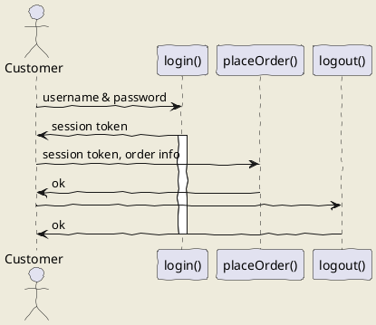

# Markdown

## Resource

- [Markdown Guide](https://www.markdownguide.org/basic-syntax/)
- [Markdown ](https://ed521.github.io/2019/08/hexo-markdown)

## Header

```
# Title
## Chapter 1
### Section 1
### Section 2
```


## Tables

### Basic

ID      | First Name | Last Name
--------|:----------:|:---:
R001    | David      |  Chen
R002    | Jerry      | Huang


### Alignment

|Default    | Alignment Left| Alignment Center| Alignment Right |
| --------- | :----------   |  :-----------:  |   -------------:|
|      R001 |          R001 |          R001   |          R001   |
|xxxxxxxxxx | xxxxxxxxxxxxx | xxxxxxxxxxxxxxx | xxxxxxxxxxxxxxxx|


<!--
## PlantUML

### Sequence Diagram


--->

## Convert PDF

Install

```
$ sudo apt install pandoc texlive-latex-extra
```

Conversion
:
```
$ pandoc --from markdown -o index.pdf index.md
```

## Reference

- [How Can I Convert Github-Flavored Markdown To A PDF](https://superuser.com/questions/689056/how-can-i-convert-github-flavored-markdown-to-a-pdf)

- [Bookdown](https://bookdown.org/)
<!--
- [用 Markdown 撰寫博碩士論文](https://yongfu.name/2019/03/07/ntuthesis/)
-->